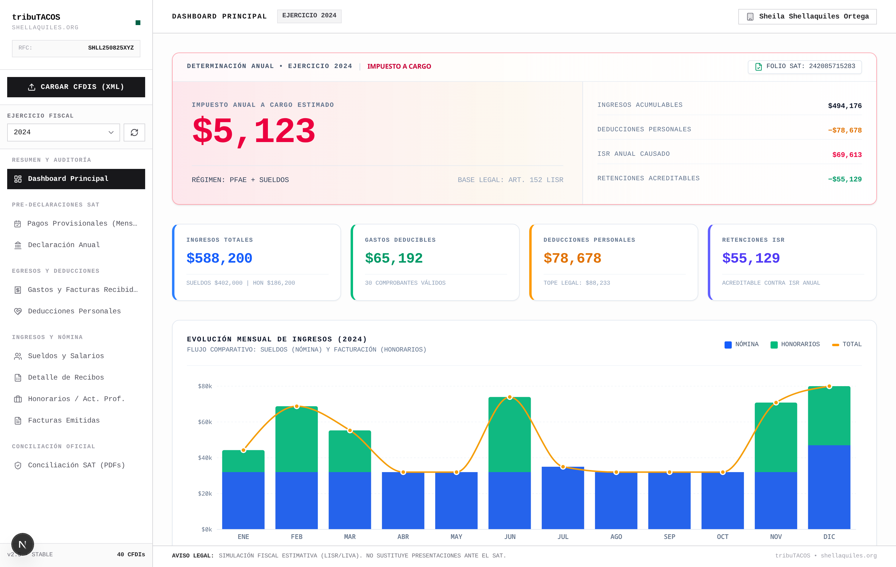
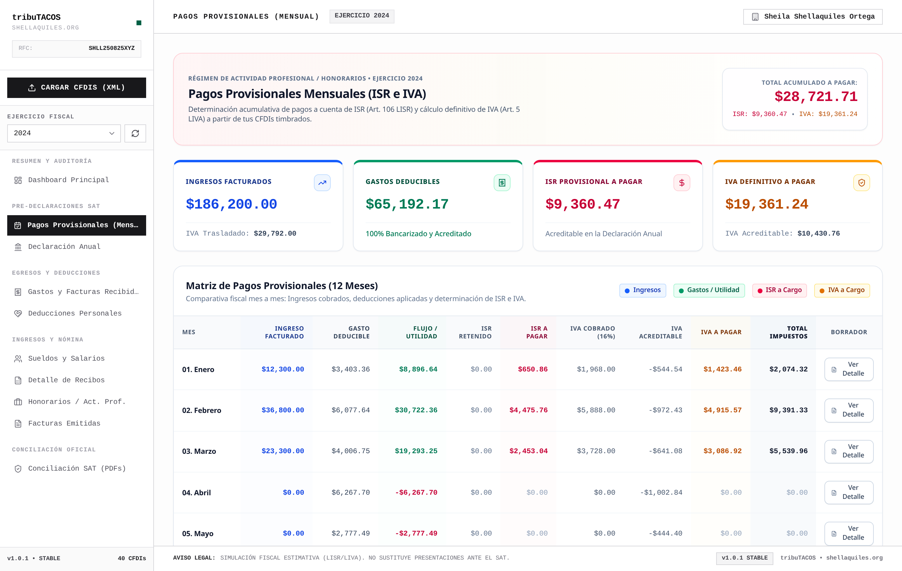
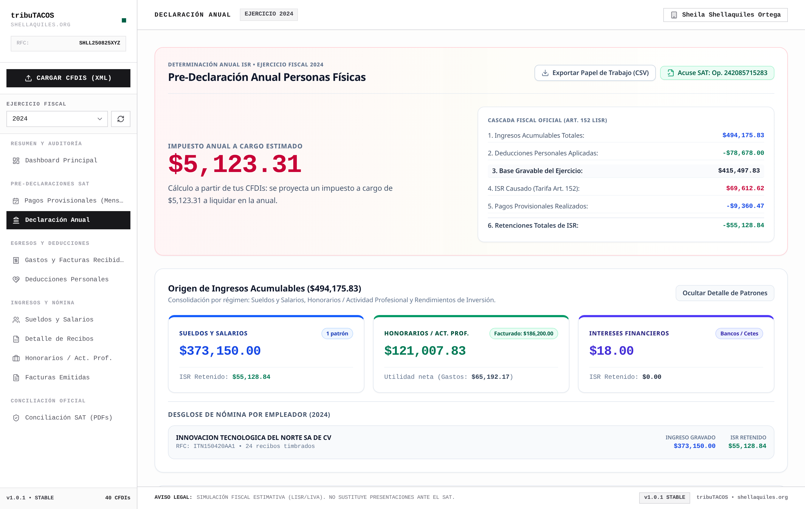
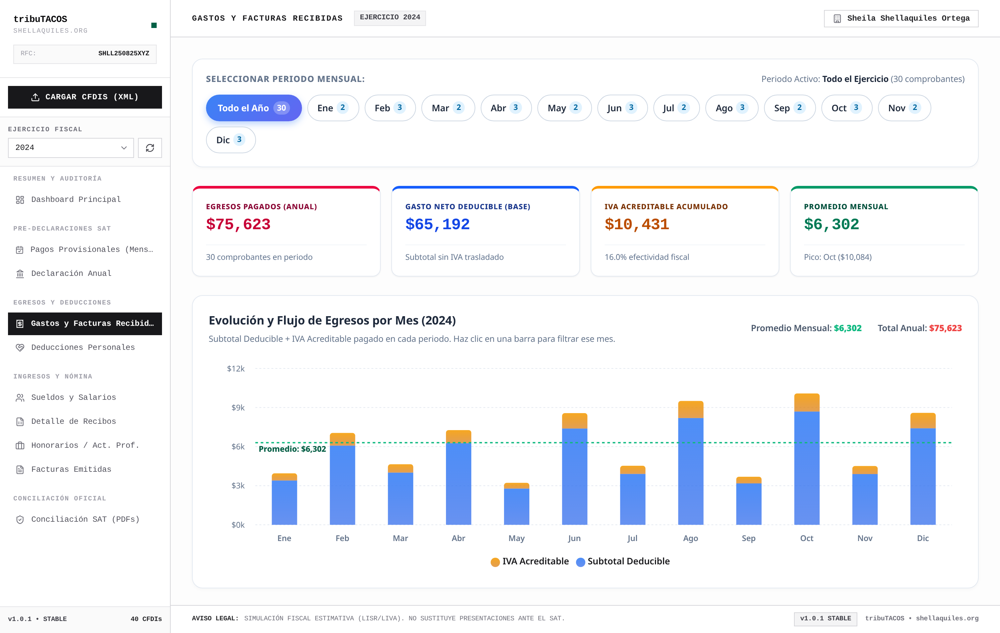
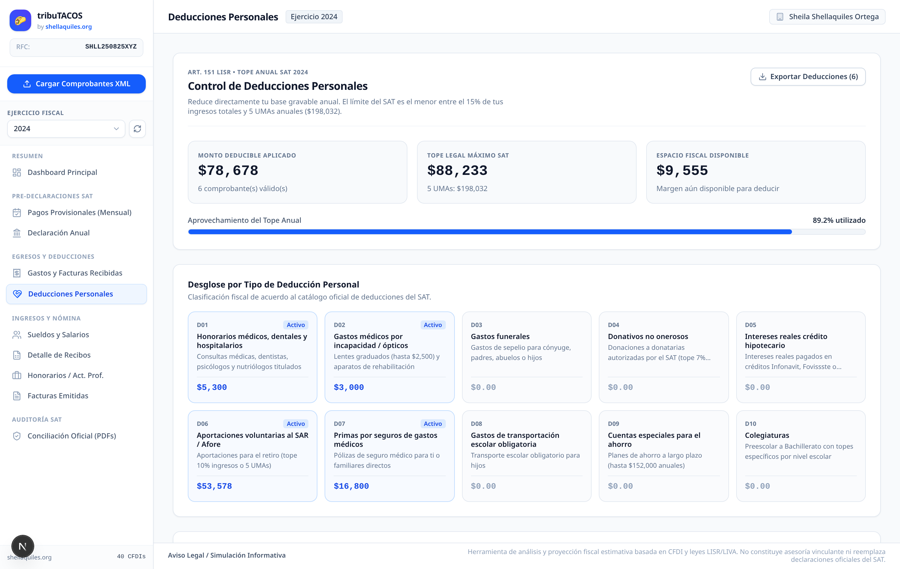
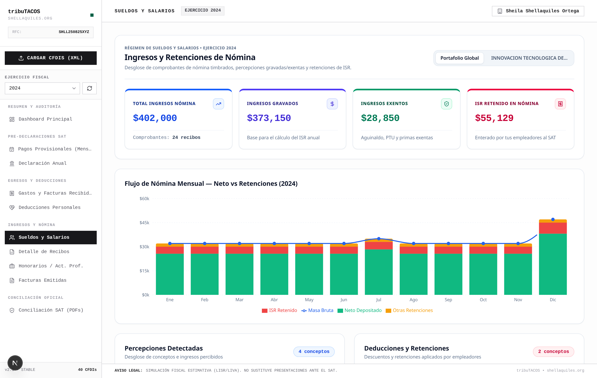
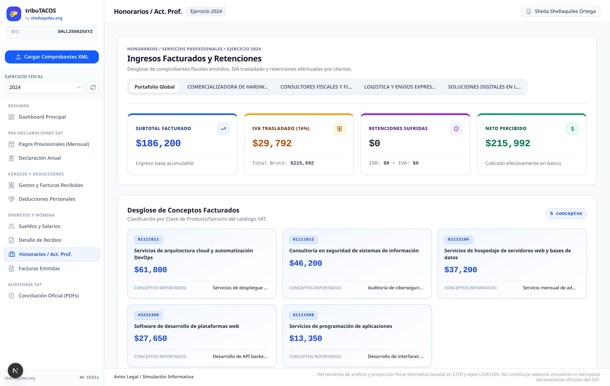
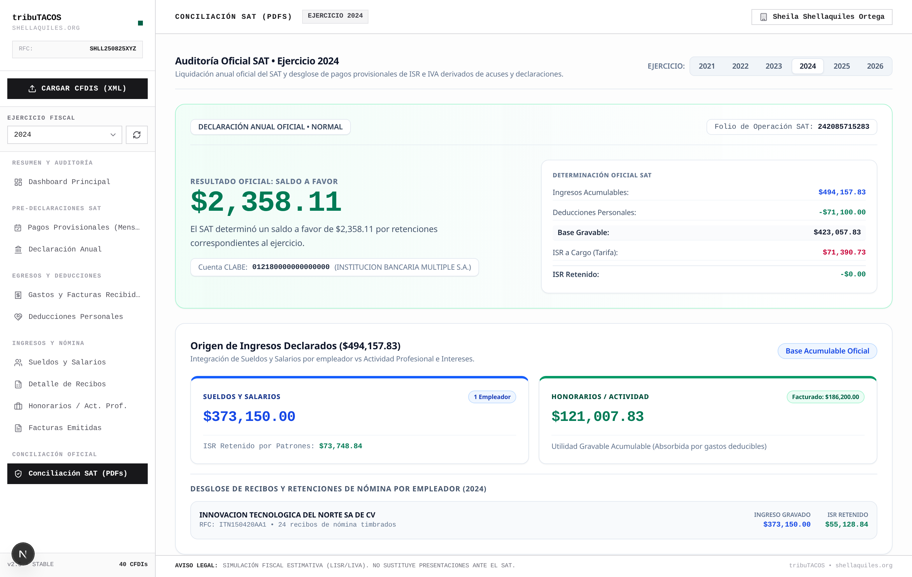

# tribuTACOS — Plataforma de Inteligencia Fiscal y Pre-Declarador SAT

[](./CHANGELOG.md)
[](./LICENSE)
[](https://fastapi.tiangolo.com)
[](https://nextjs.org)
[](https://react.dev)
[](https://python.org)
[](https://tailwindcss.com)
[](https://sqlite.org)
[](https://pytest.org)

**tribuTACOS** es una plataforma de análisis, proyección y simulación fiscal que procesa Comprobantes Fiscales Digitales por Internet (**CFDI 3.3 y 4.0 en XML**) y declaraciones oficiales del **SAT en PDF**, calculando de forma anticipada, transparente y determinista los **Pagos Provisionales Mensuales (ISR e IVA)** y la **Declaración Anual** para personas físicas en México (Sueldos y Salarios y Actividad Empresarial / Servicios Profesionales).


---

## Módulos Principales del Sistema

### 1. Tablero de Control y KPIs Ejecutivos
* Visión consolidada de ingresos totales, gastos deducibles, utilidad fiscal del ejercicio y retenciones acumuladas.
* Determinación preliminar de saldo a favor proyectado o impuesto a cargo.
* Desglose proporcional de ingresos por régimen fiscal.



### 2. Pre-Declaración Mensual (12 Meses)
* Simulación mensual bajo el principio de **flujo de efectivo** (facturas PUE y complementos de pago PPD efectivamente cobrados o pagados).
* Determinación acumulativa del Impuesto Sobre la Renta (Art. 106 LISR).
* Determinación del Impuesto al Valor Agregado mensual con gestión automática del **arrastre de saldos a favor** (Art. 5 y 6 LIVA).
* Modales interactivos con el desglose del borrador oficial para ISR e IVA.



### 3. Determinación Anual y Cascada Fiscal
* Cálculo de ISR anual conforme a la tarifa progresiva del Art. 152 LISR.
* Desglose en cascada de cinco pasos: Ingresos Acumulables ➔ Deducciones Personales ➔ Base Gravable ➔ ISR Determinado ➔ Liquidación Final.
* Cálculo de tasa efectiva y tasa marginal del ejercicio.



### 4. Clasificación Taxonómica de Egresos en 8 Rubros SAT
* Algoritmo jerárquico que mapea partidas contra las más de 52,000 claves oficiales del catálogo `c_ClaveProdServ` del SAT.
* Detección y auditoría de métodos de pago y medios bancarizados.
* Vistas analíticas por categoría, proveedor, artículo y flujo cronológico mensual.



### 5. Deducciones Personales y Optimizador Legal (Art. 151 LISR)
* Auditoría de requisitos de deducibilidad y medios de pago bancarizados obligatorios.
* Control del límite legal general (el menor entre 15% de ingresos acumulables o 5 UMAs anuales).
* Tratamiento especializado con subtopes para Planes Personales de Retiro (PPR, Fracc. V) y Seguro de Gastos Médicos Mayores (SGMM, Fracc. VI).



### 6. Sueldos, Salarios y Recibos de Nómina (Capítulo I LISR)
* Auditoría quincenal y mensual de recibos timbrados bajo el complemento CFDI 1.2.
* Desglose de ingresos gravados y percepciones exentas (aguinaldo, prima vacacional y previsión social bajo el Art. 93 LISR).
* Conciliación de retenciones de ISR de nómina (Art. 96 LISR) y cuotas obreras del IMSS.



### 7. Honorarios y Facturación Emitida (Capítulo II LISR)
* Monitoreo de ingresos facturados, retenciones de ISR (10%) e IVA (10.6667%) efectuadas por personas morales.
* Análisis de concentración de cartera por cliente y distribución por clave de producto/servicio.



### 8. Auditoría y Conciliación Oficial SAT
* Comparativa 1 a 1 entre los cálculos derivados de comprobantes XML y las cifras reportadas en las declaraciones oficiales (PDFs).
* Conciliación de números de operación, fechas de presentación y confirmación de acuses bancarios de pago con línea de captura.



---

## Stack Tecnológico

| Capa | Tecnologías Utilizadas |
| :--- | :--- |
| **Backend** | Python 3.11+, FastAPI, Uvicorn, SQLAlchemy 2.0, Pydantic v2, `lxml`, `pdfplumber`, `PyPDF2` |
| **Frontend** | Next.js 15 (App Router), React 19, Tailwind CSS, Lucide Icons |
| **Base de Datos** | SQLite (`tributacos.db`) / PostgreSQL |
| **Pruebas y Calidad** | Pytest, HTTPX, ESLint |
| **Automatización** | GNU Makefile, Bash Scripts, `scripts/tributacos.py` (Windows/macOS/Linux) |

---

## Instalación y Puesta en Marcha

### Prerrequisitos
* Python 3.11 o superior
* Node.js 18 o superior con npm
* GNU Make (Linux/macOS) o PowerShell/CMD (Windows)

### Puesta en Marcha (Linux / macOS / Windows)

`make <comando>` y `python scripts/tributacos.py <comando>` ejecutan **el mismo codigo**. En Windows, si no tienes GNU Make, usa el runner:

```bash
# 1. Configuración inicial (creación de venv, instalación de dependencias y base de datos demo)
make setup
# equivalente: python scripts/tributacos.py setup

# 2. Iniciar servidores de desarrollo (Backend :8010 + Frontend :3000)
make dev

# 3. Ejecutar la suite de pruebas
make test
```

**PowerShell (sin Make):**
```powershell
.\tributacos.ps1 setup
.\tributacos.ps1 dev
.\tributacos.ps1 test
```

**CMD o Python directo:**
```cmd
tributacos.cmd setup
tributacos.cmd dev
python scripts\tributacos.py test
```

> **Nota:** Si PowerShell bloquea la ejecución de scripts, usa `tributacos.cmd` o ejecuta una vez:
> `Set-ExecutionPolicy -Scope CurrentUser RemoteSigned`

### Instalación para usuario final (sin Python ni Node)

Si el usuario **no es técnico**, la forma más simple es usar Docker Desktop:

1. Instalar [Docker Desktop](https://www.docker.com/products/docker-desktop/) (una sola vez)
2. Abrir Docker Desktop y esperar a que esté en ejecución
3. **Doble clic** en `Iniciar-Tributacos.bat` (Windows)
4. Abrir **http://localhost:3000** en el navegador

Para detener: `Detener-Tributacos.bat` (equivalente: `make docker-down`)

Guía completa: [docs/INSTALACION_USUARIO.md](docs/INSTALACION_USUARIO.md) / [PDF](docs/tribuTACOS_instalacion_usuario.pdf)

Para verificar requisitos del modo desarrollador: `make doctor` o `python scripts/tributacos.py doctor`

### Panel de Operaciones (interfaz gráfica)

No replica la interfaz web: solo acciones de sistema (iniciar/detener, PDFs SAT, respaldos, carpetas). El panel, `make` y `python scripts/tributacos.py` llaman el **mismo runner**.

```powershell
Centro-de-Control-Tributacos.pyw
python -m control_panel
make gui
```

Servidor unico (sin Node en runtime): `python scripts/tributacos.py standalone` → http://127.0.0.1:8080

> Los scripts Windows viven en `scripts/windows/`. Los archivos en la raíz son accesos directos.

### URLs de Acceso Local
* **Aplicación Web (dev):** `http://localhost:3000`
* **Aplicación Web (standalone):** `http://127.0.0.1:8080`
* **Servicios API REST:** `http://localhost:8010` (en standalone, la API comparte el puerto 8080)
* **Documentación Interactiva Swagger / OpenAPI:** `http://localhost:8010/docs`

---

## Guía de Comandos de Operación (`Makefile`)

El proyecto implementa un `Makefile` estructurado en **5 fases**. Cada comando operativo es una fachada de `scripts/tributacos.py` (el Panel de Operaciones usa el mismo codigo). Ejecute `make` o `make help`:

| Fase | Comando | Propósito y Acción |
| :--- | :--- | :--- |
| **1. Inicio & Dev** | `make doctor` | Verifica Python, Node.js y Docker. |
| | `make setup` | Instala dependencias y prepara la base de datos con datos demo. |
| | `make dev` | Inicia Backend (`:8010`) y Frontend (`:3000`). |
| | `make gui` | Abre el Panel de Operaciones (usuario final). |
| | `make standalone` | Un solo servidor en `:8080` (API + frontend estatico). |
| | `make docker-up` / `make docker-down` | Inicia o detiene Docker Compose. |
| | `make stop` | Detiene cualquier proceso ocupando los puertos `8010`, `3000` o `8080`. |
| **2. Datos & CFDIS** | `make db-seed` | Restaura la BD con el dataset demo completo (139 CFDIs). |
| | `make db-reset` | Limpia la base de datos dejando solo catálogos oficiales del SAT. |
| | `make db-import-xml` | Procesa y clasifica facturas/recibos XML en `cfdi_recibidos/` y `cfdi_emitidos/`. |
| | `make db-import-sat` | Ingesta y procesa declaraciones y acuses oficiales del SAT en PDF. |
| | `make db-export` | Copia fechada en `respaldos/` (mismo archivo que la GUI). |
| | `make db-import-backup INPUT=...` | Restaura un respaldo `.json.gz` (reemplaza la BD). |
| | `make clear-cache` | Limpia la cache de calculos fiscales. |
| | `make open-xml-recibidos` / `open-xml-emitidos` / `open-pdf-sat` / `open-backups` | Abre las carpetas de ingesta y respaldos. |
| **3. Calidad** | `make test` | Ejecuta las pruebas del backend (Pytest). |
| | `make lint` | Valida tipado, linting y estándares de código en el Frontend. |
| | `make build` | Compila el bundle optimizado para producción en Next.js. |
| **4. Documentación** | `make screenshots` | Ejecuta capturas completas automatizadas con Playwright asistido por scroll. |
| | `make docs-sync` | Pipeline de pre-release: capturas + sincronización del manual + PDFs. |
| | `make pdf-all` | Compila los PDFs oficiales (técnico, manual e instalación) con Pandocquiles by shellaquiles.org. |
| | `make pdf-manual` | Compila únicamente el Manual de Usuario en PDF (`manual_usuario/`). |
| | `make pdf-tecnica` | Compila únicamente la Documentación Técnica en PDF (`docs/`). |
| | `make pdf-instalacion` | Compila la Guía de instalación para usuario final (`docs/INSTALACION_USUARIO.md`). |
| **5. Limpieza** | `make clean` | Elimina temporales, cachés (`__pycache__`) y PDFs generados. |
| | `make clean-deep` | Elimina entornos locales (`backend/venv` y `frontend/node_modules`). |

---

## Estructura del Proyecto

```text
tributacos/
├── backend/                  # Capa de Backend y Lógica Contable
│   ├── app/
│   │   ├── catalogos/        # Catálogo maestro UNSPSC (52,547 claves) y taxonomía
│   │   ├── cfdis/            # Parser XML y calculadoras fiscales puras
│   │   ├── sat_docs/         # Parser y conciliación de PDFs del SAT
│   │   ├── seeds/            # Fixtures y generador determinista del dataset demo
│   │   ├── auth/             # Módulo de autenticación
│   │   ├── database.py       # Configuración y sesiones de base de datos
│   │   ├── models.py         # Modelos relacionales ORM (Client, Cfdi, etc.)
│   │   ├── cli.py            # Interfaz de línea de comandos unificada
│   │   └── main.py           # Instancia principal de FastAPI
│   ├── tests/                # Pruebas automatizadas (test_api.py, test_calculators.py)
│   ├── requirements.txt      # Dependencias de Python
│   └── tributacos.db         # Base de datos SQLite activa
├── frontend/                 # Capa de Presentación Next.js 15
│   ├── src/
│   │   ├── app/              # App Router (layout.js, page.js, globals.css)
│   │   ├── components/       # Componentes visuales desacoplados por módulo
│   │   ├── SatUI.jsx         # Exportación unificada de vistas
│   │   ├── csvExport.js      # Generador de reportes CSV con BOM UTF-8
│   │   ├── App.jsx           # Componente principal de estado y navegación
│   │   └── index.css         # Tokens de diseño y estilos globales
│   ├── package.json          # Dependencias de Node.js
│   └── next.config.mjs       # Configuración de Next.js
├── docs/                     # Documentación Técnica Especializada
│   ├── 01_arquitectura_general.md
│   ├── 02_modelo_de_datos.md
│   ├── 03_motor_fiscal_algoritmos.md
│   ├── 04_catalogos_sat_taxonomia.md
│   ├── 05_api_endpoints.md
│   ├── 06_frontend_ux_componentes.md
│   ├── funcional.md
│   ├── tecnico.md
│   ├── INSTALACION_USUARIO.md
│   ├── tribuTACOS_instalacion_usuario.pdf
│   └── tribuTACOS_documentacion_tecnica.pdf
├── manual_usuario/           # Manual de Usuario Completo con Guías Visuales
│   ├── 01_introduccion_y_propuesta_de_valor.md
│   ├── ...
│   ├── MANUAL_DE_USUARIO_COMPLETO.md
│   └── tribuTACOS_manual_usuario.pdf
├── utils/                    # Utilerías y Generador de Documentación
│   ├── pandocquiles.env      # Configuración oficial persistente (temas, títulos, metadatos)
│   └── pandocquiles/         # Submódulo del motor de generación PDF (Pandocquiles)
├── tributacos_core/          # Utilidades compartidas (rutas, ingesta, diagnóstico)
│   └── runtime.py
├── control_panel/            # Panel de Operaciones (Tkinter)
│   ├── app.py                # Entry point
│   ├── domain/               # Lógica (panel, server, models)
│   ├── config/               # copy, constants, catalog, theme
│   ├── ui/                   # about, widgets, views/
│   └── infra/                # bootstrap
├── VERSION                   # Fuente unica de SemVer (X.Y.Z o X.Y.Z-rc.N)
├── Makefile                  # Fachada de scripts/tributacos.py (`make X`)
├── docker-compose.yml        # Empaquetado Docker (usuario final)
├── docker/                   # Dockerfiles backend y frontend
├── scripts/
│   ├── tributacos.py         # Runner multiplataforma (fuente unica de comandos)
│   ├── runtime.py            # Shim → tributacos_core.runtime
│   ├── windows/              # Launchers Windows (.bat, .ps1, .cmd, .pyw)
│   ├── macos/                # Launchers Docker macOS
│   └── linux/                # Launchers Docker Linux
├── packaging/
│   └── windows/              # PyInstaller + Inno Setup (`TributacosSetup-X.Y.Z.exe`)
├── Iniciar-Tributacos.bat    # Acceso directo → scripts/windows/iniciar-docker.bat
├── Detener-Tributacos.bat    # Acceso directo → scripts/windows/detener-docker.bat
├── Centro-de-Control-Tributacos.pyw  # Acceso directo al Panel de Operaciones
├── tributacos.ps1 / .cmd     # Acceso directo CLI → scripts/windows/
├── levantar_proyecto.sh      # Alias de `python3 scripts/tributacos.py dev`
├── CHANGELOG.md              # Historial de versiones y cambios
├── CONTRIBUTING.md           # Guía de contribución y estándares
├── CODE_OF_CONDUCT.md        # Código de conducta para la comunidad
├── SECURITY.md               # Política de seguridad y privacidad local
├── LICENSE                   # Licencia MIT
└── README.md                 # Guía principal del proyecto
```

---

## 📚 Documentación Oficial

Los documentos en PDF del proyecto son generados y maquetados mediante **[Pandocquiles](https://github.com/shellaquiles/pandocquiles) by shellaquiles.org**:

* 📗 **[Guía de instalación para usuario final (Markdown)](docs/INSTALACION_USUARIO.md)** / **[Versión PDF (Pandocquiles by shellaquiles.org)](docs/tribuTACOS_instalacion_usuario.pdf)**: Windows (.exe), Docker Desktop y Panel de Operaciones, sin terminal.
* 📘 **[Manual de Usuario Completo (Markdown)](manual_usuario/MANUAL_DE_USUARIO_COMPLETO.md)** / **[Versión PDF (Pandocquiles by shellaquiles.org)](manual_usuario/tribuTACOS_manual_usuario.pdf)**: Guía detallada paso a paso con diagramas y capturas de pantalla de la interfaz.
* 📄 **[Documentación Técnica de Arquitectura (Markdown)](docs/01_arquitectura_general.md)** / **[Versión PDF (Pandocquiles by shellaquiles.org)](docs/tribuTACOS_documentacion_tecnica.pdf)**: Diseño de software, flujo de datos y dependencias.
* 🧮 **[Motor Fiscal y Algoritmos LISR/LIVA](docs/03_motor_fiscal_algoritmos.md)**: Fórmulas y disposiciones legales de la legislación tributaria mexicana.
* 🗄️ **[Modelo de Datos Relacional](docs/02_modelo_de_datos.md)**: Diagrama entidad-relación y catálogo de tablas.
* 🔌 **[Especificación de la API REST](docs/05_api_endpoints.md)**: Esquemas JSON y contratos de endpoints FastAPI.


---

## 📄 Comunidad, Gobernanza y Licencia

Desarrollado bajo la licencia MIT como parte del ecosistema de herramientas de código abierto de **Shellaquiles Org**.

- 📜 [Licencia MIT](./LICENSE)
- 📋 [Historial de Cambios (Changelog)](./CHANGELOG.md)
- 🤝 [Guía de Contribución](./CONTRIBUTING.md)
- 🛡️ [Política de Seguridad y Privacidad](./SECURITY.md)
- 📜 [Código de Conducta](./CODE_OF_CONDUCT.md)

---

## ⚖️ Aviso Legal / Disclaimer

tribuTACOS es una plataforma de análisis, proyección y simulación fiscal basada en la interpretación algorítmica de comprobantes digitales (CFDI) y la legislación mexicana (LISR y LIVA). Los cálculos, proyecciones y determinaciones presentados son de carácter estrictamente estimativo e informativo, no constituyen asesoría fiscal, contable o legal vinculante, y no sustituyen las determinaciones, declaraciones formales ni obligaciones presentadas ante el Servicio de Administración Tributaria (SAT).

