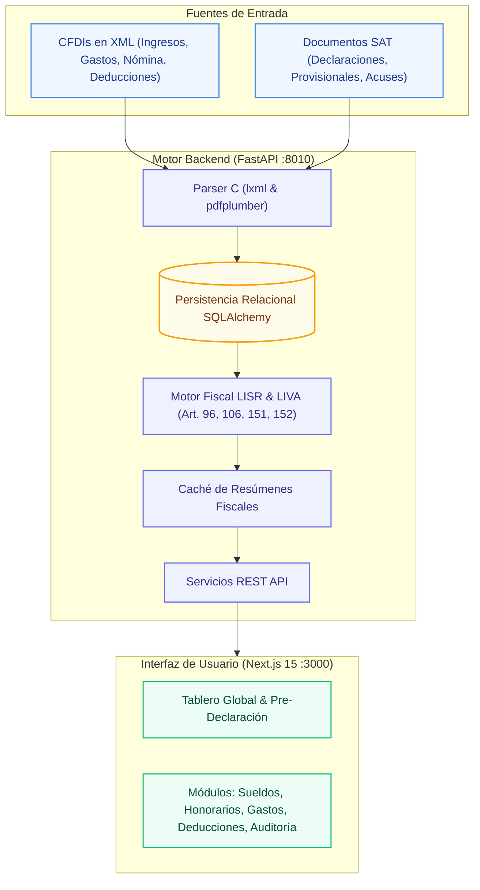

# tribuTACOS — Plataforma de Inteligencia Fiscal y Pre-Declarador SAT

[](./CHANGELOG.md)
[](./LICENSE)
[](https://fastapi.tiangolo.com)
[](https://nextjs.org)
[](https://react.dev)
[](https://python.org)
[](https://tailwindcss.com)
[](https://sqlite.org)
[](https://pytest.org)

**tribuTACOS** es una plataforma de análisis, proyección y simulación fiscal que procesa Comprobantes Fiscales Digitales por Internet (**CFDI 3.3 y 4.0 en XML**) y declaraciones oficiales del **SAT en PDF**, calculando de forma anticipada, transparente y determinista los **Pagos Provisionales Mensuales (ISR e IVA)** y la **Declaración Anual** para personas físicas en México (Sueldos y Salarios y Actividad Empresarial / Servicios Profesionales).

---

## Flujo de Procesamiento y Arquitectura



---

## Módulos Principales del Sistema

### 1. Tablero de Control y KPIs Ejecutivos
* Visión consolidada de ingresos totales, gastos deducibles, utilidad fiscal del ejercicio y retenciones acumuladas.
* Determinación preliminar de saldo a favor proyectado o impuesto a cargo.
* Desglose proporcional de ingresos por régimen fiscal.


### 2. Pre-Declaración Mensual (12 Meses)
* Simulación mensual bajo el principio de **flujo de efectivo** (facturas PUE y complementos de pago PPD efectivamente cobrados o pagados).
* Determinación acumulativa del Impuesto Sobre la Renta (Art. 106 LISR).
* Determinación del Impuesto al Valor Agregado mensual con gestión automática del **arrastre de saldos a favor** (Art. 5 y 6 LIVA).
* Modales interactivos con el desglose del borrador oficial para ISR e IVA.


### 3. Determinación Anual y Cascada Fiscal
* Cálculo de ISR anual conforme a la tarifa progresiva del Art. 152 LISR.
* Desglose en cascada de cinco pasos: Ingresos Acumulables ➔ Deducciones Personales ➔ Base Gravable ➔ ISR Determinado ➔ Liquidación Final.
* Cálculo de tasa efectiva y tasa marginal del ejercicio.


### 4. Clasificación Taxonómica de Egresos en 8 Rubros SAT
* Algoritmo jerárquico que mapea partidas contra las más de 52,000 claves oficiales del catálogo `c_ClaveProdServ` del SAT.
* Detección y auditoría de métodos de pago y medios bancarizados.
* Vistas analíticas por categoría, proveedor, artículo y flujo cronológico mensual.


### 5. Deducciones Personales y Optimizador Legal (Art. 151 LISR)
* Auditoría de requisitos de deducibilidad y medios de pago bancarizados obligatorios.
* Control del límite legal general (el menor entre 15% de ingresos acumulables o 5 UMAs anuales).
* Tratamiento especializado con subtopes para Planes Personales de Retiro (PPR, Fracc. V) y Seguro de Gastos Médicos Mayores (SGMM, Fracc. VI).


### 6. Sueldos, Salarios y Recibos de Nómina (Capítulo I LISR)
* Auditoría quincenal y mensual de recibos timbrados bajo el complemento CFDI 1.2.
* Desglose de ingresos gravados y percepciones exentas (aguinaldo, prima vacacional y previsión social bajo el Art. 93 LISR).
* Conciliación de retenciones de ISR de nómina (Art. 96 LISR) y cuotas obreras del IMSS.


### 7. Honorarios y Facturación Emitida (Capítulo II LISR)
* Monitoreo de ingresos facturados, retenciones de ISR (10%) e IVA (10.6667%) efectuadas por personas morales.
* Análisis de concentración de cartera por cliente y distribución por clave de producto/servicio.


### 8. Auditoría y Conciliación Oficial SAT
* Comparativa 1 a 1 entre los cálculos derivados de comprobantes XML y las cifras reportadas en las declaraciones oficiales (PDFs).
* Conciliación de números de operación, fechas de presentación y confirmación de acuses bancarios de pago con línea de captura.


---

## Stack Tecnológico

| Capa | Tecnologías Utilizadas |
| :--- | :--- |
| **Backend** | Python 3.11+, FastAPI, Uvicorn, SQLAlchemy 2.0, Pydantic v2, `lxml`, `pdfplumber`, `PyPDF2` |
| **Frontend** | Next.js 15 (App Router), React 19, Tailwind CSS, Lucide Icons |
| **Base de Datos** | SQLite (`tributacos.db`) / PostgreSQL |
| **Pruebas y Calidad** | Pytest, HTTPX, ESLint |
| **Automatización** | GNU Makefile, Bash Scripts |

---

## Instalación y Puesta en Marcha

### Prerrequisitos
* Python 3.11 o superior
* Node.js 18 o superior con npm
* GNU Make

### Puesta en Marcha con Makefile

```bash
# 1. Configuración inicial (creación de venv, instalación de dependencias y base de datos demo)
make setup

# 2. Iniciar servidores de desarrollo en paralelo (Backend :8010 + Frontend :3000)
make dev

# 3. Ejecutar la suite de pruebas unitarias y de integración
make test
```

### URLs de Acceso Local
* **Aplicación Web:** `http://localhost:3000`
* **Servicios API REST:** `http://localhost:8010`
* **Documentación Interactiva Swagger / OpenAPI:** `http://localhost:8010/docs`

---

## Guía de Comandos del Sistema (`Makefile`)

| Comando | Descripción |
| :--- | :--- |
| `make setup` | Instala dependencias de backend/frontend y genera la base de datos con el dataset demo oficial. |
| `make install` | Instala o actualiza dependencias de Python (`requirements.txt`) y Node.js (`package.json`). |
| `make dev` | Inicia Backend (FastAPI en puerto 8010) y Frontend (Next.js en puerto 3000) en paralelo con hot-reload. |
| `make backend` | Inicia únicamente el servidor backend de FastAPI. |
| `make frontend` | Inicia únicamente el servidor frontend de Next.js. |
| `make db-fresh` | Reinicia la base de datos y carga el dataset de prueba completo (CFDIs, nómina, honorarios y declaraciones SAT). |
| `make db-empty` | Crea una base de datos limpia con catálogos SAT pero sin comprobantes fiscales. |
| `make db-export` | Genera un respaldo comprimido (`demo_dataset.json.gz`) del estado actual de la base de datos. |
| `make test` | Ejecuta la suite completa de pruebas unitarias y de integración con Pytest. |
| `make build` | Compila el paquete optimizado de producción para la aplicación Next.js. |
| `make clean` | Elimina cachés temporales de compilación (`.next`, `__pycache__`). |

---

## Estructura del Proyecto

```text
declara/
├── backend/                  # Capa de Backend y Lógica Contable
│   ├── app/
│   │   ├── catalogos/        # Catálogo maestro UNSPSC (52,547 claves) y taxonomía
│   │   ├── cfdis/            # Parser XML y calculadoras fiscales puras
│   │   ├── sat_docs/         # Parser y conciliación de PDFs del SAT
│   │   ├── seeds/            # Fixtures y generador determinista del dataset demo
│   │   ├── auth/             # Módulo de autenticación
│   │   ├── database.py       # Configuración y sesiones de base de datos
│   │   ├── models.py         # Modelos relacionales ORM (Client, Cfdi, etc.)
│   │   ├── cli.py            # Interfaz de línea de comandos unificada
│   │   └── main.py           # Instancia principal de FastAPI
│   ├── tests/                # Pruebas automatizadas (test_api.py, test_calculators.py)
│   ├── requirements.txt      # Dependencias de Python
│   └── tributacos.db         # Base de datos SQLite activa
├── frontend/                 # Capa de Presentación Next.js 15
│   ├── src/
│   │   ├── app/              # App Router (layout.js, page.js, globals.css)
│   │   ├── components/       # Componentes visuales desacoplados por módulo
│   │   ├── SatUI.jsx         # Exportación unificada de vistas
│   │   ├── csvExport.js      # Generador de reportes CSV con BOM UTF-8
│   │   ├── App.jsx           # Componente principal de estado y navegación
│   │   └── index.css         # Tokens de diseño y estilos globales
│   ├── package.json          # Dependencias de Node.js
│   └── next.config.mjs       # Configuración de Next.js
├── docs/                     # Documentación Técnica Especializada
│   ├── 01_arquitectura_general.md
│   ├── 02_modelo_de_datos.md
│   ├── 03_motor_fiscal_algoritmos.md
│   ├── 04_catalogos_sat_taxonomia.md
│   ├── 05_api_endpoints.md
│   ├── 06_frontend_ux_componentes.md
│   ├── funcional.md
│   ├── tecnico.md
│   └── tribuTACOS_documentacion_tecnica.pdf
├── manual_usuario/           # Manual de Usuario Completo con Guías Visuales
│   ├── 01_introduccion_y_propuesta_de_valor.md
│   ├── ...
│   ├── MANUAL_DE_USUARIO_COMPLETO.md
│   └── tribuTACOS_manual_usuario.pdf
├── Makefile                  # Automatización integral del ciclo de vida
├── levantar_proyecto.sh      # Script de inicialización rápida
├── CHANGELOG.md              # Historial de versiones y cambios
├── CONTRIBUTING.md           # Guía de contribución y estándares
├── CODE_OF_CONDUCT.md        # Código de conducta para la comunidad
├── SECURITY.md               # Política de seguridad y privacidad local
├── LICENSE                   # Licencia MIT
└── README.md                 # Guía principal del proyecto
```

---

## 📚 Documentación Oficial

Para consultar la documentación técnica y funcional en profundidad:

* 📘 **[Manual de Usuario Completo (Markdown)](manual_usuario/MANUAL_DE_USUARIO_COMPLETO.md)** / **[Versión PDF](manual_usuario/tribuTACOS_manual_usuario.pdf)**: Guía detallada paso a paso con diagramas y capturas de pantalla de la interfaz.
* 📄 **[Documentación Técnica de Arquitectura (Markdown)](docs/01_arquitectura_general.md)** / **[Versión PDF](docs/tribuTACOS_documentacion_tecnica.pdf)**: Diseño de software, flujo de datos y dependencias.
* 🧮 **[Motor Fiscal y Algoritmos LISR/LIVA](docs/03_motor_fiscal_algoritmos.md)**: Fórmulas y disposiciones legales de la legislación tributaria mexicana.
* 🗄️ **[Modelo de Datos Relacional](docs/02_modelo_de_datos.md)**: Diagrama entidad-relación y catálogo de tablas.
* 🔌 **[Especificación de la API REST](docs/05_api_endpoints.md)**: Esquemas JSON y contratos de endpoints FastAPI.

---

## 📄 Comunidad, Gobernanza y Licencia

Desarrollado bajo la licencia MIT como parte del ecosistema de herramientas de código abierto de **Shellaquiles Org**.

- 📜 [Licencia MIT](./LICENSE)
- 📋 [Historial de Cambios (Changelog)](./CHANGELOG.md)
- 🤝 [Guía de Contribución](./CONTRIBUTING.md)
- 🛡️ [Política de Seguridad y Privacidad](./SECURITY.md)
- 📜 [Código de Conducta](./CODE_OF_CONDUCT.md)

---

## ⚖️ Aviso Legal / Disclaimer

tribuTACOS es una plataforma de análisis, proyección y simulación fiscal basada en la interpretación algorítmica de comprobantes digitales (CFDI) y la legislación mexicana (LISR y LIVA). Los cálculos, proyecciones y determinaciones presentados son de carácter estrictamente estimativo e informativo, no constituyen asesoría fiscal, contable o legal vinculante, y no sustituyen las determinaciones, declaraciones formales ni obligaciones presentadas ante el Servicio de Administración Tributaria (SAT).

