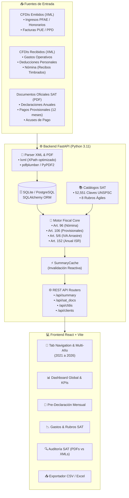

# 🏗️ 01. Arquitectura General y Ecosistema Técnico

> **Visión técnica global del sistema tribuTACOS, capas de software, pipelines de procesamiento y flujo de datos.**

---

## 1. Visión General del Sistema

**tributacos** es una solución web de inteligencia fiscal y auditoría automatizada que ingesta comprobantes fiscales digitales (CFDI versión 3.3 y 4.0 en XML) y declaraciones oficiales del SAT (en PDF), procesándolos mediante un **Motor Fiscal Determinista** para calcular pre-declaraciones provisionales mensuales y la declaración anual de personas físicas bajo el marco de la legislación tributaria mexicana (**LISR**, **LIVA** y **CFF**).



---

## 2. Stack Tecnológico

| Capa | Tecnología | Propósito |
| :--- | :--- | :--- |
| **Backend Core** | Python 3.11+ | Lenguaje de procesamiento numérico y lógica de negocio. |
| **API Web** | FastAPI + Uvicorn | Framework asíncrono de alto rendimiento con OpenAPI automático. |
| **ORM & BD** | SQLAlchemy 2.0 + SQLite / PostgreSQL | Persistencia relacional indexada, migraciones y consistencia ACID. |
| **Parsing XML** | `lxml` (C-Engine) | Parseo de CFDI 3.3/4.0 a más de 1,000 XMLs por segundo. |
| **Parsing PDF** | `pdfplumber` + `PyPDF2` | Extracción de tablas y campos oficiales de acuses y declaraciones SAT. |
| **Frontend** | React 18 + Vite | Interfaz gráfica reactiva de una sola página (SPA). |
| **Gráficas** | Recharts (D3 Wrapper) | Visualizaciones dinámicas de flujo de efectivo, retenciones y compras. |
| **Estilos** | Vanilla CSS Modular + Design Tokens | Sistema de diseño profesional, dark-mode ready y sin frameworks pesados. |

---

## 3. Pipeline de Procesamiento de Datos

### Paso 1: Ingesta y Detección de Comprobantes
1. El usuario sube o coloca archivos XML en los directorios de ingesta (`/cfdi_emitidos`, `/cfdi_recibidos`).
2. El **Parser XML** extrae:
   * **UUID:** Identificador Universal Único del timbre fiscal digital.
   * **Tipo de Comprobante:** `I` (Ingreso), `E` (Egreso), `N` (Nómina), `P` (Pago).
   * **Método de Pago:** `PUE` (Pago en una sola exhibición) o `PPD` (Pago en parcialidades o diferido).
   * **Partidas / Conceptos:** ClaveProdServ, descripción, importe base, impuestos trasladados (IVA 16%, 8%, 0%, Exento) y retenidos (ISR 10%, 1.25%, IVA 10.6667%).
   * **Complemento de Nómina (1.2):** Días pagados, percepciones gravadas/exentas, deducciones y retención de ISR (código `002`).

### Paso 2: Normalización y Persistencia Relacional
* Cada CFDI se almacena en la tabla `cfdis` vinculada al `client_id` (Multi-RFC).
* Se aplica deduplicación estricta por `UUID`.
* La información no estructurada se serializa en `parsed_data` (JSON) para acceso de baja latencia sin perder fidelidad XML.

### Paso 3: Ejecución del Motor Fiscal
* Al solicitar el resumen del ejercicio (`/api/summary?year=YYYY`), el motor procesa en memoria o recupera de `summary_cache`:
  1. Sueldos y salarios consolidados por empleador y quincenas continuas.
  2. Facturación emitida PFAE mensual.
  3. Clasificación de egresos en los **8 rubros SAT**.
  4. Deducciones personales sujetas a los topes del Art. 151 LISR.
  5. Pagos provisionales mensuales de ISR (Art. 106 LISR) e IVA definitivo con arrastre de saldos a favor (Art. 5 y 6 LIVA).
  6. Cálculo anual de ISR bajo tarifa Art. 152 LISR.

---

## 4. Estructura de Directorios del Repositorio

```
declara/
├── backend/                  # Servidor API FastAPI y Lógica de Negocio
│   ├── app/
│   │   ├── catalogos/        # Taxonomía y Catálogos SAT (52k claves)
│   │   │   ├── taxonomia.py  # Definición de 8 rubros maestros y reglas
│   │   │   ├── sat_catalogo.py # Motor de resolución en 4 capas
│   │   │   ├── seed.py       # Sembrador de claves SAT en SQLite
│   │   │   └── seed_fiscal.py# Sembrador de tarifas Art. 152 y factores UMA
│   │   ├── cfdis/            # Motor Fiscal, Calculadoras y Parser XML
│   │   │   ├── calculators/  # Calculadoras de dominio puras
│   │   │   │   ├── tarifas.py      # Tarifa progresiva Art. 152 y breakdown
│   │   │   │   ├── nomina.py       # Sueldos, retenciones y masa bruta
│   │   │   │   ├── honorarios.py   # PFAE, analítica mensual y clientes
│   │   │   │   ├── gastos.py       # Clasificación, matriz mensual y deducibilidad
│   │   │   │   ├── deducciones.py  # Deducciones personales y topes UMA
│   │   │   │   ├── intereses.py    # Intereses reales del sistema financiero
│   │   │   │   └── simulador_sat.py# Cascada anual (waterfall) y tasas
│   │   │   ├── engine.py     # Despachador de agregaciones y resúmenes
│   │   │   ├── parser.py     # Parser optimizado de CFDI 3.3/4.0
│   │   │   ├── storage.py    # Ingesta, escaneo local y caché
│   │   │   ├── schemas.py    # Modelos Pydantic v2
│   │   │   └── router.py     # Endpoints REST de CFDIs y analíticas
│   │   ├── sat_docs/         # Parser y Conciliación de PDFs Oficiales SAT
│   │   │   ├── parser.py     # Extractor de declaraciones SAT y acuses
│   │   │   ├── importer.py   # Ingesta de PDFs a BD relacional
│   │   │   └── router.py     # Endpoint /api/sat_docs/summary
│   │   ├── seeds/            # Seeding y Fixtures de Prueba
│   │   │   ├── seed_demo.py  # Exportador/importador de datos de prueba
│   │   │   └── demo_dataset.json.gz # Fixture empaquetado (269 KB)
│   │   ├── auth/             # Autenticación y JWT opcional
│   │   ├── database.py       # Conexión SQLAlchemy y SessionLocal
│   │   ├── models.py         # Modelos relacionales ORM (Client, Cfdi, etc.)
│   │   ├── cli.py            # CLI unificada (init-db, seed-demo, sync)
│   │   ├── config.py         # Configuración centralizada (.env)
│   │   └── main.py           # Instancia principal de FastAPI y CORS
│   ├── tests/                # Suite de pruebas Pytest (11 tests)
│   ├── tributacos.db         # Base de datos relacional SQLite
│   ├── requirements.txt      # Dependencias Python
│   └── anonymize.py          # Motor de sanitización determinista
├── frontend/                 # Aplicación Cliente React (Vite)
│   ├── src/
│   │   ├── components/       # Componentes visuales modularizados
│   │   │   ├── ui/           # Primitives y Modals reutilizables
│   │   │   ├── nomina/       # Sueldos, quincenas y analítica de recibos
│   │   │   ├── honorarios/   # Facturas, clientes y mix de conceptos
│   │   │   ├── egresos/      # Matriz mensual y reporte por rubro SAT
│   │   │   ├── deducciones/  # Deducciones personales y determinación anual
│   │   │   ├── PreDeclaracionMensualSection.jsx # Matriz de 12 meses
│   │   │   └── ConciliacionSatSection.jsx      # Auditoría SAT vs XMLs
│   │   ├── SatUI.jsx         # Barrel export modular
│   │   ├── csvExport.js      # Motor de exportación estructurada CSV
│   │   ├── App.jsx           # Componente raíz y navegación
│   │   └── index.css         # Design System y CSS tokens
│   ├── package.json
│   └── vite.config.js        # Configuración de Vite con proxy /api
├── docs/                     # Documentación Técnica Especializada
├── Makefile                  # Suite de automatización de desarrollo
└── levantar_proyecto.sh      # Script de arranque local
```
