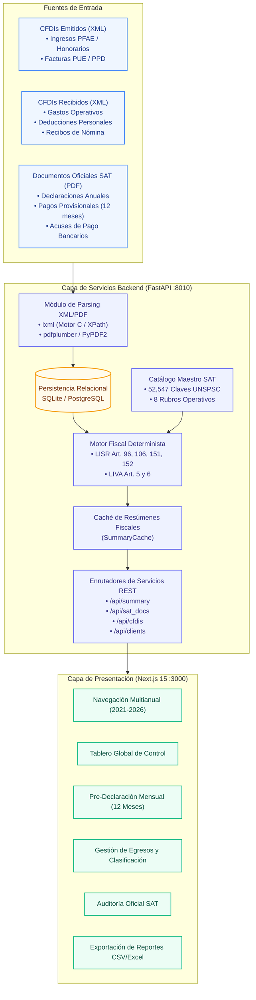

# tribuTACOS — 01. Arquitectura General y Ecosistema Técnico

[](#)
[](#)

> **Versión de Referencia del Sistema:** Esta documentación técnica describe la arquitectura y especificación de **tribuTACOS v1.1.0-rc.2 RC**.

Especificación formal de la arquitectura del sistema, componentes de software, pipeline de procesamiento de datos y estructura de directorios.


---

## 1. Visión General del Sistema

tribuTACOS es una plataforma web de inteligencia fiscal y auditoría automatizada diseñada para procesar Comprobantes Fiscales Digitales por Internet (CFDI 3.3 y 4.0 en XML) y declaraciones oficiales del Servicio de Administración Tributaria (en PDF). El sistema integra un motor fiscal determinista que calcula pre-declaraciones provisionales mensuales y la determinación anual del Impuesto Sobre la Renta (ISR) e Impuesto al Valor Agregado (IVA), en apego a la Ley del Impuesto Sobre la Renta (LISR), Ley del Impuesto al Valor Agregado (LIVA) y el Código Fiscal de la Federación (CFF).



---

## 2. Stack Tecnológico

| Capa | Componente | Justificación Técnica |
| :--- | :--- | :--- |
| **Backend Core** | Python 3.11+ | Lenguaje base para ejecución de lógica contable, aritmética fiscal y transformaciones de datos. |
| **Framework Web** | FastAPI + Uvicorn | Framework asíncrono basado en ASGI, tipado estricto con Pydantic v2 y generación de OpenAPI. |
| **Persistencia** | SQLAlchemy 2.0 + SQLite / PostgreSQL | Capa de abstracción de datos relacional con soporte transaccional ACID e indexación optimizada. |
| **Motor de Parsing XML** | `lxml` | Parser basado en libxml2 con optimización C para procesamiento masivo de XMLs fiscales. |
| **Motor de Parsing PDF** | `pdfplumber` + `PyPDF2` | Extracción estructurada de tablas, metadatos y valores fiscales de documentos oficiales SAT. |
| **Frontend** | Next.js 15 + React 19 | Arquitectura App Router para renderizado eficiente de interfaces analíticas complejas. |
| **Diseño y Estilos** | Tailwind CSS | Sistema de utilidades CSS con tipografía formal, alto contraste y paletas semánticas estructuradas. |
| **Exportación de Datos** | Vanilla JavaScript (`csvExport.js`) | Generación en cliente de archivos CSV con codificación UTF-8 BOM para compatibilidad total con hojas de cálculo. |
| **Generador de PDFs** | Pandocquiles by shellaquiles.org | Pipeline de compilación Markdown a PDF con renderizado de diagramas Mermaid, incrustación de recursos Base64 y tematización CSS editorial. |


---

## 3. Pipeline de Procesamiento de Datos

### 3.1 Ingesta y Validación de Estructura
1. Los archivos XML son recibidos y validados contra los esquemas estándar del SAT (CFDI versión 3.3 o 4.0).
2. El parser extrae los atributos esenciales:
   * **UUID:** Folio Fiscal único del Comprobante Fiscal Digital por Internet.
   * **Tipo de Comprobante:** `I` (Ingreso), `E` (Egreso), `N` (Nómina), `P` (Pago).
   * **Condiciones de Pago:** `PUE` (Pago en una sola exhibición) o `PPD` (Pago en parcialidades o diferido).
   * **Partidas y Conceptos:** Clave de Producto o Servicio, desglose de base imponible, traslados de IVA (16%, 8%, 0%, Exento) y retenciones (ISR 10%, 1.25%, IVA 10.6667%).
   * **Complemento de Nómina (versión 1.2):** Días laborados, percepciones gravadas y exentas (Art. 93 LISR), deducciones y retención de ISR (Art. 96 LISR).

### 3.2 Normalización y Persistencia Relacional
* Cada comprobante es registrado en la tabla `cfdis` asignado a un `client_id`.
* Se ejecuta un control de integridad para prevenir duplicados mediante restricciones de unicidad por `UUID`.
* Los metadatos extendidos del CFDI se almacenan en formato JSON normalizado dentro del campo `parsed_data`.

### 3.3 Ejecución del Motor Fiscal
Al consultar el resumen fiscal anual (`/api/summary?year=YYYY`), el motor procesa:
1. Masa salarial anual, desglose de percepciones gravadas/exentas y retenciones de nómina.
2. Ingresos mensuales por actividades profesionales y empresariales (PFAE).
3. Clasificación de partidas de gasto en los 8 rubros operativos estandarizados.
4. Determinación de deducciones personales y aplicación de los topes legales del Art. 151 LISR.
5. Cálculo de pagos provisionales mensuales de ISR (Art. 106 LISR) y determinación de IVA mensual con arrastre de saldos a favor (Art. 5 y 6 LIVA).
6. Determinación anual de ISR mediante la tarifa progresiva del Art. 152 LISR.

---

## 4. Estructura del Repositorio

```text
tributacos/
├── backend/                  # Servicios de Backend y Lógica de Negocio
│   ├── app/
│   │   ├── catalogos/        # Catálogos SAT y Clasificación Taxonómica
│   │   │   ├── taxonomia.py  # Definición de rubros y reglas de clasificación
│   │   │   ├── sat_catalogo.py # Algoritmo de resolución jerárquica en 4 niveles
│   │   │   ├── seed.py       # Poblado del catálogo maestro UNSPSC (52,547 claves)
│   │   │   └── seed_fiscal.py# Poblado de tarifas del Art. 152 LISR y factores UMA
│   │   ├── cfdis/            # Módulos del Motor Fiscal y Procesamiento CFDI
│   │   │   ├── calculators/  # Calculadoras fiscales de dominio puro
│   │   │   │   ├── tarifas.py      # Tarifa del Art. 152 LISR y desglose marginal
│   │   │   │   ├── nomina.py       # Sueldos, retenciones e ingresos exentos
│   │   │   │   ├── honorarios.py   # Ingresos PFAE y analítica de clientes
│   │   │   │   ├── gastos.py       # Egresos deducibles y matriz mensual
│   │   │   │   ├── deducciones.py  # Deducciones personales y topes legales
│   │   │   │   ├── intereses.py    # Intereses reales del sistema financiero
│   │   │   │   └── simulador_sat.py# Determinación anual y pre-declaración mensual
│   │   │   ├── engine.py     # Orquestador del resumen fiscal consolidado
│   │   │   ├── parser.py     # Parser de comprobantes CFDI 3.3/4.0
│   │   │   ├── storage.py    # Gestión de almacenamiento e invalidación de caché
│   │   │   ├── schemas.py    # Esquemas Pydantic v2 de validación
│   │   │   └── router.py     # Endpoints REST de CFDIs y resúmenes
│   │   ├── sat_docs/         # Módulo de Documentos Oficiales SAT (PDF)
│   │   │   ├── parser.py     # Extractor de declaraciones y acuses SAT
│   │   │   ├── importer.py   # Ingesta y persistencia de documentos SAT
│   │   │   └── router.py     # Endpoints de consulta y conciliación SAT
│   │   ├── seeds/            # Módulos de Generación y Poblado de Datos
│   │   │   ├── seed_demo.py  # Importador y exportador de fixtures
│   │   │   ├── recalculate_dataset.py # Generador determinista del dataset fiscal
│   │   │   └── demo_dataset.json.gz   # Fixture comprimido de prueba
│   │   ├── auth/             # Módulo de autenticación
│   │   ├── database.py       # Conexión SQLAlchemy y gestión de sesiones
│   │   ├── models.py         # Definición de modelos ORM
│   │   ├── cli.py            # Interfaz de línea de comandos unificada
│   │   ├── config.py         # Configuración del entorno
│   │   └── main.py           # Inicialización de la aplicación FastAPI
│   ├── tests/                # Suite de pruebas automatizadas Pytest
│   ├── tributacos.db         # Base de datos SQLite
│   └── requirements.txt      # Dependencias de Python
├── frontend/                 # Aplicación Cliente Next.js 15
│   ├── src/
│   │   ├── app/              # Enrutador App Router (layout.js, page.js, globals.css)
│   │   ├── components/       # Componentes de interfaz de usuario
│   │   │   ├── ui/           # Componentes base reutilizables
│   │   │   ├── nomina/       # Vistas de nómina y recibos de sueldos
│   │   │   ├── honorarios/   # Vistas de honorarios y facturación PFAE
│   │   │   ├── egresos/      # Vistas de gastos y desglose de rubros
│   │   │   ├── deducciones/  # Vistas de deducciones personales y cálculo anual
│   │   │   ├── PreDeclaracionMensualSection.jsx # Matriz mensual de 12 meses
│   │   │   └── ConciliacionSatSection.jsx      # Comparativa de auditoría SAT
│   │   ├── SatUI.jsx         # Exportación modular de componentes
│   │   ├── csvExport.js      # Módulo de exportación CSV con UTF-8 BOM
│   │   ├── App.jsx           # Componente principal de navegación y estado
│   │   └── index.css         # Estilos base y tokens de diseño
│   ├── package.json          # Dependencias de Node.js
│   └── next.config.mjs       # Configuración de Next.js
├── docs/                     # Documentación Técnica del Sistema
├── manual_usuario/           # Manual de usuario y capturas
├── scripts/                  # Runner, Panel de Operaciones y launchers
├── packaging/                # PyInstaller, Inno Setup y bundle Docker
├── VERSION                   # SemVer fuente unica
├── Makefile                  # Fachada de scripts/tributacos.py (make X == python scripts/tributacos.py X)
└── levantar_proyecto.sh      # Alias de python3 scripts/tributacos.py dev
```

---

## 5. Aviso Legal / Disclaimer

tribuTACOS es una plataforma de análisis, proyección y simulación fiscal basada en comprobantes digitales (CFDI) y las leyes tributarias aplicables. Los resultados generados son de naturaleza puramente informativa y proyectiva, no representan asesoría contable o fiscal vinculante, y no reemplazan las declaraciones oficiales presentadas ante el Servicio de Administración Tributaria (SAT).

