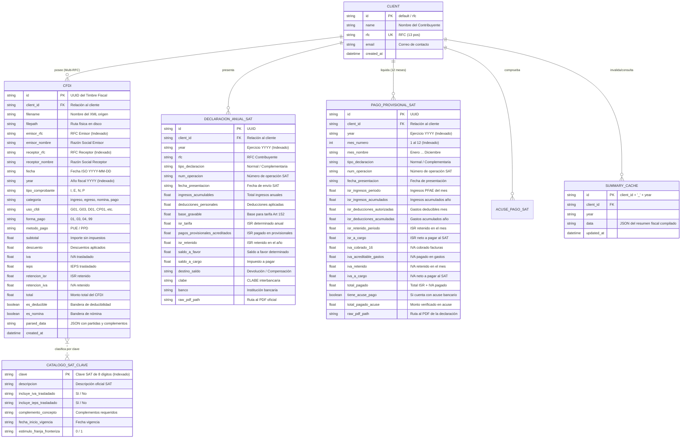

# 🗄️ 02. Modelo de Datos Relacional y Esquema SQLAlchemy

> **Diseño de base de datos relacional, diagramas entidad-relación (ERD), modelos SQLAlchemy, índices de rendimiento y diccionario de datos.**

---

## 1. Diagrama Entidad-Relación (ERD)



---

## 2. Índices de Alto Rendimiento

Para garantizar tiempos de respuesta menores a **15 ms** en auditorías con miles de CFDIs, se han configurado los siguientes índices en SQLAlchemy:

```python
# Definición en backend/app/models.py
__table_args__ = (
    Index('idx_cfdi_client_year', 'client_id', 'year'),
    Index('idx_cfdi_emisor_fecha', 'emisor_rfc', 'fecha'),
    Index('idx_cfdi_receptor_fecha', 'receptor_rfc', 'fecha'),
    Index('idx_cfdi_categoria', 'categoria'),
)
```

---

## 3. Modelo de Partidas Desestructuradas (`parsed_data`)

Cada CFDI almacena en su columna `parsed_data` un objeto JSON normalizado que contiene:

```json
{
  "uuid": "4A1B2C3D-E4F5-6789-ABCD-EF0123456789",
  "emisor_rfc": "STM180415AA1",
  "emisor_nombre": "SOLUCIONES TECNOLÓGICAS DE MÉXICO S.A. DE C.V.",
  "receptor_rfc": "SHLL250825XYZ",
  "receptor_nombre": "pixelead0 Shellaquiles org",
  "regimen_fiscal_emisor": "601",
  "regimen_fiscal_receptor": "605",
  "conceptos": [
    {
      "clave": "81111508",
      "desc": "Desarrollo de software y backend en Python",
      "imp": 35000.00,
      "subtotal": 35000.00,
      "descuento": 0.00,
      "tasa_iva": 0.16,
      "iva": 5600.00,
      "ret_isr": 3500.00,
      "ret_iva": 3733.33
    }
  ],
  "nomina_detalle": {
    "dias_pagados": 15.0,
    "fecha_inicial_pago": "2024-01-01",
    "fecha_final_pago": "2024-01-15",
    "salario_base_cot_apor": 1350.00,
    "salario_diario_integrado": 1420.50,
    "percepciones": [
      { "tipo": "001", "concepto": "Sueldos y Salarios", "gravado": 20000.00, "exento": 0.00 }
    ],
    "deducciones": [
      { "tipo": "001", "concepto": "Seguridad Social IMSS", "total": 540.00 },
      { "tipo": "002", "concepto": "Retención de ISR", "total": 3533.23 }
    ]
  }
}
```

---

## 4. Estrategia de Invalidación de Caché (`SummaryCache`)

* La tabla `summary_cache` almacena el payload JSON completo del motor fiscal para evitar re-calcular la matriz de 12 meses y los impuestos en cada lectura de la UI.
* **Eventos de Invalidación:**
  * Al subir o eliminar un CFDI (`Cfdi`).
  * Al sincronizar una declaración oficial del SAT (`PagoProvisionalSAT` / `DeclaracionAnualSAT`).
  * Al ejecutar cualquier script de anonimización o recálculo (`anonymize.py`, `recalcular_nomina.py`, `recalcular_pfae.py`).
