# tribuTACOS — 02. Modelo de Datos Relacional y Esquema SQLAlchemy

Diseño de base de datos relacional, diagramas entidad-relación (ERD), modelos SQLAlchemy, índices de rendimiento y diccionario de datos.

---

## 1. Esquema Relacional de Entidades

```mermaid
flowchart TD
    subgraph Core["Entidad Central"]
        CLIENT["CLIENT\n(Contribuyente Multi-RFC)"]
    end

    subgraph Comprobantes["Comprobantes y Reglas"]
        CFDI["CFDI\n(XMLs Ingresos, Gastos, Nómina)"]
        CFDI_EXC["CFDI_EXCLUSION\n(Reglas de Exclusión)"]
        CONST_EXT["CONSTANCIA_FISCAL_EXTERNA\n(PPRs y Deducciones Físicas)"]
    end

    subgraph DocumentosSAT["Auditoría Oficial SAT"]
        DECL_ANUAL["DECLARACION_ANUAL_SAT\n(Declaraciones Anuales PDF)"]
        PAGO_PROV["PAGO_PROVISIONAL_SAT\n(12 Pagos Provisionales PDF)"]
        ACUSE_PAGO["ACUSE_PAGO_SAT\n(Comprobantes Bancarios)"]
    end

    subgraph Catalogos["Catálogos y Parámetros Fiscales"]
        CAT_SAT["CATALOGO_SAT_CLAVE\n(52,547 Claves UNSPSC)"]
        TARIFA_ISR["TARIFA_ISR_ANUAL\n(Art. 152 2021-2026)"]
        PARAM_SAT["PARAMETRO_SAT\n(Factores UMA y Topes)"]
    end

    subgraph Rendimiento["Aceleración de Consultas"]
        SUMMARY_CACHE["SUMMARY_CACHE\n(Resumen Fiscal Compilado)"]
    end

    CLIENT --> CFDI
    CLIENT --> CFDI_EXC
    CLIENT --> CONST_EXT
    CLIENT --> DECL_ANUAL
    CLIENT --> PAGO_PROV
    CLIENT --> ACUSE_PAGO
    CLIENT --> SUMMARY_CACHE

    CFDI -.-> CAT_SAT
    TARIFA_ISR -.-> PARAM_SAT

    classDef clientStyle fill:#1e293b,stroke:#0f172a,stroke-width:2px,color:#ffffff;
    classDef cfdiStyle fill:#eff6ff,stroke:#3b82f6,stroke-width:1.5px,color:#1e3a8a;
    classDef satStyle fill:#eef2ff,stroke:#6366f1,stroke-width:1.5px,color:#312e81;
    classDef catStyle fill:#fffbeb,stroke:#f59e0b,stroke-width:1.5px,color:#78350f;
    classDef cacheStyle fill:#ecfdf5,stroke:#10b981,stroke-width:1.5px,color:#064e3b;

    class CLIENT clientStyle;
    class CFDI,CFDI_EXC,CONST_EXT cfdiStyle;
    class DECL_ANUAL,PAGO_PROV,ACUSE_PAGO satStyle;
    class CAT_SAT,TARIFA_ISR,PARAM_SAT catStyle;
    class SUMMARY_CACHE cacheStyle;
```



---

## 2. Diagrama Entidad-Relación Detallado (ERD)

```mermaid
erDiagram
    CLIENT ||--o{ CFDI : "posee"
    CLIENT ||--o{ DECLARACION_ANUAL_SAT : "presenta"
    CLIENT ||--o{ PAGO_PROVISIONAL_SAT : "liquida (12 meses)"
    CLIENT ||--o{ ACUSE_PAGO_SAT : "comprueba"
    CLIENT ||--o{ CFDI_EXCLUSION : "configura exclusiones"
    CLIENT ||--o{ CONSTANCIA_FISCAL_EXTERNA : "registra deducciones externas"
    CLIENT ||--o{ SUMMARY_CACHE : "almacena resumen compilado"
    
    CFDI }|..|{ CATALOGO_SAT_CLAVE : "clasifica por clave"
    TARIFA_ISR_ANUAL ||--o{ PARAMETRO_SAT : "parámetros del ejercicio"

    CLIENT {
        string id PK "default / rfc"
        string name "Nombre o Razón Social"
        string rfc UK "RFC (12 o 13 posiciones)"
        string email "Correo electrónico"
        datetime created_at
    }

    CFDI {
        string id PK "UUID del Timbre Fiscal"
        string client_id FK "Relación al cliente"
        string filename "Nombre del archivo XML"
        string filepath "Ruta física del archivo"
        string emisor_rfc "RFC Emisor (Indexado)"
        string emisor_nombre "Razón Social Emisor"
        string receptor_rfc "RFC Receptor (Indexado)"
        string receptor_nombre "Razón Social Receptor"
        string fecha "Fecha de emisión (YYYY-MM-DD)"
        string year "Ejercicio fiscal YYYY (Indexado)"
        string tipo_comprobante "I, E, N, P"
        string categoria "ingreso, egreso, nomina, pago"
        string uso_cfdi "G01, G03, D01, D06, etc."
        string forma_pago "01, 03, 04, 99"
        string metodo_pago "PUE / PPD"
        float subtotal "Importe base antes de impuestos"
        float descuento "Descuentos comerciales"
        float iva "IVA trasladado"
        float ieps "IEPS trasladado"
        float retencion_isr "ISR retenido"
        float retencion_iva "IVA retenido"
        float total "Total liquidado en el comprobante"
        boolean es_deducible "Estado de deducibilidad fiscal"
        boolean es_nomina "Bandera de comprobante de nómina"
        string parsed_data "JSON con partidas y complementos"
        datetime created_at
    }

    CFDI_EXCLUSION {
        int id PK "Autoincremental"
        string client_id FK "Relación al cliente"
        string uuid "UUID excluido del motor fiscal"
        string motivo "Motivo de la exclusión"
        string tipo "nomina / ingreso / gasto"
        datetime created_at
    }

    CONSTANCIA_FISCAL_EXTERNA {
        string id PK "Identificador único"
        string client_id FK "Relación al cliente"
        string year "Ejercicio fiscal YYYY"
        string uso_cfdi "D06 (PPR), D01, etc."
        string emisor_rfc "RFC de la entidad financiera/emisora"
        string emisor_nombre "Razón Social de la entidad"
        string fecha "Fecha de emisión (YYYY-MM-DD)"
        float monto "Importe total deducible"
        string descripcion "Descripción de la aportación"
    }

    TARIFA_ISR_ANUAL {
        int id PK "Autoincremental"
        string year "Ejercicio fiscal YYYY"
        float limite_inferior "Límite inferior del tramo"
        float limite_superior "Límite superior del tramo"
        float cuota_fija "Cuota fija del tramo"
        float porcentaje_excedente "Tasa marginal sobre el excedente"
        int orden "Renglón de la tarifa (1 a 11)"
    }

    PARAMETRO_SAT {
        string year PK "Ejercicio fiscal YYYY"
        float uma_diaria "Valor diario de la UMA"
        float uma_mensual "Valor mensual de la UMA"
        float uma_anual "Valor anual de la UMA"
        float uma_5_anual "Tope de 5 UMAs anuales"
        float tope_deducciones_pct "Tope del 15% de ingresos"
        float salario_minimo "Salario mínimo general"
    }

    DECLARACION_ANUAL_SAT {
        string id PK "Identificador único"
        string client_id FK "Relación al cliente"
        string year "Ejercicio fiscal YYYY"
        string rfc "RFC del Contribuyente"
        string tipo_declaracion "Normal / Complementaria"
        string num_operacion "Número de operación oficial SAT"
        string fecha_presentacion "Fecha y hora de presentación"
        float ingresos_acumulables "Ingresos acumulables totales"
        float deducciones_personales "Deducciones personales aplicadas"
        float base_gravable "Base gravable para Art. 152"
        float isr_tarifa "ISR determinado del ejercicio"
        float pagos_provisionales_acreditados "Pagos provisionales acreditados"
        float isr_retenido "ISR retenido acumulado"
        float saldo_a_favor "Saldo a favor determinado"
        float saldo_a_cargo "Impuesto a cargo determinado"
        string clabe "Cuenta CLABE para devolución"
        string banco "Institución bancaria receptora"
        string raw_pdf_path "Ruta al archivo PDF oficial"
    }

    PAGO_PROVISIONAL_SAT {
        string id PK "Identificador único"
        string client_id FK "Relación al cliente"
        string year "Ejercicio fiscal YYYY"
        int mes_numero "Mes del ejercicio (1 a 12)"
        string mes_nombre "Nombre del mes"
        string tipo_declaracion "Normal / Complementaria"
        string num_operacion "Número de operación oficial SAT"
        string fecha_presentacion "Fecha de presentación"
        float isr_ingresos_periodo "Ingresos del periodo"
        float isr_ingresos_acumulados "Ingresos acumulados del ejercicio"
        float isr_deducciones_autorizadas "Deducciones autorizadas del mes"
        float isr_deducciones_acumuladas "Deducciones autorizadas acumuladas"
        float isr_retenido_periodo "ISR retenido en el periodo"
        float isr_a_cargo "ISR neto a cargo"
        float iva_base_gravada_16 "Base gravada para IVA"
        float iva_cobrado_16 "IVA cobrado al 16%"
        float iva_acreditable_gastos "IVA acreditable pagado"
        float iva_retenido "IVA retenido por terceros"
        float iva_a_cargo "IVA neto a cargo"
        float total_pagado "Total pagado (ISR + IVA)"
        boolean tiene_acuse_pago "Indicador de acuse bancario verificado"
        float total_pagado_acuse "Monto verificado en acuse"
        string raw_pdf_path "Ruta al archivo PDF oficial"
    }

    CATALOGO_SAT_CLAVE {
        string clave PK "Clave SAT de 8 dígitos"
        string descripcion "Descripción técnica oficial"
        string categoria_id "Rubro operativo asignado"
        string tipo "Tipo de producto o servicio"
    }

    SUMMARY_CACHE {
        string id PK "client_id_year"
        string client_id FK "Relación al cliente"
        string year "Ejercicio fiscal YYYY"
        string data "JSON consolidado del resumen fiscal"
        datetime updated_at
    }
```



---

## 3. Índices de Rendimiento y Optimización

Para garantizar tiempos de respuesta inferiores a 15 ms en consultas analíticas sobre volúmenes elevados de comprobantes, se definen los siguientes índices en SQLAlchemy:

```python
# Declaración en backend/app/models.py
__table_args__ = (
    Index('idx_cfdi_client_year', 'client_id', 'year'),
    Index('idx_cfdi_emisor_fecha', 'emisor_rfc', 'fecha'),
    Index('idx_cfdi_receptor_fecha', 'receptor_rfc', 'fecha'),
    Index('idx_cfdi_categoria', 'categoria'),
)
```

---

## 4. Estructura del Campo Desestructurado (`parsed_data`)

Cada comprobante fiscal almacena en su columna `parsed_data` un objeto JSON estandarizado con la información analizada del XML:

```json
{
  "uuid": "4A1B2C3D-E4F5-6789-ABCD-EF0123456789",
  "emisor_rfc": "ITN150420AA1",
  "emisor_nombre": "INNOVACION TECNOLOGICA DEL NORTE SA DE CV",
  "receptor_rfc": "SHLL250825XYZ",
  "receptor_nombre": "Sheila Shellaquiles Ortega",
  "regimen_fiscal_emisor": "601",
  "regimen_fiscal_receptor": "605",
  "conceptos": [
    {
      "clave": "81111508",
      "desc": "Desarrollo de software y arquitectura backend en Python",
      "imp": 35000.00,
      "subtotal": 35000.00,
      "descuento": 0.00,
      "tasa_iva": 0.16,
      "iva": 5600.00,
      "ret_isr": 3500.00,
      "ret_iva": 3733.33
    }
  ],
  "nomina_detalle": {
    "dias_pagados": 15.0,
    "fecha_inicial_pago": "2024-01-01",
    "fecha_final_pago": "2024-01-15",
    "salario_base_cot_apor": 1350.00,
    "salario_diario_integrado": 1420.50,
    "percepciones": [
      { "tipo": "001", "concepto": "Sueldos y Salarios", "gravado": 15000.00, "exento": 0.00 }
    ],
    "deducciones": [
      { "tipo": "001", "concepto": "Seguridad Social IMSS", "total": 450.00 },
      { "tipo": "002", "concepto": "Retención de ISR", "total": 2150.00 }
    ]
  }
}
```

---

## 5. Estrategia de Caché e Invalidación (`SummaryCache`)

La tabla `summary_cache` almacena el payload precalculado del resumen fiscal para proporcionar respuestas de baja latencia a la capa de frontend.

### Eventos de Invalidación y Reconstrucción:
1. Ingesta, modificación o eliminación de un registro en `cfdis`.
2. Registro o actualización de documentos oficiales en `declaraciones_anuales_sat` o `pagos_provisionales_sat`.
3. Modificación de exclusiones fiscales en `cfdi_exclusions`.
4. Ejecución del comando de regeneración de base de datos (`make db-fresh`).
