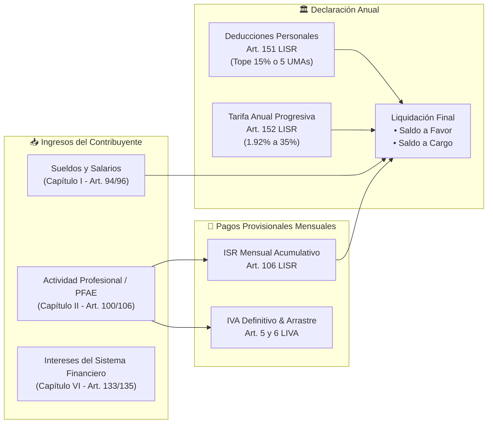
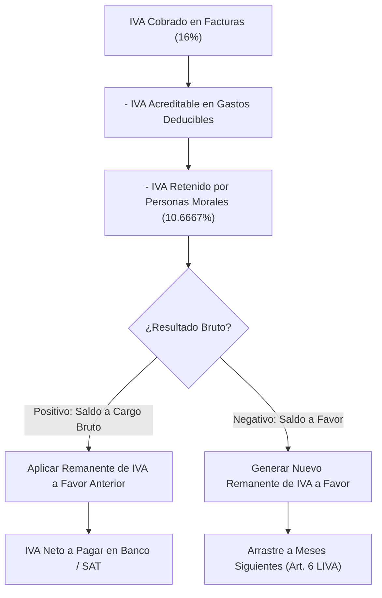

# 🧮 03. Motor Fiscal y Algoritmos LISR/LIVA

> **Modelación matemática, fundamentos legales y algoritmos de cálculo para Pagos Provisionales de ISR e IVA, Nómina y Declaración Anual.**

---

## 1. Fundamentos Legales de la Legislación Fiscal Mexicana

El motor fiscal implementado en [`backend/app/cfdis/engine.py`](file:///home/kubrick/www/declara/backend/app/cfdis/engine.py) opera bajo los siguientes artículos de la **Ley del Impuesto sobre la Renta (LISR)** y la **Ley del Impuesto al Valor Agregado (LIVA)**:



---

## 2. Pagos Provisionales de ISR (Art. 106 LISR)

Para las personas físicas con Actividad Empresarial y Profesional (Honorarios), el pago provisional de ISR es **acumulativo mes a mes**:

### Fórmula de Base Gravable Provisional:
$$\text{Base Gravable Acumulada}_m = \max\left(0, \sum_{i=1}^m \text{Ingresos PFAE}_i - \sum_{i=1}^m \text{Gastos Deducibles}_i\right)$$

### Tarifa Mensual Acumulada:
Para obtener el impuesto causado acumulado en el mes $m$, se anualiza la base y se aplica la tarifa del Art. 152 multiplicada por la fracción del periodo $\frac{m}{12}$:
$$\text{ISR Causado Acumulado}_m = \text{TarifaAnual}\left(\text{Base}_m \times \frac{12}{m}\right) \times \frac{m}{12}$$

### ISR Neto a Cargo del Mes $m$:
$$\text{ISR a Pagar}_m = \max\left(0, \text{ISR Causado Acumulado}_m - \sum_{i=1}^{m-1} \text{Pagos Prov Anteriores}_i - \sum_{i=1}^m \text{ISR Retenido}_i\right)$$

---

## 3. IVA Definitivo y Arrastre de Saldos a Favor (Art. 5 y 6 LIVA)

A diferencia del ISR, el IVA es un **impuesto definitivo mensual** que no se acumula anualmente, pero permite el **acreditamiento de remanentes a favor de periodos anteriores**:



---

## 4. Topes en Deducciones Personales (Art. 151 LISR)

Las deducciones personales (honorarios médicos `D01`, gastos dentales `D02`, gastos hospitalarios `D03`, intereses reales hipotecarios `D05`, primas de seguros `D07`, colegiaturas) están sujetas a un **doble límite legal**:

$$\text{Tope Legal} = \min\left(\text{Total Ingresos Anuales} \times 15\%, 5 \times \text{UMA Anual}\right)$$

### Valores de Referencia de 5 UMAs Anuales por Ejercicio:
* **2022:** $178,938.00 MXN
* **2023:** $189,222.00 MXN
* **2024:** $198,031.80 MXN
* **2025:** $209,113.65 MXN
* **2026:** $220,614.90 MXN

---

## 5. Tarifa Progresiva de ISR Anual (Art. 152 LISR)

La tarifa del Art. 152 aplica escalones marginales que van desde el **1.92%** hasta el **35.00%**:

```python
def calcular_isr_tarifa_anual(base_gravable: float) -> float:
    if base_gravable <= 0:
        return 0.0
    for limite_inf, cuota_fija, pct in TARIFA_ISR_ANUAL_2024:
        if base_gravable >= limite_inf:
            excedente = base_gravable - limite_inf
            impuesto_marginal = excedente * (pct / 100.0)
            return round(cuota_fija + impuesto_marginal, 2)
    return 0.0
```

### Liquidación Anual:
$$\text{Impuestos Pagados Totales} = \sum \text{Pagos Provisionales ISR} + \sum \text{ISR Retenido (Nómina + PFAE + Intereses)}$$

* Si $\text{Impuestos Pagados Totales} \ge \text{ISR Anual Causado}$:
  $$\text{Saldo a Favor (Devolución SAT)} = \text{Impuestos Pagados} - \text{ISR Anual Causado}$$
* Si $\text{Impuestos Pagados Totales} < \text{ISR Anual Causado}$:
  $$\text{Saldo a Cargo (A Pagar SAT)} = \text{ISR Anual Causado} - \text{Impuestos Pagados}$$
