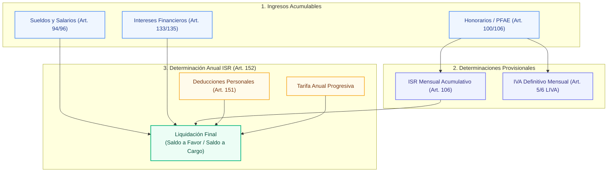
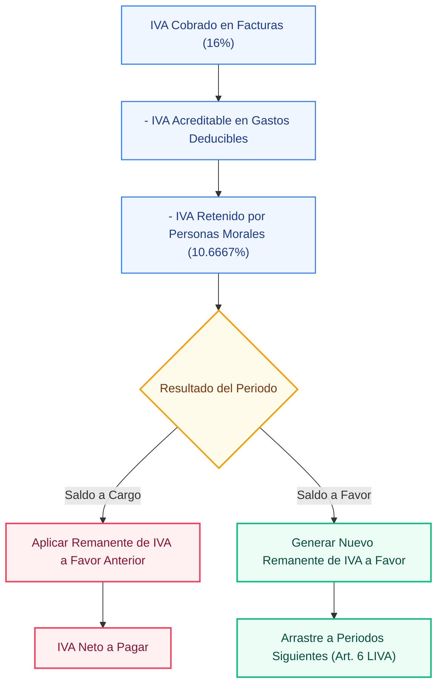

# tribuTACOS — 03. Motor Fiscal y Algoritmos LISR/LIVA

Modelación matemática, fundamentos legales y algoritmos deterministas para pagos provisionales de ISR e IVA, nómina y determinación anual.

---

## 1. Fundamentos Legales y Módulos de Cálculo

El motor fiscal implementado en [`backend/app/cfdis/calculators/`](file:///home/kubrick/www/declara/backend/app/cfdis/calculators/) y coordinado por [`backend/app/cfdis/engine.py`](file:///home/kubrick/www/declara/backend/app/cfdis/engine.py) opera como un conjunto de funciones matemáticas deterministas desacopladas de la persistencia:

* [`tarifas.py`](file:///home/kubrick/www/declara/backend/app/cfdis/calculators/tarifas.py): Cálculo de la tarifa del Art. 152 LISR con desglose de límite inferior, cuota fija, porcentaje excedente e impuesto marginal.
* [`nomina.py`](file:///home/kubrick/www/declara/backend/app/cfdis/calculators/nomina.py): Cálculo de sueldos, desglose de percepciones gravadas y exentas (Art. 93 LISR), deducciones y serie temporal de recibos.
* [`honorarios.py`](file:///home/kubrick/www/declara/backend/app/cfdis/calculators/honorarios.py): Facturación PFAE emitida, serie de 12 meses, concentración por cliente y mezcla de conceptos por clave SAT.
* [`gastos.py`](file:///home/kubrick/www/declara/backend/app/cfdis/calculators/gastos.py): Deducibilidad operativa, matriz mensual de egresos y asignación de rubros SAT.
* [`deducciones.py`](file:///home/kubrick/www/declara/backend/app/cfdis/calculators/deducciones.py): Deducciones personales (Art. 151 LISR), integración de planes de retiro (PPR), gastos médicos y cálculo del doble tope legal.
* [`intereses.py`](file:///home/kubrick/www/declara/backend/app/cfdis/calculators/intereses.py): Intereses nominales, cálculo de interés real y retenciones financieras.
* [`simulador_sat.py`](file:///home/kubrick/www/declara/backend/app/cfdis/calculators/simulador_sat.py): Pre-declaración mensual provisional y determinación anual con desglose paso a paso.

---

## 2. Pagos Provisionales de ISR (Art. 106 LISR)

Para personas físicas con Actividad Empresarial y Profesional, el pago provisional de ISR se calcula de forma acumulativa mes a mes dentro del ejercicio fiscal:

### 2.1 Base Gravable Acumulada:
$$\text{Base Gravable Acumulada}_m = \max\left(0, \sum_{i=1}^m \text{Ingresos PFAE}_i - \sum_{i=1}^m \text{Gastos Deducibles}_i\right)$$

### 2.2 Tarifa Mensual Acumulada:
Para calcular el impuesto causado acumulado al mes $m$, se anualiza la base y se aplica la tarifa del Art. 152 multiplicada por la proporción del periodo $m / 12$:
$$\text{ISR Causado Acumulado}_m = \text{TarifaAnual}\left(\text{Base}_m \times \frac{12}{m}\right) \times \frac{m}{12}$$

### 2.3 ISR Neto a Pagar del Mes:
$$\text{ISR a Pagar}_m = \max\left(0, \text{ISR Causado Acumulado}_m - \sum_{i=1}^{m-1} \text{Pagos Prov Anteriores}_i - \sum_{i=1}^m \text{ISR Retenido}_i\right)$$

---

## 3. IVA Definitivo y Acreditamiento de Saldos a Favor (Art. 5 y 6 LIVA)

A diferencia del ISR, el IVA es un impuesto definitivo de causación mensual que permite el acreditamiento de remanentes a favor generados en periodos anteriores:

---

## 4. Topes de Deducciones Personales (Art. 151 LISR)

Las deducciones personales (honorarios médicos `D01`, gastos dentales `D02`, gastos hospitalarios `D03`, intereses reales hipotecarios `D05`, primas de seguros `D07`, colegiaturas) están sujetas a un límite general:

$$\text{Tope Legal General} = \min(0.15 \times \text{Total Ingresos Anuales}, 5 \times \text{UMA Anual})$$

### 4.1 Excepciones y Reglas Específicas:
* **Planes Personales de Retiro (PPR - Fracc. V):** Cuentan con un límite independiente de hasta el **10% de los ingresos acumulables o 5 UMAs anuales**, adicional al tope general.
* **Seguro de Gastos Médicos Mayores (SGMM - Fracc. VI):** Se computa dentro del límite general sin subtopes específicos.

### 4.2 Valores de 5 UMAs Anuales por Ejercicio:
* **2022:** $178,938.00 MXN
* **2023:** $189,222.00 MXN
* **2024:** $198,031.80 MXN
* **2025:** $209,113.65 MXN
* **2026:** $220,614.90 MXN

---

## 5. Tarifa Progresiva Anual (Art. 152 LISR)

La determinación anual aplica la tarifa progresiva sobre la base gravable:

$$\text{Base Gravable Anual} = \text{Ingresos Acumulables Totales} - \text{Deducciones Personales Aceptadas}$$

$$\text{ISR Causado Anual} = \text{Cuota Fija} + (\text{Base Gravable} - \text{Límite Inferior}) \times \text{Tasa Marginal}$$

$$\text{Resultado Final} = \text{ISR Causado Anual} - \text{Retenciones Nómina} - \text{Retenciones PFAE} - \text{Pagos Provisionales ISR}$$

* Si $\text{Resultado Final} < 0$: **Saldo a Favor** (sujeto a devolución o compensación).
* Si $\text{Resultado Final} > 0$: **Saldo a Cargo** (impuesto a liquidar ante el SAT).
