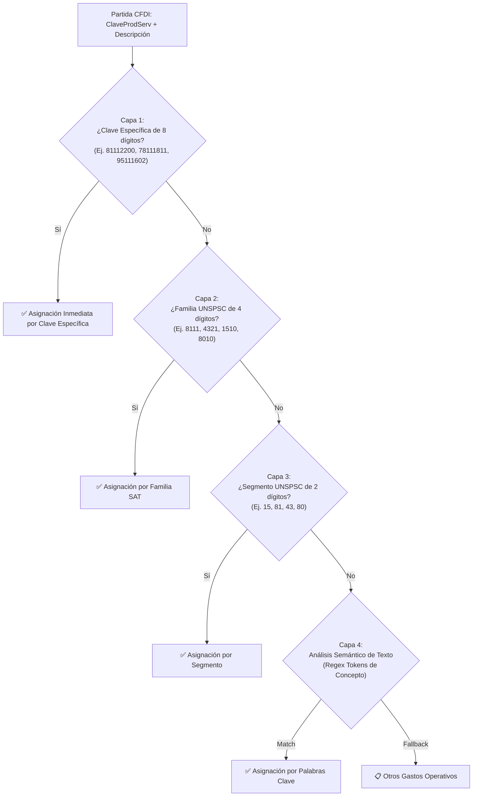

# 📚 04. Catálogos SAT y Taxonomía de 8 Rubros Ágiles

> **Estructura jerárquica UNSPSC, sembrado masivo de 52,551 claves y algoritmo de resolución en 4 capas.**

---

## 1. Los 8 Rubros SAT Esenciales

Para eliminar el ruido de categorías dispersas y artículos individuales (*"Arnés pasacables"*, *"Aspiradoras"*, etc.), el sistema agrupa todos los egresos en **8 rubros maestros ágiles** optimizados para profesionistas y PFAE:

| # | Rubro Maestro | ID Interno | Icono | Color | Tipo Contable | Conceptos y Claves Incluidas |
| :---: | :--- | :---: | :---: | :---: | :---: | :--- |
| **1** | **Software, Nube e Infraestructura TI** | `software_ti` | 💻 | `#8b5cf6` | Operativo | AWS, Google Cloud, Azure, SaaS, GitHub, Hosting, Dominios, Software (Segmento 81, Familias 8111, 4323). |
| **2** | **Equipo de Cómputo y Electrónica** | `computo_hardware` | 🖥️ | `#0ea5e9` | Inversión | Laptops, Monitores, Periféricos, Componentes TI (Segmento 43, 32, Familias 4321, 4322). |
| **3** | **Servicios Profesionales y Asesoría** | `servicios_profesionales` | 💼 | `#059669` | Operativo | Honorarios contables, asesoría fiscal/legal, consultoría (Segmento 80, Familias 8010, 8012, 8411). |
| **4** | **Renta de Vehículos y Autos** | `renta_vehiculos` | 🚗 | `#3b82f6` | Operativo | Renta de automóviles utilitarios para transporte y trabajo (Clave 78111811). |
| **5** | **Plataformas de Movilidad y Taxis** | `movilidad_taxis` | 🚖 | `#eab308` | Viáticos | Uber, Didi, Cabify, Taxis de ciudad (Claves 78111808, 78111804). |
| **6** | **Combustibles y Lubricantes** | `combustibles` | ⛽ | `#f97316` | Operativo | Gasolina Magna, Premium, Diésel, Aceites (Segmento 15, Familia 1510). |
| **7** | **Seguros y Fianzas** | `seguros_polizas` | 🛡️ | `#0d9488` | Operativo | Pólizas vehiculares, coberturas de protección y fianzas (Familia 8413, Clave 80161505). |
| **8** | **Viáticos, Viajes y Peajes** | `viaticos_viajes` | ✈️ | `#64748b` | Viáticos | Casetas/Peajes (95111602), Vuelos (78111502), Hospedaje (90111500) y Restaurantes de viaje (90101500). |
| **+** | **Otros Gastos Operativos** | `otros_operativos` | 📋 | `#475569` | Operativo | Insumos de cafetería, papelería, envíos y gastos operativos generales. |

---

## 2. Algoritmo de Resolución en 4 Capas

El motor implementado en [`backend/app/catalogos/sat_catalogo.py`](file:///home/kubrick/www/declara/backend/app/catalogos/sat_catalogo.py) resuelve la clasificación de cualquier partida de factura mediante una cascada determinista de 4 niveles:



---

## 3. Sembrado y Carga Masiva (`seed_catalogo.py`)

La base de datos se auto-puebla al iniciar con las **52,551 claves oficiales** del catálogo `c_ClaveProdServ` del SAT mediante el sembrador de alto rendimiento:

```bash
# Ejecución manual del sembrado
python3 backend/seed_catalogo.py
```

* **Tiempo de Inserción:** 3.2 segundos (usando `executemany` en SQLite).
* **Consistencia:** Verificación automática de claves duplicadas e indexación B-Tree en la columna `clave`.
