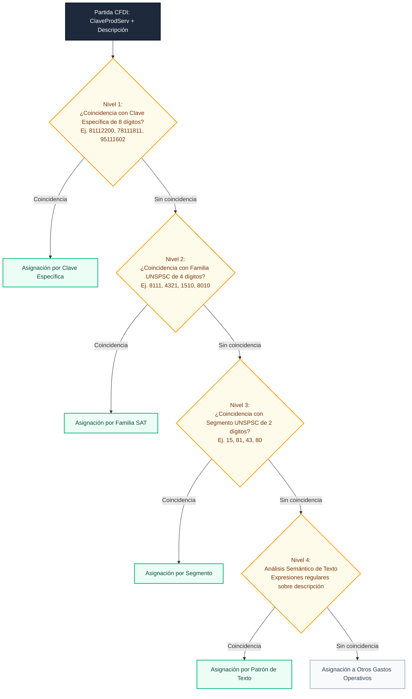

# tribuTACOS — 04. Catálogos SAT y Taxonomía de Rubros Operativos

Estructura de clasificación basada en el catálogo UNSPSC del SAT, esquema de agregación en 8 rubros operativos y algoritmo de resolución jerárquica en 4 niveles.

---

## 1. Clasificación en 8 Rubros Operativos

El catálogo oficial de productos y servicios del SAT (`c_ClaveProdServ`) contiene más de 52,000 registros que describen bienes y servicios individuales. Con el fin de estructurar la información contable y facilitar el análisis de deducibilidad para personas físicas con actividad empresarial y profesional, el sistema agrega todas las partidas de gasto en 8 rubros operativos estandarizados:

| ID | Rubro Operativo | Identificador Interno | Naturaleza Contable | Claves y Familias UNSPSC Incluidas |
| :---: | :--- | :---: | :---: | :--- |
| **01** | **Software, Nube e Infraestructura TI** | `software_ti` | Gasto Operativo | Servicios en la nube (AWS, GCP, Azure), licencias de software, hosting, dominios y desarrollo de sistemas (Segmento 81, Familias 8111, 4323). |
| **02** | **Equipo de Cómputo y Electrónica** | `computo_hardware` | Inversión / Activo Fijo | Computadoras, servidores, monitores, componentes electrónicos y periféricos (Segmentos 32, 43, Familias 4321, 4322). |
| **03** | **Servicios Profesionales y Asesoría** | `servicios_profesionales` | Gasto Operativo | Honorarios contables, asesoría legal, consultoría de gestión y servicios profesionales independientes (Segmento 80, Familias 8010, 8012, 8411). |
| **04** | **Renta de Vehículos y Transporte** | `renta_vehiculos` | Gasto Operativo | Arrendamiento de vehículos automotores utilitarios para actividades de trabajo (Clave 78111811). |
| **05** | **Plataformas de Movilidad y Taxis** | `movilidad_taxis` | Viáticos / Transporte | Servicios de transporte terrestre por aplicaciones digitales y taxis concesionados (Claves 78111804, 78111808). |
| **06** | **Combustibles y Lubricantes** | `combustibles` | Gasto Operativo | Gasolinas, diésel y lubricantes automotrices (Segmento 15, Familia 1510). |
| **07** | **Seguros y Coberturas** | `seguros_polizas` | Gasto Operativo | Pólizas de seguros empresariales, coberturas de responsabilidad civil y fianzas (Familia 8413, Clave 80161505). |
| **08** | **Viáticos, Viajes y Peajes** | `viaticos_viajes` | Viáticos | Peajes de autopistas (95111602), pasajes aéreos (78111502), hospedaje temporal (90111500) y consumos en viajes (90101500). |
| **09** | **Otros Gastos Operativos** | `otros_operativos` | Gasto General | Insumos de oficina, papelería, paquetería, servicios generales y gastos no clasificados en los rubros anteriores. |

---

## 2. Algoritmo de Resolución Jerárquica en 4 Niveles

El módulo de clasificación [`backend/app/catalogos/sat_catalogo.py`](file:///home/kubrick/www/declara/backend/app/catalogos/sat_catalogo.py) evalúa cada concepto de factura mediante una cascada determinista de cuatro niveles de precisión:



### 2.1 Niveles de Resolución:
1. **Nivel 1 (Clave Específica):** Evaluación exacta del código UNSPSC de 8 dígitos contra la tabla de excepciones y reglas directas.
2. **Nivel 2 (Familia UNSPSC):** Evaluación de los primeros 4 dígitos del código para agrupar partidas dentro de familias funcionales (ej. `8111` para servicios de software).
3. **Nivel 3 (Segmento UNSPSC):** Evaluación de los primeros 2 dígitos del código para clasificación por sector industrial (ej. `15` para combustibles).
4. **Nivel 4 (Análisis Semántico):** Evaluación de cadenas de texto en el campo `descripcion` mediante patrones de expresiones regulares precompilados, permitiendo clasificar conceptos con claves genéricas (`01010101`).

---

## 3. Sembrado y Persistencia del Catálogo SAT

El catálogo de 52,547 claves oficiales del SAT se almacena de forma relacional en la tabla `catalog_sat_keys` de la base de datos:

```sql
CREATE TABLE catalog_sat_keys (
    id VARCHAR PRIMARY KEY,
    clave VARCHAR(8) UNIQUE NOT NULL,
    descripcion VARCHAR NOT NULL,
    categoria_id VARCHAR,
    tipo VARCHAR
);

CREATE INDEX ix_catalog_sat_keys_clave ON catalog_sat_keys (clave);
```

### Comandos de Poblado

```bash
# Inicialización y sembrado de la base de datos completa
make db-empty

# O mediante la interfaz de línea de comandos de Python
PYTHONPATH=backend python3 -m app.cli seed-sat
```
