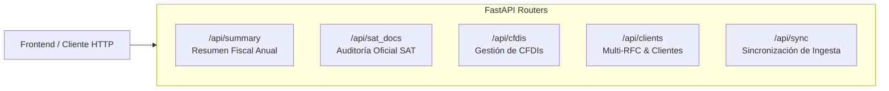

# 🌐 05. Especificación de API REST FastAPI

> **Contratos de endpoints, parámetros de consulta, estructuras de respuesta JSON y códigos de estado.**

---

## 1. Mapeo de Routers y Endpoints

La API opera bajo el prefijo `/api` expuesta en el puerto `8010`:



---

## 2. Detalle de Endpoints Principales

### `GET /api/summary`
Calcula el estado fiscal integral del ejercicio solicitado.

* **Parámetros de Consulta:**
  * `year` *(string, requerido)*: Ejercicio fiscal (ej. `2024`).
  * `client_id` *(string, opcional)*: Identificador del cliente (default: `default`).
* **Respuesta Exitosa (`200 OK`):**
```json
{
  "client": {
    "id": "default",
    "name": "CARLOS HERNANDEZ SANCHEZ",
    "rfc": "HECA850101XYZ",
    "email": "carlos.hernandez@tributacos.mx"
  },
  "year": "2024",
  "anios_disponibles": ["2021", "2022", "2023", "2024", "2025", "2026"],
  "sections": {
    "sueldos": {
      "total_ingresos": 500000.00,
      "gravado": 500000.00,
      "exento": 0.00,
      "isr_retenido": 87727.53,
      "detalle": [
        {
          "nombre": "SOLUCIONES TECNOLÓGICAS DE MÉXICO S.A. DE C.V.",
          "rfc": "STM180415AA1",
          "recibos": []
        }
      ]
    },
    "honorarios": {
      "ingresos": 330000.00,
      "isr_retenido": 33000.00,
      "iva_trasladado": 52800.00,
      "detalle": []
    },
    "reporte_gastos": [
      {
        "uuid": "...",
        "emisor": "...",
        "subtotal": 1500.00,
        "iva": 240.00,
        "total": 1740.00,
        "categoria_gasto": {
          "id": "software_ti",
          "nombre": "Software, Nube e Infraestructura TI",
          "icono": "💻",
          "color": "#8b5cf6"
        }
      }
    ],
    "deducciones_personales": {
      "total": 11275.98,
      "deducible_efectivo": 11275.98,
      "tope_legal": 198031.80
    }
  },
  "simulacion_provisional_mensual": [
    {
      "mes_numero": 1,
      "mes_nombre": "Enero",
      "ingresos_periodo": 0.00,
      "deducciones_bancarizadas_periodo": 26005.62,
      "base_gravable_provisional": 0.00,
      "isr_a_cargo_mes": 0.00,
      "iva_a_cargo_mes": 0.00,
      "total_a_pagar_mes": 0.00
    }
  ],
  "simulacion_anual": {
    "ingresos_acumulables_totales": 653695.61,
    "deducciones_personales_efectivas": 11275.98,
    "base_gravable_anual": 642419.63,
    "isr_anual_causado": 126329.82,
    "total_retenciones_anuales": 120727.53,
    "total_pagos_provisionales_calculados": 5602.29,
    "saldo_a_favor_proyectado": 0.00,
    "saldo_a_cargo_proyectado": 0.00
  }
}
```

---

### `GET /api/sat_docs/summary`
Devuelve la matriz de conciliación oficial entre las declaraciones y pagos del SAT frente a los XMLs.

* **Parámetros de Consulta:**
  * `year` *(string, requerido)*: Ejercicio fiscal (ej. `2024`).
* **Respuesta Exitosa (`200 OK`):**
```json
{
  "year": "2024",
  "anios_con_anual_disponible": ["2022", "2023", "2024", "2025", "2026"],
  "declaracion_anual_oficial": {
    "tipo_declaracion": "Normal",
    "num_operacion": "2024043000000000",
    "fecha_presentacion": "2025-04-28",
    "ingresos_acumulables_totales": 653695.61,
    "deducciones_personales": 11275.98,
    "base_gravable": 642419.63,
    "isr_tarifa": 126329.82,
    "saldo_a_favor": 0.00,
    "saldo_a_cargo": 0.00
  },
  "matriz_pagos_provisionales": [
    {
      "mes_numero": 1,
      "mes_nombre": "Enero",
      "estatus": "Presentada",
      "isr_ingresos_mes": 0.00,
      "xml_ingresos_facturados": 0.00,
      "isr_a_cargo_sat": 0.00,
      "iva_a_cargo_sat": 0.00,
      "total_pago_efectivo": 0.00,
      "tiene_acuse_pago": false
    }
  ]
}
```
