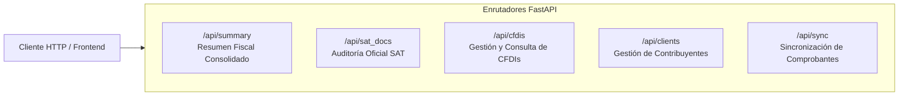

# tribuTACOS — 05. Especificación de API REST FastAPI

Contratos de servicios REST, parámetros de consulta, esquemas de respuesta JSON y códigos de estado HTTP.

---

## 1. Mapeo de Enrutadores y Servicios

La API está estructurada bajo el prefijo `/api` y expuesta por defecto en el puerto `8010`:



---

## 2. Especificación de Endpoints Principales

### 2.1 Resumen Fiscal Consolidado

#### `GET /api/summary`
Calcula el estado fiscal integral del ejercicio solicitado, consolidando ingresos de nómina, actividad profesional, gastos deducibles, deducciones personales y simulaciones anuales y mensuales.

* **Parámetros de Consulta:**
  * `year` *(string, requerido)*: Ejercicio fiscal (ej. `2024`).
  * `client_id` *(string, opcional)*: Identificador del cliente (por defecto: `default`).

* **Respuesta Exitosa (`200 OK`):**
```json
{
  "client": {
    "id": "default",
    "name": "Sheila Shellaquiles Ortega",
    "rfc": "SHLL250825XYZ",
    "email": "tributacos@shellaquiles.org"
  },
  "year": "2024",
  "anios_disponibles": ["2021", "2022", "2023", "2024", "2025", "2026"],
  "sections": {
    "sueldos": {
      "total_ingresos": 402000.00,
      "gravado": 373150.00,
      "exento": 28850.00,
      "isr_retenido": 55128.84,
      "detalle": []
    },
    "honorarios": {
      "ingresos": 186200.00,
      "isr_retenido": 18620.00,
      "iva_trasladado": 29792.00,
      "detalle": []
    },
    "reporte_gastos": [
      {
        "uuid": "4A1B2C3D-E4F5-6789-ABCD-EF0123456789",
        "emisor": "PROVEEDOR EJEMPLO SA DE CV",
        "subtotal": 1500.00,
        "iva": 240.00,
        "total": 1740.00,
        "categoria_gasto": {
          "id": "software_ti",
          "nombre": "Software, Nube e Infraestructura TI"
        }
      }
    ],
    "deducciones_personales": {
      "total": 71100.00,
      "deducible_efectivo": 71100.00,
      "tope_legal": 198031.80
    }
  },
  "simulacion_provisional_mensual": [
    {
      "mes_numero": 1,
      "mes_nombre": "Enero",
      "ingresos_periodo": 12300.00,
      "deducciones_bancarizadas_periodo": 5120.00,
      "base_gravable_provisional": 7180.00,
      "isr_a_cargo_mes": 0.00,
      "iva_a_cargo_mes": 0.00,
      "total_a_pagar_mes": 0.00
    }
  ],
  "simulacion_anual": {
    "ingresos_acumulables_totales": 494157.83,
    "deducciones_personales_efectivas": 71100.00,
    "base_gravable": 423057.83,
    "isr_tarifa": 71390.73,
    "retenciones_totales": 73748.84,
    "saldo_a_favor": 2358.11,
    "saldo_a_cargo": 0.00
  }
}
```

---

### 2.2 Auditoría y Documentos Oficiales SAT

#### `GET /api/sat_docs/summary`
Retiene las declaraciones anuales oficiales, matriz de 12 pagos provisionales y conciliaciones bancarias registradas para el ejercicio.

* **Parámetros de Consulta:**
  * `year` *(string, requerido)*: Ejercicio fiscal (ej. `2024`).
  * `client_id` *(string, opcional)*: Identificador del cliente.

* **Respuesta Exitosa (`200 OK`):**
```json
{
  "ejercicio": "2024",
  "declaracion_anual": {
    "num_operacion": "240500190419",
    "fecha_presentacion": "25/04/2025 17:30",
    "tipo_declaracion": "Normal",
    "ingresos_acumulables": 494157.83,
    "deducciones_personales": 71100.00,
    "base_gravable": 423057.83,
    "isr_tarifa": 71390.73,
    "saldo_a_favor": 2358.11,
    "saldo_a_cargo": 0.00,
    "clabe": "012180000000000000",
    "banco": "INSTITUCION BANCARIA MULTIPLE S.A."
  },
  "pagos_provisionales": [
    {
      "mes_numero": 1,
      "mes_nombre": "Enero",
      "num_operacion": "2401123456",
      "isr_a_cargo": 0.00,
      "iva_a_cargo": 0.00,
      "total_pagado": 0.00,
      "tiene_acuse": false
    }
  ]
}
```

---

### 2.3 Gestión de Contribuyentes

#### `GET /api/clients`
Lista los clientes o contribuyentes registrados en el sistema.

* **Respuesta Exitosa (`200 OK`):**
```json
[
  {
    "id": "default",
    "name": "Sheila Shellaquiles Ortega",
    "rfc": "SHLL250825XYZ",
    "email": "tributacos@shellaquiles.org",
    "created_at": "2026-08-25T12:00:00"
  }
]
```

---

## 3. Códigos de Estado HTTP

| Código | Significado | Descripción |
| :---: | :--- | :--- |
| **`200 OK`** | Petición Exitosa | La solicitud se procesó correctamente y devuelve los datos requeridos. |
| **`400 Bad Request`** | Parámetros Inválidos | El ejercicio fiscal o los parámetros enviados no cumplen con el formato esperado. |
| **`404 Not Found`** | Recurso No Encontrado | No se encontraron datos para el ejercicio o cliente especificado. |
| **`500 Internal Error`** | Error de Servidor | Error no controlado durante el procesamiento contable o acceso a la base de datos. |
