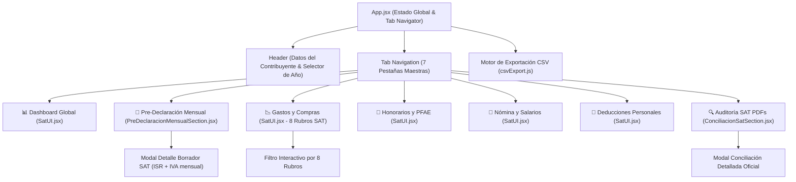

# 💻 06. Frontend, UI/UX y Componentes React

> **Arquitectura cliente, árbol de componentes, sistema de diseño en Vanilla CSS, gestión de estado y exportación de datos.**

---

## 1. Arquitectura de Componentes en React

El frontend está estructurado como una Single Page Application (SPA) con renderizado declarativo basado en componentes modulares:



---

## 2. Sistema de Diseño y Tokens CSS (`index.css`)

El diseño utiliza CSS moderno con **CSS Custom Properties (Variables)** para garantizar contrastes óptimos, legibilidad contable y micro-interacciones suaves:

```css
:root {
  --primary: #3b82f6;
  --primary-dark: #1d4ed8;
  --success: #10b981;
  --success-bg: #f0fdf4;
  --danger: #dc2626;
  --danger-bg: #fff1f2;
  --warning: #f59e0b;
  --neutral-900: #0f172a;
  --neutral-600: #475569;
  --neutral-100: #f1f5f9;
  --card-radius: 16px;
  --card-shadow: 0 4px 20px -2px rgba(0, 0, 0, 0.05);
}
```

---

## 3. Matriz de Pre-Declaración Mensual (`PreDeclaracionMensualSection.jsx`)

Este componente renderiza la tabla interactiva de los 12 meses con lógica de semaforización:
* **🔴 Mes con Déficit / Pérdida Operativa (Gastos > Ingresos):**
  * Fondo rosado suave (`#fff1f2`).
  * Indicador `🔴 Mes`.
  * Badge `Déficit: -$X,XXX.XX`.
  * Estatus `⚠️ Saldo a Favor / Sin Pago`.
* **🟢 Mes con Superávit / Utilidad:**
  * Fondo blanco con borde verde.
  * Indicador `🟢 Mes`.
  * Badge `+$XX,XXX.XX`.
  * Si genera pago al SAT: `🔴 Pagar: $X,XXX.XX`.

---

## 4. Motor de Exportación CSV / Excel (`csvExport.js`)

El archivo [`frontend/src/csvExport.js`](file:///home/kubrick/www/declara/frontend/src/csvExport.js) genera archivos CSV compatibles con **Microsoft Excel**, **Apple Numbers** y **Google Sheets** incorporando el `Byte Order Mark (BOM)` UTF-8 (`\uFEFF`):

### Tipos de Reportes Exportables:
1. **Reporte Maestro de Egresos:** UUID, Fecha, RFC Emisor, Razón Social, Clave SAT, Descripción de Concepto, Rubro Maestro, Subtotal, IVA, Total y Estado Deducible.
2. **Matriz de Pagos Provisionales (12 Meses):** Ingresos PFAE, Gastos Deducibles, Utilidad/Pérdida, ISR Retenido, ISR Causado, ISR a Pagar, IVA Cobrado, IVA Acreditable e IVA a Pagar.
3. **Auditoría de Sueldos y Nómina:** Empleador, Quincenas pagadas, Sueldo Bruto, ISR Retenido e IMSS.
