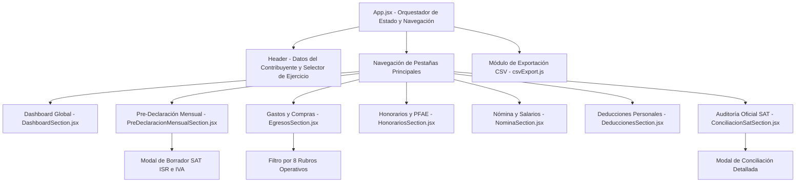

# tribuTACOS — 06. Frontend, UI/UX y Componentes Next.js

Arquitectura cliente, árbol de componentes, sistema de diseño con Tailwind CSS, paletas semánticas autodescriptivas, gestión de estado y exportación de datos.

---

## 1. Arquitectura de Componentes en Next.js

La capa de presentación está implementada en **Next.js 15 (App Router)** con **React 19**, estructurada mediante componentes desacoplados y modulares:

---

## 2. Sistema de Diseño y Paleta Semántica Autodescriptiva

El diseño visual está implementado con **Tailwind CSS**, estructurado mediante clases utilitarias y variables semánticas en `globals.css` e `index.css`. Se asocia una identidad cromática de alto contraste y formalidad a cada régimen fiscal y estado tributario:

| Concepto Fiscal | Tonalidad | Clases Tailwind Principales | Significado Contable |
| :--- | :--- | :--- | :--- |
| **Sueldos y Salarios** | Azul cobalto | `bg-blue-50`, `border-blue-500`, `text-blue-700` | Ingresos estables por relación laboral subordinada. |
| **Honorarios PFAE** | Índigo / Violeta | `bg-indigo-50`, `border-indigo-500`, `text-indigo-700` | Servicios profesionales y actividad empresarial. |
| **Gastos Deducibles** | Esmeralda / Verde | `bg-emerald-50`, `border-emerald-500`, `text-emerald-700` | Egresos operativos que reducen la base gravable. |
| **Gastos No Deducibles** | Gris pizarra | `bg-slate-50`, `border-slate-300`, `text-slate-500` | Egresos sin requisitos fiscales o de uso personal. |
| **Deducciones Personales** | Ámbar / Dorado | `bg-amber-50`, `border-amber-500`, `text-amber-700` | Gastos médicos, lentes, SGMM y aportaciones al retiro (PPR). |
| **Saldo a Favor (Devolución)** | Verde bosque | `bg-green-100`, `border-green-600`, `text-green-800` | Devolución oficial determinada a favor del contribuyente. |
| **Saldo a Cargo (Pago)** | Rojo coral | `bg-rose-50`, `border-rose-500`, `text-rose-700` | Impuesto pendiente de liquidar ante el SAT. |

---

## 3. Matriz de Pre-Declaración Mensual (`PreDeclaracionMensualSection.jsx`)

Este componente presenta la tabla analítica de los 12 meses del ejercicio con estados visuales claros:
* **Mes con Pérdida Operativa o Sin Pago:**
  * Fondo tenue (`bg-rose-50`).
  * Indicador de balance negativo `Déficit: -$X,XXX.XX`.
  * Estatus de resultado: `Sin Pago / Saldo a Favor`.
* **Mes con Superávit o Utilidad:**
  * Fondo blanco con borde esmeralda (`border-emerald-500`).
  * Indicador de utilidad `+$XX,XXX.XX`.
  * Monto a pagar al SAT: `Pagar: $X,XXX.XX`.

---

## 4. Motor de Exportación de Datos (`csvExport.js`)

El módulo [`frontend/src/csvExport.js`](file:///home/kubrick/www/declara/frontend/src/csvExport.js) genera archivos CSV estructurados con el **Byte Order Mark (BOM) UTF-8 (`\uFEFF`)**, garantizando compatibilidad inmediata con **Microsoft Excel**, **Apple Numbers** y **Google Sheets** sin problemas de codificación de caracteres en español.

### Tipos de Reportes Disponibles:
1. **Reporte Maestro de Egresos:** UUID, Fecha, RFC Emisor, Razón Social, Clave SAT, Descripción de Concepto, Rubro Operativo, Subtotal, IVA, Total y Estado de Deducibilidad.
2. **Matriz de Pagos Provisionales (12 Meses):** Ingresos PFAE, Gastos Deducibles, Utilidad o Pérdida, ISR Retenido, ISR Causado, ISR a Pagar, IVA Cobrado, IVA Acreditable e IVA a Pagar.
3. **Auditoría de Sueldos y Nómina:** Empleador, Quincenas pagadas, Sueldo Bruto, Percepciones Exentas, ISR Retenido y Cuotas IMSS.
4. **Resumen de Deducciones Personales:** Categoría, Prestador de servicio, RFC, Importe y aplicabilidad al límite legal del Art. 151 LISR.
