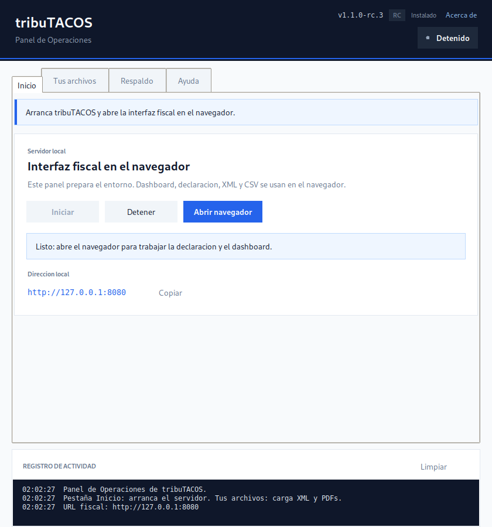
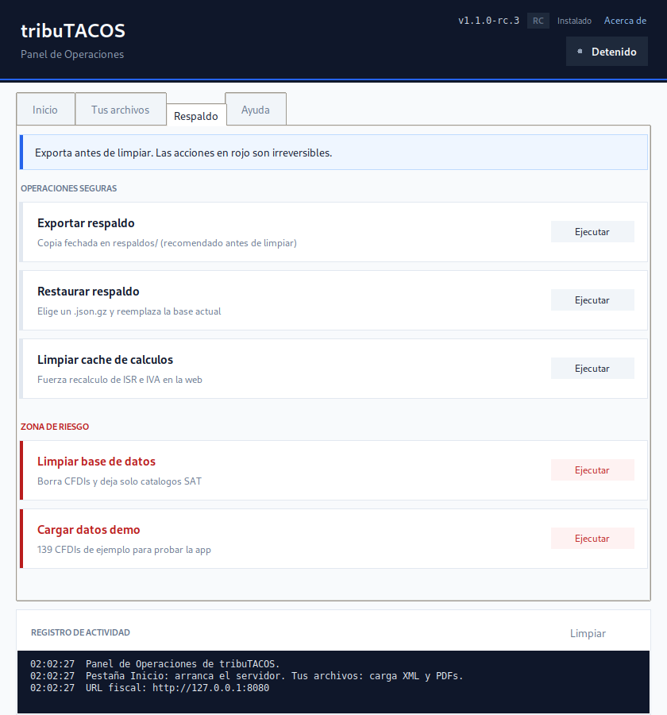
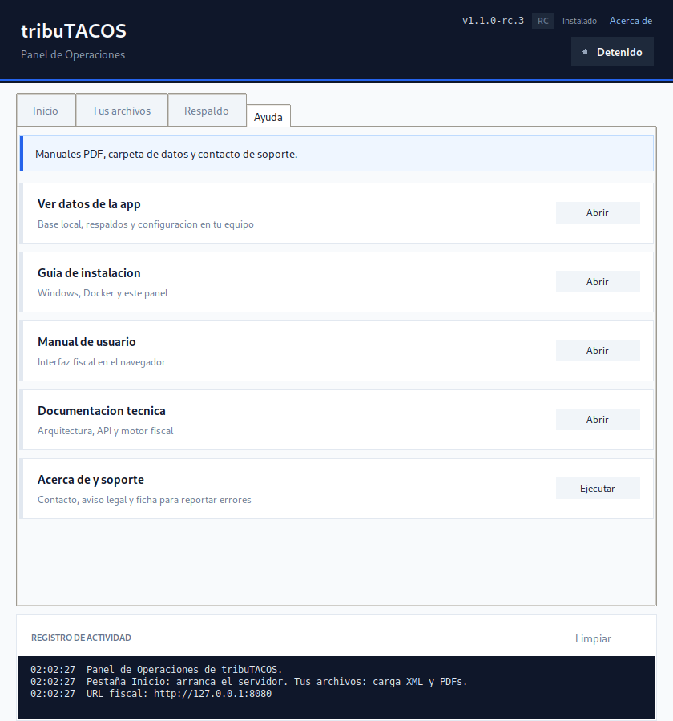

# tribuTACOS — Guía de instalación para usuario final

[](#)

> **Versión de Referencia:** Esta guía corresponde a **tribuTACOS v1.1.0 STABLE**.

Esta guía es para contadores, personas físicas y usuarios que **no quieren usar la terminal**.

Hay tres caminos. Elige uno:

| Camino | Requisitos | Mejor para |
| :--- | :--- | :--- |
| **Instalador Windows (.exe)** | Windows 10/11 | Uso diario sin Docker |
| **Docker Desktop** | Docker Desktop | Cualquier sistema, o si el .exe no esta listo |
| **Panel de Operaciones + Python** | Python 3.11+ | Quien ya tiene Python y no quiere Docker |

---

## 1. Instalador Windows (cuando exista en GitHub Releases)

1. Descarga `TributacosSetup-X.Y.Z.exe` (por ejemplo `TributacosSetup-1.1.0-rc.1.exe`) desde [Releases](https://github.com/shellaquiles/tributacos/releases)
2. Instala con las opciones por defecto
3. En el escritorio:
   - **tribuTACOS** — abre la aplicacion en el navegador (`http://127.0.0.1:8080`). Un segundo clic no duplica el servidor: reabre el navegador.
   - **Operaciones tribuTACOS** — Panel de Operaciones (iniciar/detener, PDFs SAT, respaldos, carpetas)
4. Los datos quedan en `%APPDATA%\tributacos\` (no se borra al actualizar)

La **interfaz fiscal** (dashboard, subir XML, CSV) es siempre el navegador. El panel solo cubre lo que no esta en la web.

---

## 2. Panel de Operaciones (con Python)

1. Doble clic en **`Centro-de-Control-Tributacos.pyw`** (el Panel de Operaciones; `make gui` hace lo mismo)
2. <kbd>Verificar requisitos</kbd> (solo en modo desarrollo, pestaña Sistema)
3. <kbd>Instalar dependencias (primera vez)</kbd> (solo la primera vez, modo desarrollo)
4. <kbd>Iniciar tribuTACOS</kbd> — se abre el navegador

La **interfaz fiscal** (dashboard, subir XML, CSV) es siempre el navegador. El panel cubre arranque, carpetas locales, PDFs del SAT, respaldos y utilidades.

### Pestaña Inicio



- <kbd>Iniciar tribuTACOS</kbd> / <kbd>Detener tribuTACOS</kbd>
- <kbd>Abrir declaracion en el navegador</kbd>
- Estado en vivo del servidor y registro con hora

### Pestaña Tus archivos


1. Abre la carpeta que corresponda (<kbd>Facturas que te emitieron</kbd>, <kbd>Facturas que tu emitiste</kbd>, <kbd>PDFs generados por el SAT</kbd>) y pega tus archivos.
2. <kbd>Procesar facturas XML</kbd> — incorpora los `.xml` de tus carpetas locales.
3. <kbd>Procesar PDFs descargados</kbd> — extrae cifras de PDFs que ya pegaste (sin conexion al portal del SAT).

> [!NOTE]
> tribuTACOS **no se conecta al SAT** ni descarga comprobantes en linea. Solo procesa archivos que tu ya descargaste en tu computadora.

### Pestaña Respaldo



- <kbd>Exportar respaldo</kbd> — copia fechada en `respaldos/` (recomendado antes de limpiar)
- <kbd>Restaurar respaldo</kbd> — elige un `.json.gz` y reemplaza la base actual
- <kbd>Limpiar cache de calculos</kbd> / <kbd>Limpiar base de datos</kbd> (zona de riesgo)
- <kbd>Cargar datos demo</kbd> (modo desarrollo)

### Pestaña Ayuda



- <kbd>Guia de instalacion</kbd>, <kbd>Manual de usuario</kbd>, <kbd>Documentacion tecnica</kbd> (PDF)
- <kbd>Acerca de y soporte</kbd> — contacto, aviso legal y ficha tecnica para reportar errores

---

## 3. Docker Desktop (sin Python ni Node)

### Una sola vez

1. Instala [Docker Desktop](https://www.docker.com/products/docker-desktop/)
2. Abre Docker Desktop y espera a que diga **Running**

### Cada dia

1. Doble clic en `Iniciar-Tributacos.bat` (Windows)
   - macOS: `scripts/macos/iniciar-docker.command`
   - Linux: `scripts/linux/iniciar-docker.sh`
2. Navegador: **http://localhost:3000**
3. Para detener: `Detener-Tributacos.bat`

Si descargaste el ZIP de Release (`tributacos-docker-vX.Y.Z.zip`), usa el `docker-compose.yml` incluido (imagenes de GHCR, sin compilar).

Datos Docker: volumen `tributacos-data`.

---

## Si falta una herramienta

| Situacion | Que hacer |
| :--- | :--- |
| No tienes Docker | El `.bat` abre la pagina de descarga de Docker Desktop |
| Docker instalado pero apagado | Abre Docker Desktop y reintenta |
| Quieres evitar Docker y el .exe | Python 3.11+ y el Panel de Operaciones, o `python scripts/tributacos.py standalone` |

---

## Modo desarrollador (terminal)

`make <comando>` y `python scripts/tributacos.py <comando>` son equivalentes.

```powershell
make doctor
make setup
make dev
# o un solo puerto:
make standalone
# Docker (igual que Iniciar-Tributacos.bat):
make docker-up
```

---

## Preguntas frecuentes

**¿Necesito internet?**  
La primera vez si (instalador, Docker o dependencias). El procesamiento de CFDIs es local.

**¿Mis datos salen de mi computadora?**  
No.

**¿macOS y Linux?**  
Hoy: Docker o `python scripts/tributacos.py`. Instaladores nativos (.dmg / AppImage) vienen despues del .exe de Windows.

**¿Si abro el .exe dos veces?**  
No se duplica. El segundo clic reabre el navegador en `http://127.0.0.1:8080`.

**¿Diferencia entre Sincronizar en la web y Procesar facturas XML en el panel?**  
La web sincroniza con la aplicacion ya abierta. El panel procesa las carpetas locales aunque no tengas el navegador abierto.
