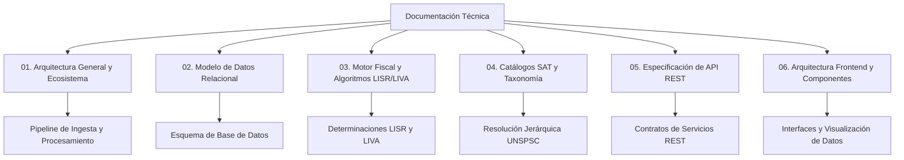

# tribuTACOS — Documentación Técnica

Documentación técnica oficial de la arquitectura, modelo de datos, algoritmos fiscales y especificaciones de API de la plataforma tribuTACOS.

---

## Índice General

El sistema se documenta a través de los siguientes módulos técnicos:



---

## Módulos de Documentación

| Módulo | Documento | Alcance y Contenido |
| :--- | :--- | :--- |
| **01** | [01. Arquitectura General](01_arquitectura_general.md) | Arquitectura desacoplada, pipeline de ingesta de comprobantes y flujo de datos. |
| **02** | [02. Modelo de Datos Relacional](02_modelo_de_datos.md) | Diagramas entidad-relación, esquemas relacionales, indexación y almacenamiento de caché. |
| **03** | [03. Motor Fiscal y Algoritmos](03_motor_fiscal_algoritmos.md) | Fundamentos matemáticos y legales: Art. 96, 106, 151 y 152 de la LISR, y Art. 5 y 6 de la LIVA. |
| **04** | [04. Catálogos SAT y Taxonomía](04_catalogos_sat_taxonomia.md) | Clasificación de claves UNSPSC del SAT y algoritmo de resolución en 4 niveles. |
| **05** | [05. Especificación de API REST](05_api_endpoints.md) | Contratos OpenAPI, esquemas de entrada/salida y códigos de respuesta HTTP. |
| **06** | [06. Frontend y Componentes](06_frontend_ux_componentes.md) | Arquitectura cliente en Next.js 15, sistema de diseño semántico y exportación de datos. |
| **Anexos** | [Documentación Funcional](funcional.md) / [Resumen Técnico](tecnico.md) | Especificaciones funcionales y resumen ejecutivo de despliegue. |

---

## Ejecución del Entorno de Desarrollo

### Requisitos Previos
* Python 3.11 o superior
* Node.js 18 o superior
* GNU Make

### Comandos de Inicialización

```bash
# Inicialización completa (instalación de dependencias y base de datos con datos de prueba)
make setup

# Ejecución de servidores de desarrollo (Backend :8010 y Frontend :3000)
make dev

# Ejecución de suite de pruebas automatizadas
make test
```

### Servicios Standalone

```bash
# Backend FastAPI (Puerto 8010)
cd backend && source venv/bin/activate && uvicorn app.main:app --host 0.0.0.0 --port 8010 --reload

# Frontend Next.js (Puerto 3000)
cd frontend && npm run dev
```

---

## Aviso Legal / Disclaimer

tribuTACOS es una plataforma de análisis, proyección y simulación fiscal basada en la interpretación algorítmica de comprobantes digitales (CFDI) y la legislación mexicana (LISR y LIVA). Los cálculos, proyecciones y determinaciones presentados son de carácter estrictamente estimativo e informativo, no constituyen asesoría fiscal, contable o legal vinculante, y no sustituyen las determinaciones o declaraciones oficiales del Servicio de Administración Tributaria (SAT).

