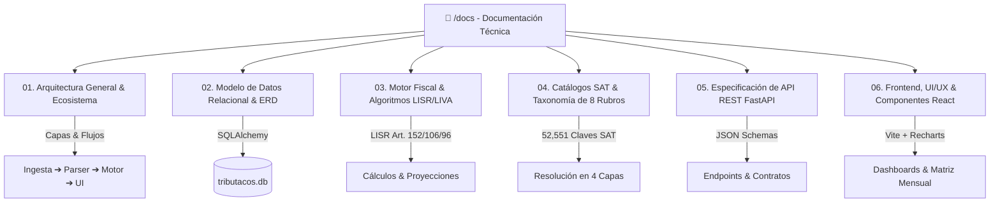

# 📚 Documentación Técnica de tribuTACOS

> **Suite Integral de Arquitectura, Algoritmos Fiscales, Modelo de Datos y Especificación de API para la Plataforma de Inteligencia Fiscal y Pre-Declaración Anual/Mensual.**

---

## 🗺️ Mapa de la Documentación Técnica

La documentación técnica del sistema está estructurada en los siguientes módulos especializados dentro de `/docs`:



---

## 📑 Índice de Módulos Técnicos

| Documento | Descripción y Alcance |
| :--- | :--- |
| **[01. Arquitectura General](file:///home/kubrick/www/declara/docs/01_arquitectura_general.md)** | Visión global del sistema, capas de software, pipeline de ingesta de CFDIs/PDFs, ciclo de vida de peticiones y despliegue. |
| **[02. Modelo de Datos Relacional](file:///home/kubrick/www/declara/docs/02_modelo_de_datos.md)** | Esquema SQLAlchemy en SQLite/PostgreSQL, diagramas entidad-relación (ERD), índices de alto rendimiento y tablas maestras. |
| **[03. Motor Fiscal y Algoritmos LISR/LIVA](file:///home/kubrick/www/declara/docs/03_motor_fiscal_algoritmos.md)** | Lógica algorítmica y matemática: Art. 152 LISR (Tarifa anual), Art. 106 LISR (Provisionales), Art. 5/6 LIVA (Arrastre de IVA) y topes de deducciones Art. 151 LISR. |
| **[04. Catálogos SAT y Taxonomía](file:///home/kubrick/www/declara/docs/04_catalogos_sat_taxonomia.md)** | Estructura de las 52,551 claves del SAT, taxonomía consolidada de 8 rubros ágiles, y algoritmo de resolución en 4 capas. |
| **[05. Especificación de API REST](file:///home/kubrick/www/declara/docs/05_api_endpoints.md)** | Contratos OpenAPI/Swagger de FastAPI: endpoints de resumen fiscal, conciliación SAT, CRUD de clientes, carga de XMLs y exportaciones. |
| **[06. Frontend, UI/UX y Componentes](file:///home/kubrick/www/declara/docs/06_frontend_ux_componentes.md)** | Arquitectura cliente en React (Vite), sistema de diseño con design tokens, gestión de estado en memoria y exportador CSV con formato Excel/Numbers. |

---

## ⚡ Comandos Rápidos de Inicialización

### Levantar Todo el Ecosistema en Desarrollo:
```bash
# Opción 1: Con Makefile
make dev

# Opción 2: Script universal
./levantar_proyecto.sh
```

### Backend Standalone (Puerto 8010):
```bash
cd backend
source venv/bin/activate
uvicorn app.main:app --host 0.0.0.0 --port 8010 --reload
```

### Frontend Standalone (Puerto 5173):
```bash
cd frontend
npm run dev
```
