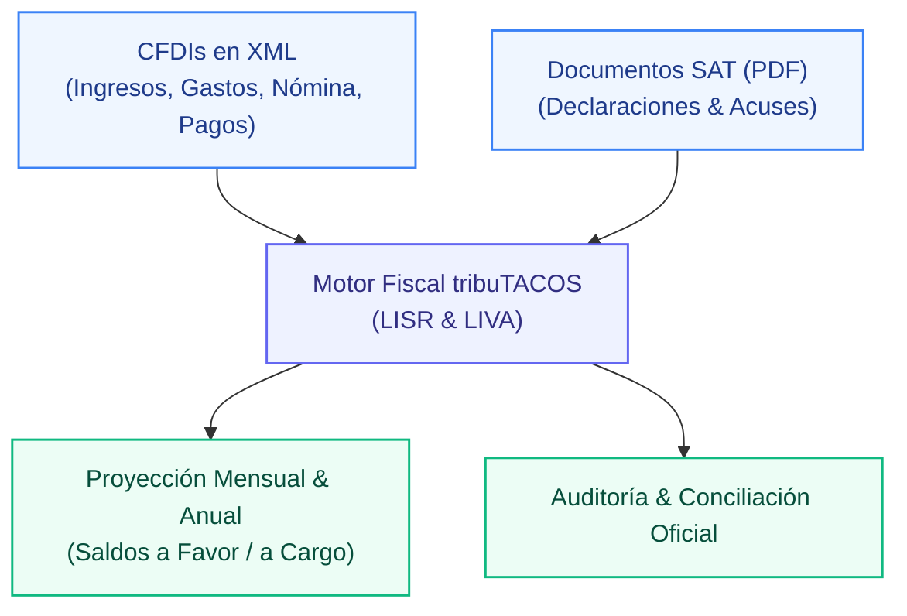

# tribuTACOS — Manual de Usuario

# Capítulo 01: Introducción y Propuesta de Valor

Plataforma de inteligencia fiscal, conciliación de comprobantes digitales (CFDI 3.3 y 4.0 en XML) y pre-declaración automática para personas físicas en México.

---

## 1. Visión General del Producto

**tribuTACOS** es una herramienta analítica diseñada para contribuyentes bajo regímenes de **Sueldos y Salarios (Capítulo I)** y **Actividad Empresarial y Servicios Profesionales (Capítulo II - PFAE)**.

La plataforma resuelve la complejidad del cálculo tributario mediante el análisis algorítmico y determinista de los comprobantes fiscales digitales timbrados (CFDIs) y los documentos oficiales del SAT en PDF, permitiendo proyectar con exactitud:
* **Pagos Provisionales Mensuales de ISR (Art. 106 LISR)** bajo el principio estricto de flujo de efectivo.
* **Declaración Definitiva Mensual de IVA (Art. 5 y 6 LIVA)** con control y arrastre automático de saldos a favor.
* **Declaración Anual del Ejercicio (Art. 152 LISR)** con auditoría del límite legal de deducciones personales (Art. 151 LISR).
* **Auditoría Bidireccional** contra las declaraciones presentadas ante el SAT y los acuses de pago bancarios.

---

## 2. Diferenciadores Clave

| Característica | Visor Tradicional / SAT | tribuTACOS |
| :--- | :--- | :--- |
| **Procesamiento de Datos** | Servidores remotos y lentos | 100% Local y Privado (Baja latencia <15ms) |
| **Taxonomía de Gastos** | Sin categorización operativa | Clasificación automática en 8 rubros de 52,547 claves SAT |
| **Flujo de Efectivo** | Mezcla PUE y PPD sin conciliar | Validación estricta por fecha efectiva de cobro/pago |
| **Deducciones Personales** | Criterio opaco sin desglose de topes | Termómetro en tiempo real: 15% de ingresos vs 5 UMAs y PPR |
| **Arrastre de IVA** | Manual y propenso a errores | Arrastre automático mes a mes de remanentes a favor |
| **Auditoría de Pagos** | Consulta dispersa en portales bancarios | Conciliación 1 a 1 de acuses bancarios vs declaraciones |

---

## 3. Principio de Soberanía y Privacidad de Datos

tribuTACOS opera bajo una estricta política de **privacidad local**. La información contable, UUIDs fiscales, cadenas originales y montos financieros residen exclusivamente en la base de datos relacional local (`tributacos.db`), sin transmisión a servidores externos ni intermediarios terceros.

---

## 4. Aviso Legal / Disclaimer

tribuTACOS es una plataforma de análisis, proyección y simulación fiscal basada en la interpretación algorítmica de comprobantes digitales (CFDI) y la legislación mexicana (LISR y LIVA). Los cálculos y resultados presentados son de carácter estrictamente estimativo e informativo, no constituyen asesoría fiscal ni reemplazan las declaraciones oficiales presentadas ante el Servicio de Administración Tributaria (SAT).
