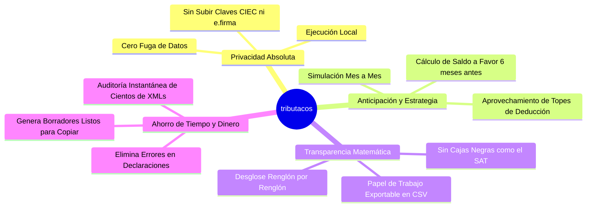
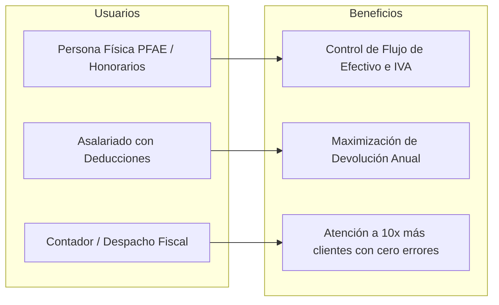

# Capítulo 1: Introducción y Propuesta de Valor

## 🌮 ¿Qué es tributacos (Declara Pro)?

**tributacos** (Declara Pro) es una plataforma de **inteligencia fiscal, analítica de comprobantes digitales (CFDI) y pre-declaración automática** diseñada específicamente para el marco tributario de México.

El sistema transforma carpetas caóticas de archivos `.XML` emitidos y recibidos en un **centro de mando financiero y fiscal transparente**, capaz de simular con exactitud milimétrica:
- Los **12 Pagos Provisionales Mensuales de ISR (Formulario R122)** y de **IVA Definitivo (Formulario R21)**.
- La **Declaración Anual de Personas Físicas (Art. 152 LISR)** proyectando con meses de anticipación si el contribuyente obtendrá un **Saldo a Favor** (Devolución del SAT) o un **Impuesto a Cargo**.
- La **Optimización de Deducciones Personales (Art. 151 LISR)** calculando automáticamente los topes legales de 5 UMAs anuales o el 15% de los ingresos brutos.
- La **Auditoría Preventiva de Deducciones y Bancarización (Art. 27 LISR)** detectando pagos en efectivo mayores a $2,000 MXN o comprobantes con anomalías de timbrado.
- La **Conciliación Cruzada contra Documentos Oficiales del SAT (PDFs)** para garantizar que no existan discrepancias fiscales entre lo declarado y lo facturado.

---

## 💎 Propuesta de Valor y Ventajas Comerciales

### 1. Privacidad y Seguridad Local Extrema (Zero-Cloud Leakage)
A diferencia de servicios web que exigen almacenar tus contraseñas del SAT (CIEC / e.firma) en servidores de terceros en la nube, **tributacos opera en tu infraestructura local**:
- Los archivos XML y la base de datos permanecen en tu computadora o servidor corporativo.
- No se expone información sensible de clientes, nóminas de empleados o cuentas bancarias.

### 2. Adiós a la "Caja Negra" del SAT
La plataforma web del SAT frecuentemente precarga importes sin explicar su desglose aritmético ni el listado de comprobantes de donde provienen. **tributacos ofrece una auditoría granular:**
- Cada renglón de ingreso o gasto se puede rastrear hasta el UUID del comprobante fiscal original.
- Los conceptos se asocian en tiempo real a las **52,514 claves del catálogo oficial del SAT (`c_ClaveProdServ`)**.
- Los recibos de nómina desglosan con precisión matemática los ingresos gravados y los ingresos exentos según el **Art. 93 de la LISR** (Aguinaldo, Prima Vacacional, PTU).

### 3. Simulador de Pagos Provisionales con "Borrador Espejo SAT"
El sistema calcula mes con mes la base gravable acumulativa y la determinación del pago provisional. Al hacer clic en un botón, abre un **formulario espejo idéntico al portal del SAT**, permitiendo que el contribuyente o su contador carguen la declaración mensual en menos de 2 minutos sin temor a cometer errores de cálculo.

### 4. Proyección de Devolución de Impuestos
En lugar de esperar al mes de abril para saber si la Declaración Anual resultará con saldo a favor o a cargo, el sistema proyecta el resultado en tiempo real con cada factura emitida o recibida, indicando cuánto dinero resta disponible en el tope legal de deducciones para adquirir más facturas de salud, seguros o aportaciones voluntarias antes del 31 de diciembre.

---

## 📊 Matriz Comparativa: tributacos vs Métodos Tradicionales

| Criterio | Hoja de Cálculo (Excel) | Portal Oficial del SAT | tributacos (Declara Pro) |
| :--- | :--- | :--- | :--- |
| **Tiempo de procesamiento** | Horas / Días manuales | Lento, caídas recurrentes | **Instantáneo (Segundos)** |
| **Detección de duplicados** | Propenso a error humano | Ignora errores de carpetas | **Automática por UUID** |
| **Aplicación de Tarifas LISR** | Compleja de formular | Oculta los cálculos | **Transparente paso a paso** |
| **Bancarización y Reglas Fiscales** | Requiere revisión manual | Precarga sin advertencias | **Alertas preventivas automáticas** |
| **Catálogo de Claves SAT** | Manual | Texto básico | **52,514 claves indexadas** |
| **Generación de Borrador Espejo** | No disponible | Es el formulario final | **Formulario espejo copiable** |
| **Exportación a Papel de Trabajo** | Manual | PDF rígido | **CSV/Excel listo para auditoría** |

---

## 👥 Casos de Uso y Perfiles de Usuario

1. **Freelancers y Profesionistas Independientes:**
   - Monitorean sus ingresos cobrados (flujo de efectivo) y saben cuánto apartar de IVA e ISR cada mes.
2. **Asalariados con Múltiples Patrones o Deducciones:**
   - Auditan que sus patrones hayan timbrado sus quincenas completas y verifican que sus gastos médicos (D01), dentales o colegiaturas sean 100% deducibles.
3. **Despachos Contables:**
   - Permite a los auxiliares contables revisar el estatus de decenas de contribuyentes en minutos, generar borradores mensuales y conciliar contra acuses oficiales en PDF.
