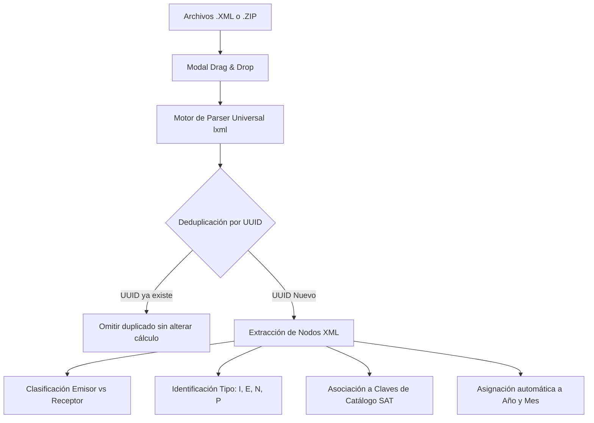

# Capítulo 2: Primeros Pasos, Ingesta de CFDIs y Multi-Contribuyente

## 🚀 Inicio y Acceso a la Plataforma

tributacos cuenta con una arquitectura desacoplada y ligera construida con **FastAPI** (Python 3.11) en el backend y **React con Vite** en el frontend.

### Arranque del Sistema
Para iniciar el sistema en un solo comando:
```bash
# Desde la raíz del proyecto
make dev
# O mediante el script automatizado
./levantar_proyecto.sh
```
- **Backend API:** `http://localhost:8010` (con documentación interactiva en `http://localhost:8010/docs`)
- **Frontend Dashboard:** `http://localhost:5173`

---

## 🧭 Barra Lateral de Navegación y Controles Globales


La barra lateral izquierda (**Sidebar**) es el punto de control central de la aplicación:
1. **Identidad del Contribuyente:** Muestra la marca **tributacos 🌮** y el RFC del contribuyente actualmente activo.
2. **Botón de Ingesta Principal:** Acceso directo a la función *"Desmenuzar XMLs"*.
3. **Selector de Contribuyente (Multi-RFC):** Desplegable que lista todos los RFCs detectados en la base de datos para alternar entre clientes instantáneamente.
4. **Selector de Ejercicio Fiscal:** Menú para cambiar entre los años **2021, 2022, 2023, 2024, 2025 y 2026**.
5. **Botón de Sincronización (🔄):** Fuerza el recálculo y la reindexación de los comprobantes locales en memoria.
6. **Agrupadores de Menú:** Navegación por bloques (*Visión General*, *Pre-Declaraciones SAT*, *Egresos y Deducciones*, *Ingresos y Nómina*, *Verificación Oficial*).

---

## 🗂️ Ingesta Inteligente: Modal "🌮 Desmenuzar XMLs"


Al presionar el botón **"🌮 Desmenuzar XMLs"**, se despliega el modal interactivo de carga con las siguientes capacidades:



### Características de la Ingesta:
- **Arrastrar y Soltar (Drag & Drop):** Puedes soltar decenas o cientos de archivos `.xml` directamente en la zona punteada.
- **Soporte para Archivos Comprimidos `.ZIP`:** Si descargas un paquete de facturas desde el portal del SAT o de tu proveedor de facturación, puedes arrastrar el archivo `.zip` completo. El sistema descomprime, analiza y procesa recursivamente todas las carpetas internas.
- **Deduplicación Automática por Folio Fiscal (UUID):** El sistema garantiza que ningún comprobante se contabilice dos veces, sin importar si el archivo tiene nombres distintos o está repetido en varias subcarpetas.
- **Auto-clasificación por RFC y Año:** El motor identifica si el comprobante corresponde a un ingreso emitido, a un gasto recibido, a una nómina timbrada o a un pago bancarizado, asignándolo al ejercicio fiscal correspondiente.
