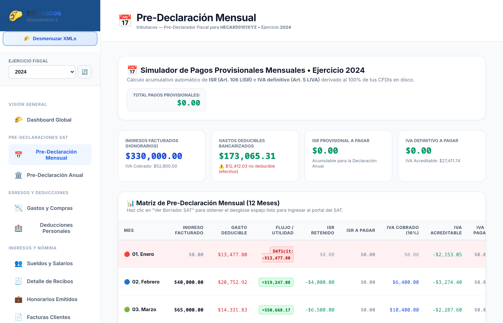
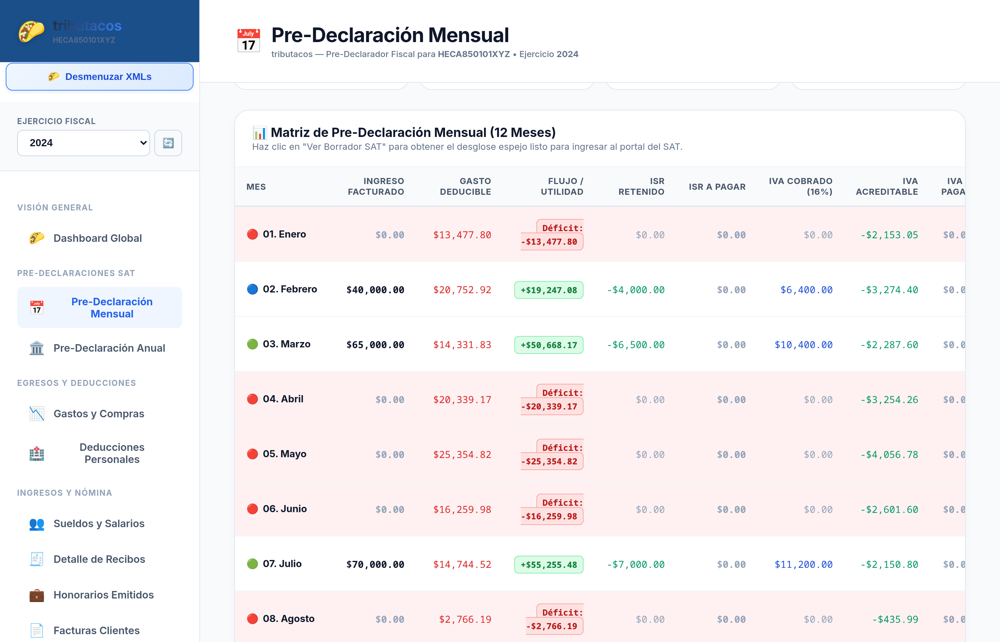
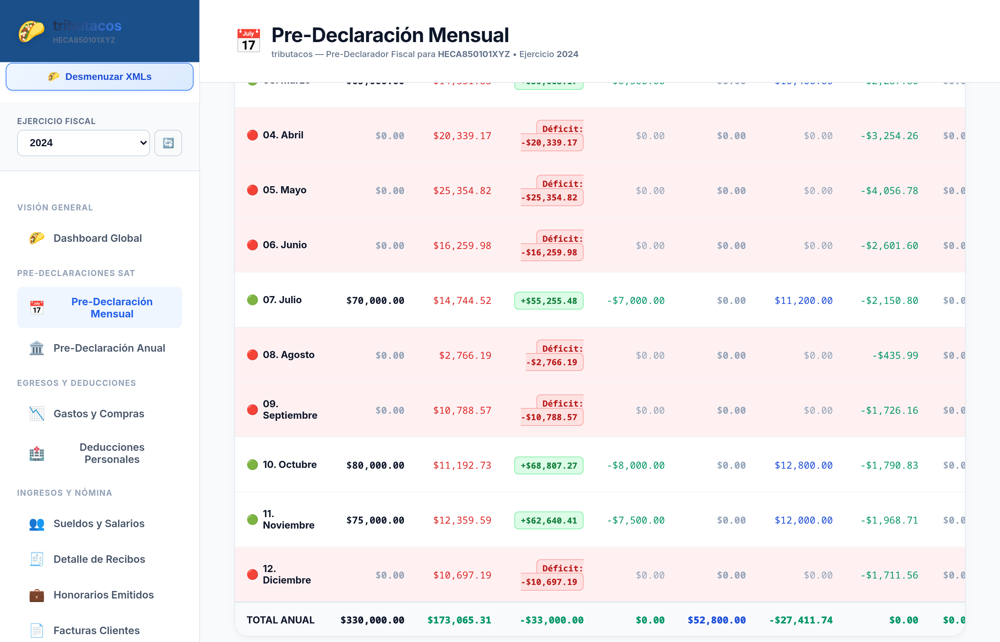
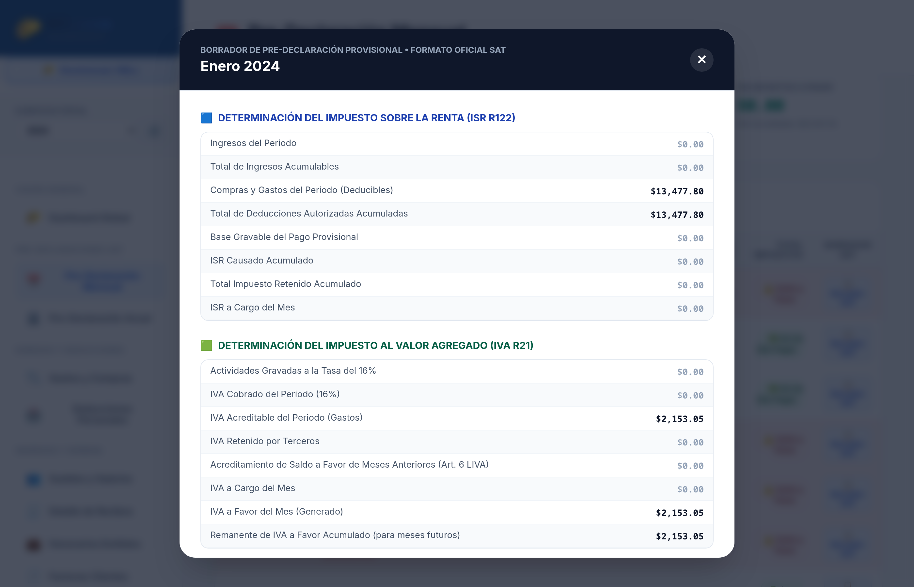
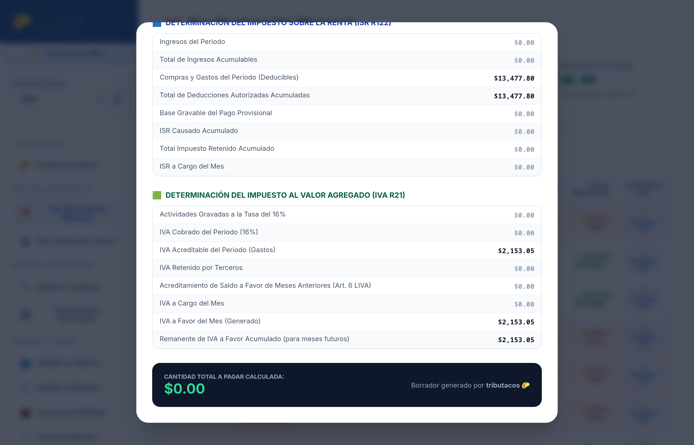

# Capítulo 4: Módulo 2 — Pre-Declaración Mensual (Pagos Provisionales)

## 📅 Propósito del Módulo

El módulo de **Pre-Declaración Mensual** automatiza por completo el cumplimiento de las obligaciones fiscales de cada mes (antes del día 17) para Personas Físicas con Actividad Empresarial y Servicios Profesionales (Honorarios):
1. **ISR Provisional (Formulario R122 - Art. 106 LISR):** Aplica la mecánica de acumulación de ingresos y deducciones del ejercicio, deduciendo el ISR retenido y los pagos provisionales efectuados en meses anteriores.
2. **IVA Definitivo (Formulario R21 - Art. 5 y 6 LIVA):** Determina el IVA cobrado al 16%, resta el IVA acreditable de compras deducibles y aplica saldos a favor de meses previos.
3. **Generador de Borrador Espejo SAT:** Un formulario emergente que reproduce renglón por renglón el formulario oficial de la plataforma del SAT, listo para copiar y pegar sin errores.

---

## 🖥️ Secciones de la Pantalla y Análisis Paso a Paso

---

### 1. Encabezado y 4 KPIs Ejecutivos de Pagos Provisionales

#### Indicadores del Panel Superior:
- **Ingresos Facturados (Honorarios):** Total de ingresos acumulados en el año derivados de facturas emitidas y cobradas.
- **Gastos Deducibles Bancarizados:** Compras y gastos pagados por medios electrónicos (tarjeta, transferencia, cheque). Si se detectan gastos en efectivo mayores a $2,000, el sistema muestra una alerta de no deducibilidad.
- **ISR Provisional a Pagar:** Suma de los pagos provisionales de ISR acumulables para la declaración anual.
- **IVA Definitivo a Pagar:** Total del impuesto al valor agregado liquidado al SAT tras acreditar el IVA de proveedores.
- **Total Pagos Provisionales:** Cifra global acumulada en la esquina superior derecha.

---

### 2. Matriz Interactiva de Pre-Declaración (12 Meses)

#### Columnas y Lógica de la Matriz:
| Columna | Significado Fiscal |
| :--- | :--- |
| **Mes** | Periodo fiscal (01. Enero a 12. Diciembre) con semáforos de volumen. |
| **Ingreso Facturado** | Subtotal de facturas PUE y recibos de pago cobrados en el mes. |
| **Gasto Deducible** | Egresos y compras deducibles pagados por medios bancarios. |
| **Flujo / Utilidad** | Margen operativo del mes (`Ingresos - Gastos`). Destaca en verde (`+Utilidad`) o rojo (`-Déficit`). |
| **ISR Retenido** | Retención del 10% aplicada por clientes personas morales. |
| **ISR a Pagar** | Impuesto sobre la renta determinado conforme a la tarifa acumulativa del Art. 106 de la LISR. |
| **IVA Cobrado (16%)** | Impuesto al valor agregado trasladado a clientes. |
| **IVA Acreditable** | Impuesto trasladado por proveedores en compras deducibles efectivamente pagadas. |
| **IVA a Pagar** | Impuesto definitivo a liquidar al SAT. |
| **Total Impuestos** | Suma total líquida a pagar en ventanilla bancaria (`ISR a Pagar + IVA a Pagar`). |
| **Borrador SAT** | Botón para abrir el formulario espejo oficial listo para copiar. |

---

### 3. Modal "Borrador Espejo SAT" (Listo para Copiar)

Al presionar el botón **"📋 Borrador SAT"** en cualquier mes, se abre un modal con el desglose exacto que solicita el portal web del SAT:

#### A. Sección R122: Determinación del Impuesto Sobre la Renta (ISR)

Contiene los 8 renglones oficiales:
1. *Ingresos del Periodo*
2. *Total de Ingresos Acumulables*
3. *Compras y Gastos del Periodo (Deducibles)*
4. *Total de Deducciones Autorizadas Acumuladas*
5. *Base Gravable del Pago Provisional*
6. *ISR Causado Acumulado*
7. *Total Impuesto Retenido Acumulado*
8. *ISR a Cargo del Mes*

---

#### B. Sección R21: Determinación del Impuesto al Valor Agregado (IVA)

Contiene los renglones oficiales de IVA:
1. *Actividades Gravadas a la Tasa del 16%*
2. *IVA Cobrado del Periodo (16%)*
3. *IVA Acreditable del Periodo (Gastos)*
4. *IVA Retenido por Terceros*
5. *Acreditamiento de Saldo a Favor de Meses Anteriores (Art. 6 LIVA)*
6. *IVA a Cargo del Mes / IVA a Favor Generado*
7. *Remanente de IVA a Favor Acumulado para Meses Futuros*
8. *Cantidad Total a Pagar Calculada*
