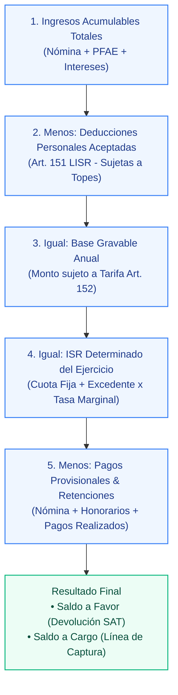

# tribuTACOS — Manual de Usuario

# Capítulo 05: Módulo de Declaración Anual

Determinación del Impuesto Sobre la Renta anual conforme al Artículo 152 de la LISR, desglose en cascada de cinco pasos, cálculo de tasas y gestión de devoluciones.

---

## 1. Visión General de la Determinación Anual

El módulo de **Declaración Anual** integra todos los ingresos acumulables del contribuyente (Sueldos y Salarios + Honorarios/PFAE + Intereses) y computa el impuesto del ejercicio contra la tarifa progresiva del **Art. 152 LISR**.

---

## 2. La Cascada Fiscal de Cinco Pasos

La plataforma visualiza el cálculo en cinco etapas transparentes y auditables:

---

## 3. Métricas Financieras del Ejercicio

* **Tasa Efectiva de Impuesto:** Porcentaje real del ingreso que representa el impuesto determinado ($\text{ISR Determinado} / \text{Ingresos Totales}$).
* **Tasa Marginal:** Porcentaje aplicable al último tramo de la tarifa en el que se ubica la base gravable (de acuerdo con el límite superior del Art. 152 LISR, de hasta el 35%).
* **Determinación de Saldos Anuales:**
  - **Saldo a Favor (Devolución SAT):** Se origina cuando el total de retenciones e impuestos pagados provisionalmente durante el ejercicio excede el ISR anual causado, indicando el importe disponible para solicitar devolución automática con CLABE interbancaria o compensación contra ejercicios futuros.
  - **Saldo a Cargo (Línea de Captura):** Se origina cuando el impuesto anual determinado es superior a los anticipos y retenciones acumuladas en el año, señalando el importe a enterar a la autoridad fiscal.
