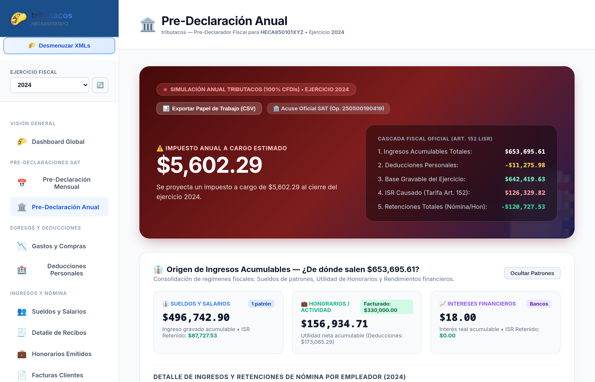
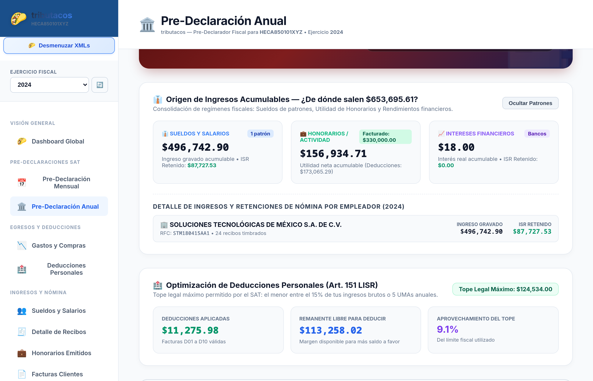
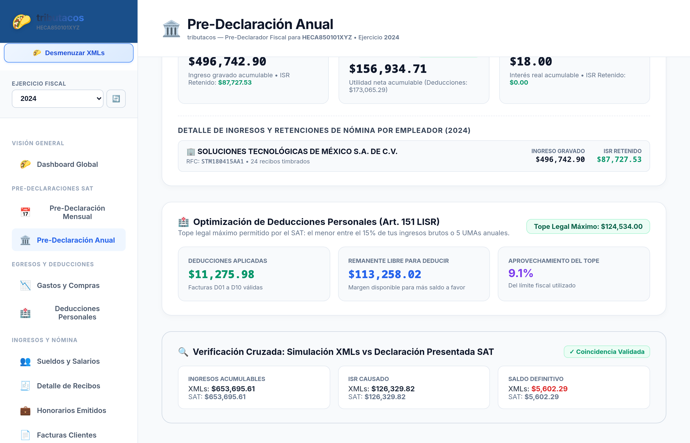

# Capítulo 5: Módulo 2 — Pre-Declaración Anual (Art. 152 LISR)

## 🏛️ Propósito del Módulo

La **Pre-Declaración Anual** calcula la liquidación fiscal de Personas Físicas bajo la tarifa progresiva del **Artículo 152 de la Ley del Impuesto sobre la Renta (LISR)**.

Integra todos los regímenes fiscales del contribuyente, proyecta el **Saldo a Favor** (Devolución del SAT) o **Impuesto a Cargo**, optimiza el uso de **Deducciones Personales (Art. 151 LISR)** y permite exportar el papel de trabajo contable completo en formato CSV.

---

## 🖥️ Secciones Detalladas de la Pantalla

---

### 1. Gran Hero Card: Saldo Proyectado y Cascada Oficial

#### Características del Hero Card:
- **Semáforo Visual Dinámico:** 
  - **Fondo Verde / Esmeralda:** Si el resultado proyectado es un **Saldo a Favor (Devolución del SAT)**.
  - **Fondo Rojo / Borgoña:** Si el resultado proyectado es un **Impuesto Anual a Cargo**.
- **Monto Gigante:** Cifra en pesos mexicanos calculada con precisión milimétrica.
- **Botón "📊 Exportar Papel de Trabajo (CSV)":** Descarga un archivo estructurado con todos los renglones y fórmulas para abrirse en Excel o integrarse a auditorías contables.
- **Cascada Oficial (Panel Derecho):**
  1. *Ingresos Acumulables Totales*
  2. *Deducciones Personales Aplicadas*
  3. *Base Gravable del Ejercicio*
  4. *ISR Causado Anual (Tarifa Art. 152)*
  5. *Pagos Provisionales Acreditables*
  6. *Retenciones Totales de Nómina y Clientes*

---

### 2. Origen de Ingresos Acumulables y Desglose de Patrones

Al hacer scroll hacia abajo, la pantalla desglosa el origen de los ingresos gravables:
- **👔 Sueldos y Salarios:** Muestra los ingresos gravados de nómina y las retenciones de patrones.
- **💼 Honorarios / Actividad Empresarial:** Despliega la facturación total y la utilidad neta una vez restadas las deducciones autorizadas.
- **📈 Intereses Financieros:** Muestra los rendimientos reales acumulables reportados por bancos.
- **Lista de Patrones de Nómina (Toggle):** Detalla cada empleador con su nombre, RFC, número de recibos timbrados, ingreso gravado y retención de ISR quincena por quincena.

---

### 3. Optimizador de Deducciones Personales y Tope Legal (Art. 151 LISR)

El SAT impone un límite estricto a las deducciones personales. El sistema calcula en tiempo real el valor que resulte **menor** entre:
1. El **15% del total de ingresos brutos** del contribuyente.
2. **5 veces el valor de la UMA anual**.

#### Métricas del Optimizador:
- **Tope Legal Máximo:** Límite monetario exacto para el ejercicio fiscal consultado.
- **Deducciones Aplicadas:** Suma de comprobantes válidos (D01 a D10).
- **Remanente Libre para Deducir:** Monto en pesos que el contribuyente todavía puede gastar en salud, seguros o retiro antes del 31 de diciembre para aumentar su devolución.
- **Aprovechamiento del Tope:** Porcentaje del límite legal utilizado hasta el momento.
