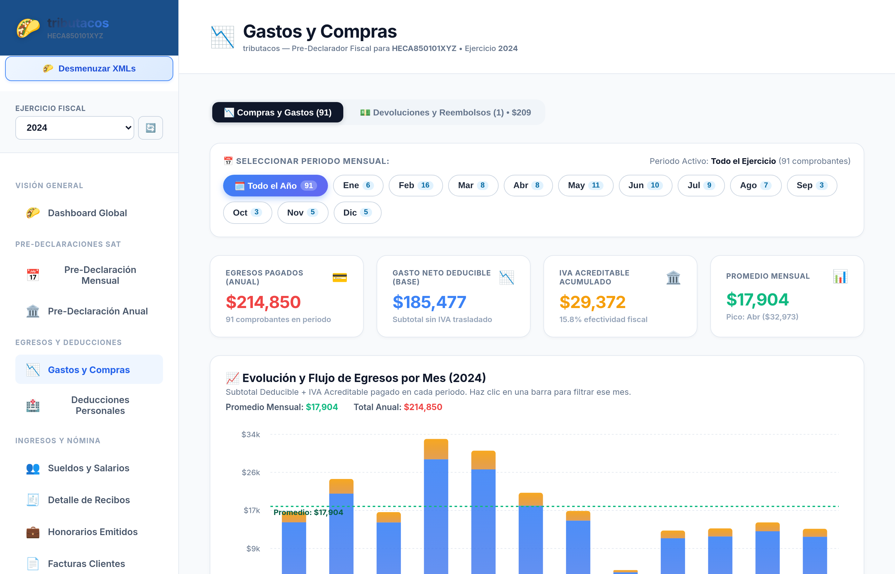
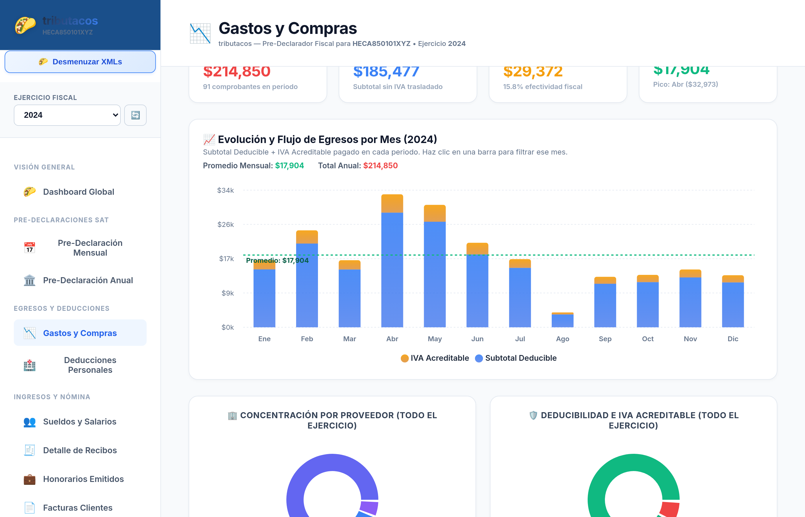
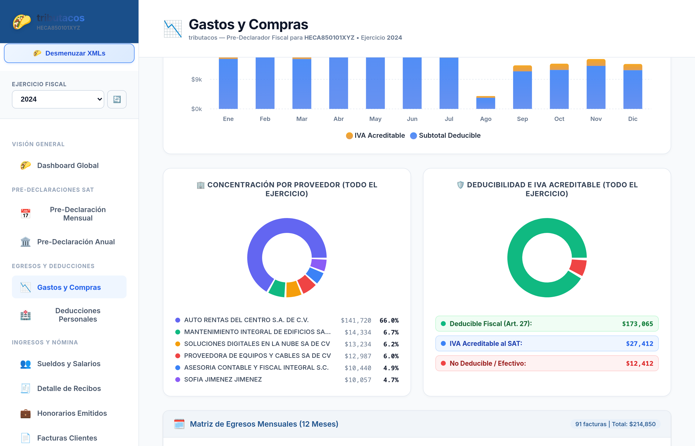
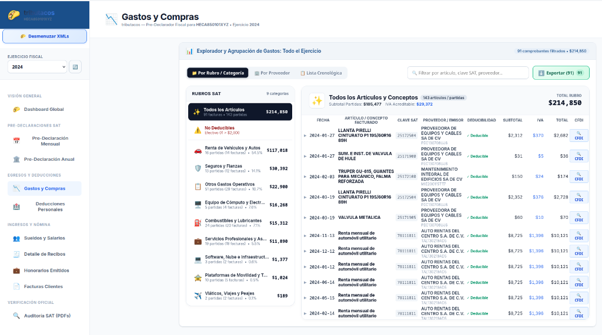
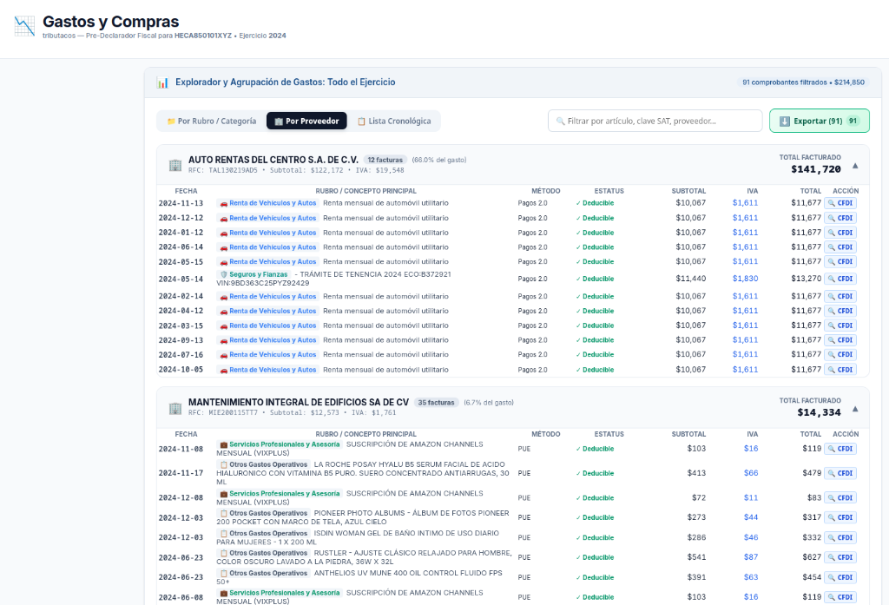
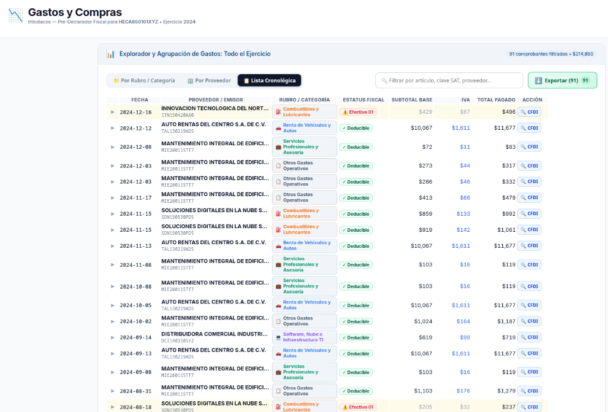
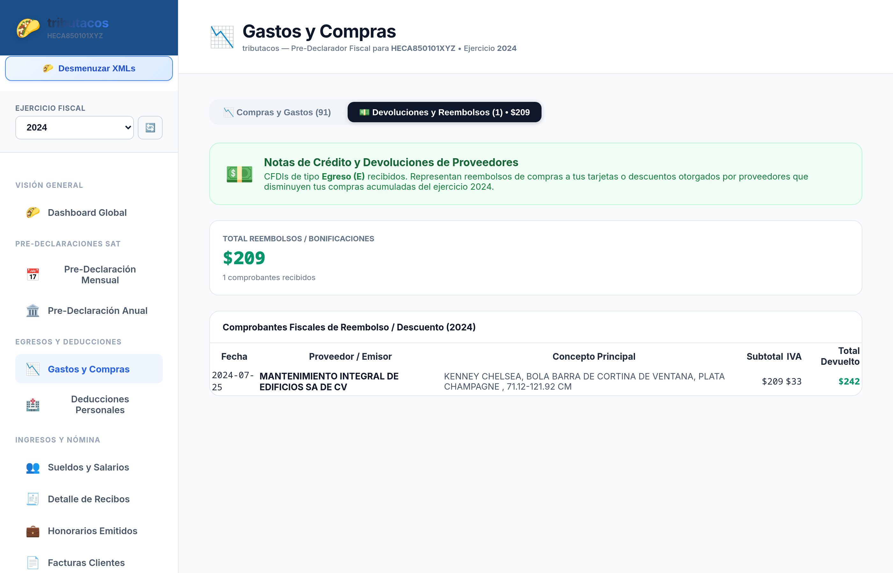
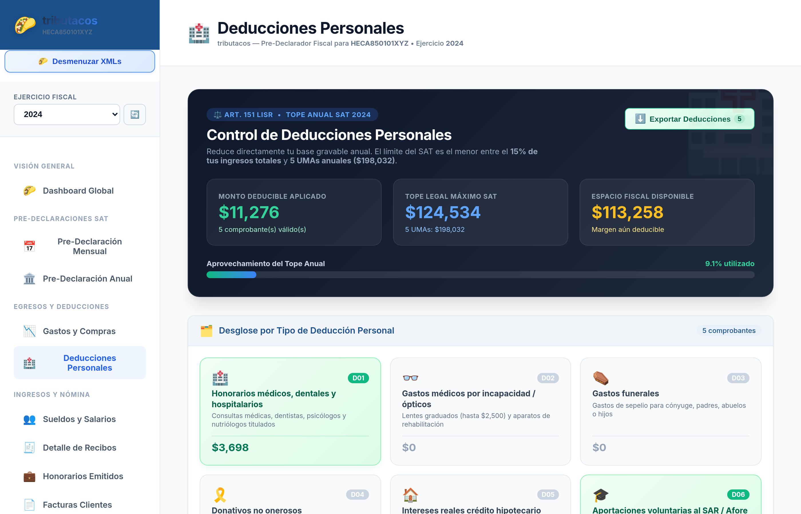
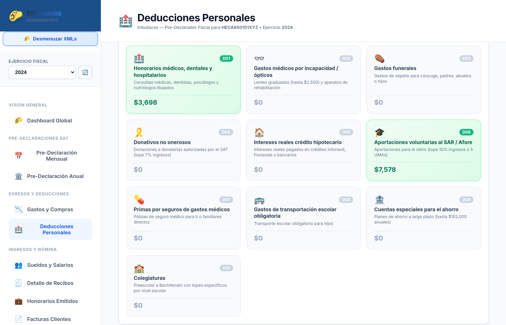
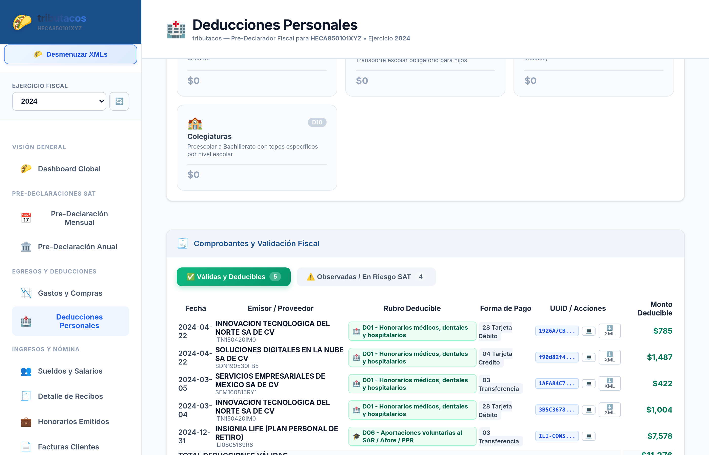

# Capítulo 6: Módulo 3 — Egresos, Gastos, Deducciones y Bancarización

## 📉 Propósito del Módulo

El módulo de **Egresos y Deducciones** es el motor de auditoría financiera más potente de tributacos. Su función es auditar con rigor legal y matemático todos los comprobantes de salida recibidos por el contribuyente:
1. **Gastos y Compras Operativas:** Análisis de egresos por mes, categoría de gasto, proveedor y partidas individuales, aplicando las reglas de bancarización y deducibilidad del **Artículo 27 de la LISR**.
2. **Explorador y Agrupación de Gastos (Todo el Ejercicio o Mensual):** Motor analítico maestro-detalle que permite auditar las compras a través de 3 modos de vista: *Por Rubro / Categoría*, *Por Proveedor* y *Lista Cronológica*.
3. **Notas de Crédito y Devoluciones (CFDI Tipo E):** Control de reembolsos a cuentas bancarias y bonificaciones de proveedores que disminuyen las compras netas.
4. **Deducciones Personales (Art. 151 LISR):** Clasificación de gastos de salud, educación, vivienda y retiro que disminuyen la base gravable de la declaración anual.

---

## 🖥️ Sección 1: Gastos y Compras Operativas

---

### 1. Sub-pestañas Principales y Selector de Meses en Píldoras (Pills)

#### Controles Superiores:
- **Alternador de Sub-pestañas:** Permite alternar entre **📉 Compras y Gastos** (facturas de egreso) y **💵 Devoluciones y Reembolsos** (Notas de crédito tipo E).
- **Selector de Periodo en Píldoras (Pills):** 
  - Botón **🗓️ Todo el Año** para ver el consolidado anual.
  - 12 botones mensuales individuales (**Ene** a **Dic**) con badges dinámicos que muestran el número exacto de comprobantes timbrados en cada mes.
- **Cuatro KPIs Ejecutivos de Egresos:**
  1. *Egresos Pagados:* Total neto pagado en el periodo seleccionado.
  2. *Gasto Neto Deducible (Base):* Subtotal sin IVA trasladado que impacta directamente en el pago provisional.
  3. *IVA Acreditable Acumulado:* IVA efectivamente pagado con porcentaje de efectividad fiscal.
  4. *Promedio Mensual y Mes Pico:* Identifica automáticamente el mes de mayor desembolso del año (ej. *Octubre con $85,420 MXN*).

---

### 2. Gráfica Interactiva de Evolución y Flujo Mensual

#### Características de la Gráfica:
- **Barras Apiladas por Mes:** Desglosa visualmente en cada barra la porción correspondiente al **Subtotal Deducible** (azul) y al **IVA Acreditable** (ámbar).
- **Línea de Gasto Promedio:** Línea horizontal punteada verde que marca la media de gasto mensual para identificar desviaciones de presupuesto.
- **Interacción al Clic:** Al hacer clic sobre la barra de cualquier mes, toda la interfaz inferior se filtra automáticamente para mostrar únicamente los gastos de ese periodo.

---

### 3. Mix de Deducibilidad Fiscal y Top 6 Proveedores

#### Análisis de Riesgo y Proveedores:
- **Gráfica Donut de Mix de Deducibilidad:**
  - **Verde (100% Deducible Fiscal):** Compras pagadas por medios electrónicos autorizados (transferencia, tarjeta de débito/crédito, cheque).
  - **Rojo (No Deducible / Observado):** Facturas pagadas en efectivo mayores a $2,000 MXN o consumos de combustible no bancarizados.
- **Ranking de Top 6 Proveedores:** Muestra los proveedores con mayor volumen de facturación en el periodo, su porcentaje de participación y el monto acumulado.

---

## 🔍 Sección 2: Explorador y Agrupación de Gastos (Todo el Ejercicio)

El **Explorador y Agrupación de Gastos** cuenta con 3 modos de organización visual interactiva para auditar exhaustivamente cada comprobante recibido:

---

### Modo 1: 📁 Por Rubro / Categoría (Maestro-Detalle de Partidas y Artículos)

Este modo organiza los gastos a nivel de **partida individual timbrada dentro del XML**, permitiendo auditar artículos específicos aun cuando vengan agrupados en una sola factura con múltiples conceptos:
- **Panel Izquierdo (Rubros SAT):**
  - **✨ Todos los Artículos:** Totaliza el universo de facturas y partidas del periodo.
  - **⚠️ No Deducibles:** Aísla de inmediato compras observadas (ej. pagos en efectivo > $2,000 MXN).
  - **Categorías Fiscales:** *Renta de Vehículos y Autos, Seguros y Fianzas, Otros Gastos Operativos, Equipo de Cómputo, Combustibles y Lubricantes, Servicios Profesionales, Software y SaaS, Movilidad y Viáticos*, con su porcentaje de gasto y total en pesos.
- **Panel Derecho (Tabla de Partidas por Artículo):**
  - **Fecha:** Fecha del comprobante.
  - **Artículo / Concepto Facturado:** Descripción del producto o servicio según el XML.
  - **Clave SAT (`c_ClaveProdServ`):** Código del catálogo SAT oficial.
  - **Proveedor / Emisor:** Nombre comercial y RFC del emisor.
  - **Deducibilidad:** Badge verde (`✓ Deducible`) o rojo (`⚠️ Efectivo 01`).
  - **Subtotal, IVA y Total:** Importe correspondiente a ese concepto.
  - **Acción CFDI:** Botón con lupa para abrir el visor del comprobante.

---

### Modo 2: 🏢 Por Proveedor (Agrupación Consolidada por RFC)

Organiza las compras agrupadas por cada empresa o prestador de servicios:
- **Encabezado del Proveedor:** Razón social, RFC, número de facturas emitidas, porcentaje de participación en tus gastos y **Total Facturado**.
- **Tabla Desplegable por Proveedor:** Lista todas las facturas recibidas de ese emisor con su fecha, rubro o concepto principal, método de pago (`PUE` / `Pagos 2.0`), estatus de deducibilidad, subtotal, IVA, total y acceso al CFDI.

---

### Modo 3: 📋 Lista Cronológica (Tabla Continua con Auditoría de Medios de Pago)

Despliega una vista continua de todas las facturas del ejercicio ordenadas cronológicamente:
- **Buscador en Tiempo Real:** Filtra al instante por artículo, clave SAT, proveedor o RFC.
- **Auditoría de Bancarización (Art. 27 LISR):** Identifica y resalta claramente con badge amarillo/rojo `⚠️ Efectivo 01` cualquier factura pagada en efectivo que supere los $2,000 MXN o gastos de combustible que exigen pago electrónico.
- **Botón Exportar (N):** Descarga el listado completo a formato Excel/CSV.

---

## 💵 Sección 3: Notas de Crédito, Devoluciones y Reembolsos (CFDI Tipo E)

Las Notas de Crédito emitidas por tus proveedores representan dinero devuelto a tus cuentas bancarias o bonificaciones que disminuyen tus compras acumuladas:
- **Total Reembolsos / Bonificaciones:** Suma neta de dinero devuelto en el ejercicio fiscal.
- **Conceptos Reembolsados:** Tarjetas con los conceptos específicos bonificados (ej. devoluciones de compras en línea, cancelaciones de servicios, descuentos por pronto pago).
- **Tabla Detallada de Comprobantes de Reembolso:** Fecha, proveedor emisor, concepto, subtotal, IVA devuelto y total reembolsado.

---

## 🏥 Sección 4: Deducciones Personales (Art. 151 LISR)

---

### 1. Termómetro de Tope Legal y Resumen de Aprovechamiento

- **Deducciones Válidas:** Total de facturas D01 a D10 encontradas.
- **Tope Legal Máximo:** El menor entre el 15% de los ingresos brutos del contribuyente o 5 UMAs anuales.
- **Margen Remanente Disponible:** Monto exacto que el contribuyente todavía puede gastar antes del 31 de diciembre para aumentar su cheque de devolución en abril.

---

### 2. Matriz de Conceptos de Deducción por Tipo (D01 a D10)

- **D01:** Honorarios médicos, dentales y nutrición (pago electrónico obligatorio).
- **D02:** Gastos médicos por incapacidad o discapacidad.
- **D04:** Donativos autorizados no onerosos.
- **D05:** Intereses reales de créditos hipotecarios (INFONAVIT, FOVISSSTE, Bancos).
- **D07:** Primas por seguros de gastos médicos mayores.
- **D08:** Transportación escolar obligatoria.
- **D10:** Colegiaturas bajo estímulo fiscal ISEE.

---

### 3. Listado de Facturas Personales Auditadas

Permite auditar individualmente cada factura médica o de seguro, verificar el RFC del prestador de servicios, validar que la forma de pago haya sido con tarjeta o transferencia y descargar el comprobante XML oficial.
