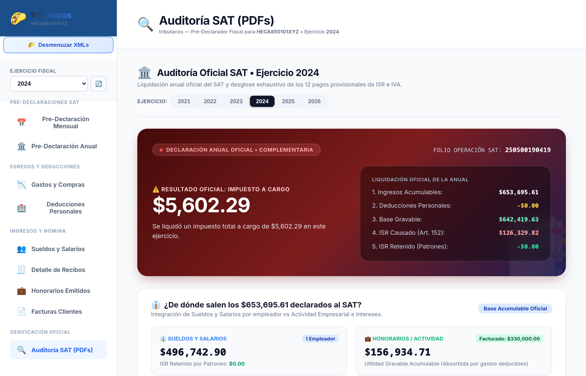
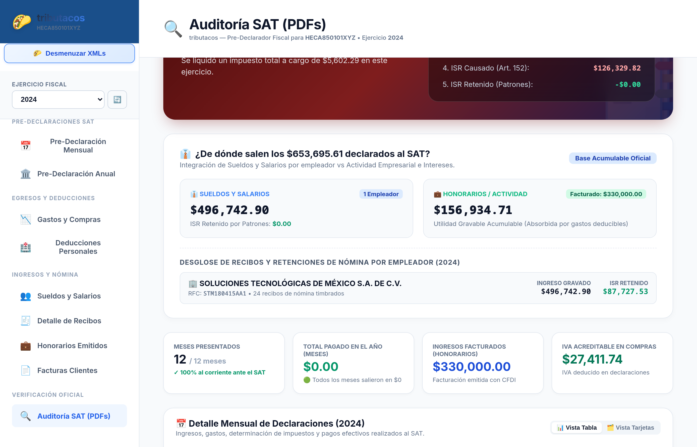
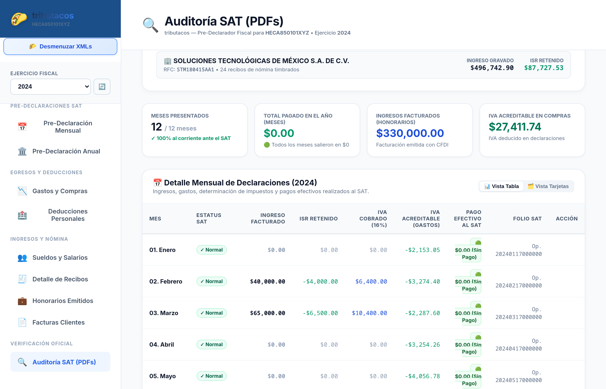

# Capítulo 8: Módulo 5 — Auditoría Oficial SAT y Conciliación

## 🔍 Propósito del Módulo

El módulo de **Auditoría Oficial SAT** es el puente definitivo entre los comprobantes digitales (XMLs) y los **documentos oficiales y acuses de recibo en formato PDF emitidos formalmente por el SAT**.

Permite que contadores y contribuyentes realicen una **conciliación cruzada exhaustiva**, verificando:
1. Que los 12 pagos provisionales del año fueron presentados en tiempo y forma.
2. Que los montos pagados en el banco corresponden exactamente con las líneas de captura del SAT.
3. Que la Declaración Anual presentada coincide con los registros contables y que la cuenta CLABE registrada para la devolución es la correcta.

---

## 🖥️ Secciones Detalladas de la Pantalla

---

### 1. Gran Hero Card: Declaración Anual Oficial Presentada

#### Datos Oficiales Verificados:
- **Estatus Oficial:** Declaración Normal o Complementaria.
- **Número de Operación SAT:** Folio de 14 dígitos generado por los sistemas del SAT.
- **Resultado Oficial:** Saldo a Favor devuelto o Impuesto Anual pagado.
- **Cuenta CLABE y Banco:** Cuenta bancaria de 18 dígitos y nombre de la institución financiera donde el SAT depositó o depositará la devolución.
- **Cascada de Liquidación Anual Oficial (Art. 152 LISR):** Desglose formal de ingresos, deducciones, base gravable, ISR causado, pagos provisionales acreditados y retenciones aplicadas.

---

### 2. Cuadro Resumen de Pagos Provisionales y Cumplimiento

- **Meses Presentados:** Contador de declaraciones mensuales presentadas (ej. `12 / 12 meses`).
- **Estatus de Cumplimiento:** Indicador de *"100% al corriente ante el SAT"*.
- **Total Pagado en el Año:** Suma líquida de los importes efectivamente pagados en los bancos por concepto de ISR e IVA provisional.
- **IVA Acreditable en Compras:** Total del impuesto deducido formalmente en las declaraciones presentadas.

---

### 3. Matriz de 12 Declaraciones Mensuales Oficiales

Permite auditar mes por mes:
- **Estatus:** Normal o Complementaria.
- **Ingreso Facturado:** Importe reportado formalmente al SAT.
- **ISR Retenido:** Impuesto acreditado en la declaración mensual.
- **IVA Cobrado (16%) vs IVA Acreditable.**
- **Pago Efectivo al SAT:** Monto liquidado en ventanilla bancaria con acuse de recibo.
- **Folio SAT:** Número de operación de cada pago provisional.
- **Botón "🔍 Ver Detalle SAT":** Despliega el formulario oficial completo de la declaración.
