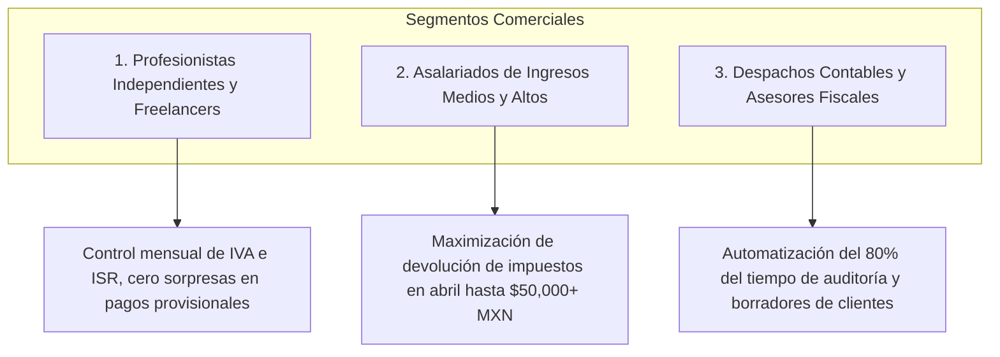

# Capítulo 9: Guía Comercial, Presentación de Ventas y Argumentario

## 🎯 El Pitch Comercial: ¿Por qué tributacos (Declara Pro)?

En México, el cumplimiento fiscal es percibido como un proceso engorroso, opaco y estresante. Los contribuyentes temen cometer errores con el SAT y desconocen cuánto dinero pueden recuperar legalmente en su declaración anual. Por su parte, los despachos contables dedican cientos de horas manuales a descargar, ordenar y formular hojas de cálculo en Excel para cada uno de sus clientes.

**tributacos resuelve este dolor de raíz.**

> *"tributacos es la única plataforma de inteligencia fiscal en México que desmenuza tus CFDIs en segundos, simula tus pagos provisionales y anuales con precisión matemática, y te dice exactamente cuánto dinero te debe devolver el SAT antes de que termine el año."*

---

## 💼 Perfiles de Cliente y Propuesta de Valor Específica

### 1. Profesionistas y Personas Físicas con Actividad Empresarial (PFAE)
- **Problema:** No saben cuánto apartar de IVA e ISR cada mes y viven con miedo de no tener liquidez para el pago del día 17.
- **Solución con tributacos:** Ven en tiempo real su matriz de 12 meses, saben si están en superávit o déficit, y obtienen el borrador del SAT listo para pagar en minutos.
- **Argumento de Venta:** *"Ahorra hasta $10,000 MXN al año en multas y recargos por declaraciones mal presentadas o fuera de tiempo."*

### 2. Empleados Asalariados (Sueldos y Salarios)
- **Problema:** En abril presentan su declaración anual a ciegas y aceptan la propuesta prellenada del SAT sin saber que el SAT omitió facturas médicas o colegiaturas deducibles.
- **Solución con tributacos:** Conocen con meses de anticipación su saldo a favor, auditan a sus patrones y aprovechan su tope de deducciones (hasta 5 UMAs) para recuperar hasta $30,000 - $60,000 MXN en su cuenta bancaria.
- **Argumento de Venta:** *"El software se paga solo con el incremento en tu saldo a favor que recuperarás en tu próxima declaración anual."*

### 3. Despachos Contables y Contadores Públicos
- **Problema:** Dedican días enteros a clasificar XMLs en carpetas y formular hojas de Excel para cada cliente, limitando el número de cuentas que pueden atender.
- **Solución con tributacos:** Sincronizan carpetas de clientes en 5 segundos, generan papeles de trabajo exportables a CSV, y entregan reportes ejecutivos modernos a sus clientes.
- **Argumento de Venta:** *"Multiplica por 5 la capacidad de atención de tu despacho sin contratar más personal y ofrece un servicio premium y transparente a tus clientes."*

---

## 🛡️ Manejo de Objeciones Comunes

| Objeción del Cliente | Respuesta y Argumento Comercial |
| :--- | :--- |
| **"¿Por qué no usar simplemente la página del SAT que es gratuita?"** | La página del SAT es una caja negra: no te explica cómo calculó los números, no te audita facturas no deducibles antes de que las pagues, se satura constantemente y no te dice cómo optimizar tus deducciones antes de que termine el ejercicio fiscal. tributacos te da control proactivo y estratégico. |
| **"¿Mis datos y contraseñas fiscales están seguros?"** | Absolutamente. tributacos se ejecuta de forma local. No te solicita contraseñas sensibles del SAT (CIEC / e.firma) ni almacena tu información fiscal en servidores externos de terceros. Tus XMLs se procesan en tu propia máquina. |
| **"¿Qué pasa si cambian las leyes fiscales o las tarifas del SAT?"** | tributacos integra las tarifas oficiales actualizadas de la LISR (Art. 106 y Art. 152) y el valor vigente de la UMA por cada ejercicio fiscal (2021 a 2026), asegurando cálculos vigentes y precisos. |
| **"Ya tengo un contador que me lleva mis impuestos."** | ¡Excelente! tributacos es el mejor aliado de tu contador. Le proporciona el papel de trabajo listo en segundos y a ti te permite supervisar y entender tus números con total tranquilidad y transparencia. |

---

## 🚀 Guión de Demostración en Vivo (Demo en 5 Minutos)

Para presentar tributacos a un prospecto o cliente en una reunión de venta, sigue este guión probado de 5 pasos:

1. **Minuto 1 — Ingesta en Vivo:** Abre el sistema, presiona *"Desmenuzar XMLs"* y arrastra un archivo `.zip` con 200 facturas. Muestra cómo en menos de 2 segundos el sistema clasifica todo sin duplicados.
2. **Minuto 2 — El Dashboard:** Muestra la pantalla principal con el semáforo y explica: *"Aquí ves de inmediato si este año el SAT te debe dinero o si tú le debes al SAT."*
3. **Minuto 3 — Pre-Declaración Mensual:** Ve a la pestaña mensual y haz clic en *"📋 Borrador SAT"*. Explica: *"Este es el formulario idéntico al del SAT. Tu contador o tú solo copian estos números y terminan la declaración en 2 minutos."*
4. **Minuto 4 — El Optimizador de Deducciones:** Abre la Pre-Declaración Anual y muestra el termómetro de deducciones: *"Aquí el sistema te dice: 'Aún tienes $40,000 pesos de margen deducible'. Si vas al dentista o pagas lentes antes de diciembre, ganas dinero directo en tu devolución."*
5. **Minuto 5 — Cierre y Exportación:** Presiona *"📊 Exportar Papel de Trabajo (CSV)"*, abre el archivo en Excel y cierra: *"Tienes auditoría completa, seguridad local y control total sobre tu dinero."*
