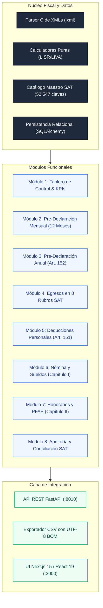

# tribuTACOS — Manual de Usuario

# Capítulo 09: Roadmap y Evolución Modular

Estructura modular del sistema, arquitectura por capas, roadmap de versiones y plan de expansión funcional.

---

## 1. Arquitectura Modular del Sistema

tribuTACOS está diseñado bajo un modelo desacoplado y extensible:

---

## 2. Roadmap Evolutivo de Versiones

### Versión 1.0 (Completada): Núcleo de Simulación y Análisis
* [x] Parser universal de comprobantes fiscales CFDI 3.3 y 4.0.
* [x] Calculadoras deterministas para Sueldos (Art. 96), Honorarios (Art. 106) y Declaración Anual (Art. 152).
* [x] Ingesta masiva por drag-and-drop y descompresión de archivos ZIP.
* [x] Taxonomía en 8 rubros con más de 52,000 claves del catálogo SAT.
* [x] Módulo de Conciliación y Auditoría de PDFs oficiales del SAT.

### Versión 2.0 (Completada): Interfaz Next.js 15 y Multi-Ejercicio
* [x] Migración integral a Next.js 15 (App Router) con React 19 y Tailwind CSS.
* [x] Soporte multianual instantáneo (2021 a 2026) con recálculo en menos de 15 ms.
* [x] Modales de borrador oficial del SAT para pagos provisionales de ISR e IVA.
* [x] Optimizador de deducciones personales con límites independientes para PPR (Fracc. V).
* [x] Generador de reportes CSV listos para Microsoft Excel con codificación UTF-8 BOM.

### Versión 2.5 (Próxima): Automatización y Alertas Tempranas
* [ ] Conector directo vía API de descarga masiva del SAT (Web Scraping / WS SAT con CIEC o e.firma).
* [ ] Sistema de alertas automáticas para deducciones en riesgo de tope legal o facturas no bancarizadas.
* [ ] Generador de proyecciones fiscales a futuro para planeación patrimonial.
* [ ] Soporte para Régimen Simplificado de Confianza (RESICO - Art. 113-E).

### Versión 3.0 (Planificada): Suite Corporativa y Multi-Tenant
* [ ] Modo multi-usuario con roles diferenciados (Contador, Asistente, Cliente).
* [ ] Panel de control para despachos contables con visión multi-empresa.
* [ ] Integración bancaria mediante Open Banking para conciliación automática de estados de cuenta.
* [ ] Exportación de declaraciones en formato XML oficial para carga en el portal del SAT.
