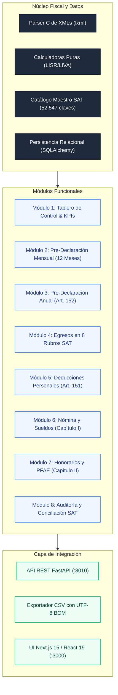

# tribuTACOS — Manual de Usuario

# Capítulo 09: Arquitectura y Componentes Modulares

Estructura modular del sistema, arquitectura por capas, catálogo de componentes y flujo de datos fiscal.

---

## 1. Arquitectura Modular del Sistema

tribuTACOS está diseñado bajo un modelo desacoplado, determinista y de alto rendimiento organizado en tres capas independientes:

---

## 2. Catálogo de Módulos Funcionales del Sistema

| Módulo | Responsabilidad Fiscal y Contable | Tecnologías y Motores |
| :--- | :--- | :--- |
| **1. Tablero Global** | KPIs financieros consolidados, mix de ingresos y saldo estimado. | FastAPI `/api/summary` + React 19 |
| **2. Pre-Declaración Mensual** | Matriz de 12 meses, pagos provisionales ISR (Art. 106) y arrastre de IVA (Art. 5/6). | Motor fiscal de flujo de efectivo |
| **3. Pre-Declaración Anual** | Cascada de 5 pasos conforme al Art. 152 LISR y tasas efectivas. | Tarifa progresiva oficial multianual |
| **4. Egresos Operativos** | Clasificación en 8 rubros de 52,547 claves SAT y auditoría de bancarización. | Catálogo `c_ClaveProdServ` SAT |
| **5. Deducciones Personales** | Termómetro del Art. 151 LISR (15% vs 5 UMAs) y subtope PPR (10%). | Validador de topes y constancias |
| **6. Sueldos y Salarios** | Percepciones gravadas/exentas (Art. 93) y recibos de nómina 1.2. | Complemento Nómina CFDI 1.2 |
| **7. Honorarios y PFAE** | Facturación emitida, retenciones del 10% ISR y 10.6667% IVA. | CFDI 3.3/4.0 de Ingresos y REP |
| **8. Auditoría SAT** | Conciliación 1 a 1 de declaraciones anuales, pagos y acuses bancarios. | Parser de PDFs oficiales del SAT |

---

## 3. Principios de Diseño del Sistema

* **Determinismo Puro:** Mismas entradas (CFDIs y PDFs) producen invariablemente los mismos resultados fiscales al centavo, sin redondeos arbitrarios.
* **Flujo de Efectivo Estricto:** La causación de ISR e IVA se computa por fecha efectiva de pago (`fecha_pago`), respetando la legislación aplicable a personas físicas.
* **Privacidad Local:** El procesamiento y la persistencia residen exclusivamente en la máquina del usuario (`backend/tributacos.db`), garantizando la soberanía de la información financiera.
* **Interoperabilidad:** Exportación instantánea en formatos abiertos estándar (CSV con UTF-8 BOM y PDF).
