# 🌮 tributacos (Declara Pro) — Manual de Usuario Integral y Guía Comercial del Sistema

> **Versión 1.0 • Guía Maestra de Operación, Auditoría Fiscal y Presentación Comercial**  
> *Plataforma de Inteligencia Tributaria, Auditoría de CFDIs y Pre-Declaración Anual y Mensual para Personas Físicas (México)*

---

## 📑 Tabla de Contenidos

1. [Capítulo 1: Introducción y Propuesta de Valor](#capítulo-1-introducción-y-propuesta-de-valor)
2. [Capítulo 2: Primeros Pasos, Ingesta de CFDIs y Multi-Contribuyente](#capítulo-2-primeros-pasos-ingesta-de-cfdis-y-multi-contribuyente)
3. [Capítulo 3: Módulo 1 — Dashboard Global](#capítulo-3-módulo-1--dashboard-global)
4. [Capítulo 4: Módulo 2 — Pre-Declaración Mensual (Pagos Provisionales)](#capítulo-4-módulo-2--pre-declaración-mensual-pagos-provisionales)
5. [Capítulo 5: Módulo 2 — Pre-Declaración Anual (Art. 152 LISR)](#capítulo-5-módulo-2--pre-declaración-anual-art-152-lisr)
6. [Capítulo 6: Módulo 3 — Egresos, Gastos, Deducciones y Bancarización](#capítulo-6-módulo-3--egresos-gastos-deducciones-y-bancarización)
7. [Capítulo 7: Módulo 4 — Ingresos, Nómina y Honorarios](#capítulo-7-módulo-4--ingresos-nómina-y-honorarios)
8. [Capítulo 8: Módulo 5 — Auditoría Oficial SAT y Conciliación](#capítulo-8-módulo-5--auditoría-oficial-sat-y-conciliación)
9. [Capítulo 9: Guía Comercial, Presentación de Ventas y Argumentario](#capítulo-9-guía-comercial-presentación-de-ventas-y-argumentario)

---

# Capítulo 1: Introducción y Propuesta de Valor

## 🌮 ¿Qué es tributacos (Declara Pro)?

**tributacos** es una solución tecnológica integral de **inteligencia fiscal y pre-declaración automatizada** creada para Personas Físicas y Despachos Contables en México.

El sistema procesa y audita comprobantes fiscales digitales por internet (**CFDI 3.3 y CFDI 4.0**), convirtiendo carpetas de archivos XML en un tablero financiero interactivo de alta precisión capaz de calcular:
- **Pagos Provisionales Mensuales de ISR (Formulario R122)** y de **IVA Definitivo (Formulario R21)** según el Artículo 106 de la LISR y Artículos 5 y 6 de la LIVA.
- **Pre-Declaración Anual (Artículo 152 de la LISR)** con proyección anticipada de Saldo a Favor (Devolución del SAT) o Impuesto Anual a Cargo.
- **Optimización de Deducciones Personales (Artículo 151 de la LISR)** determinando el tope legal de 5 UMAs anuales o el 15% de los ingresos acumulables.
- **Auditoría de Bancarización y Egresos (Artículo 27 de la LISR)** detectando pagos en efectivo no deducibles mayores a $2,000 MXN o consumos de combustible no bancarizados.
- **Conciliación Oficial contra Documentos y Acuses SAT (PDFs)** para garantizar que no existan discrepancias fiscales entre lo facturado y lo presentado.

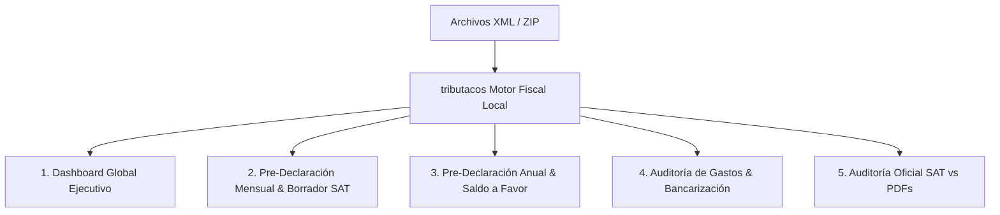

---

# Capítulo 2: Primeros Pasos, Ingesta de CFDIs y Multi-Contribuyente

## 🚀 Arranque y Despliegue Local

El sistema opera con arquitectura desacoplada: **FastAPI en Python 3.11** en el backend y **React con Vite** en el frontend.

```bash
# Iniciar ambos servicios en un solo comando
make dev
```
- **Panel de Usuario:** `http://localhost:5173`
- **Documentación de la API Backend:** `http://localhost:8010/docs`

---

## 🧭 Barra Lateral de Navegación y Controles Globales


1. **Identidad del Contribuyente:** Muestra la marca **tributacos 🌮** y el RFC del contribuyente actualmente activo.
2. **Botón de Ingesta Principal:** Acceso directo a la función *"Desmenuzar XMLs"*.
3. **Selector de Contribuyente (Multi-RFC):** Desplegable que lista todos los RFCs detectados en la base de datos para alternar entre clientes instantáneamente.
4. **Selector de Ejercicio Fiscal:** Menú para cambiar entre los años **2021, 2022, 2023, 2024, 2025 y 2026**.
5. **Botón de Sincronización (🔄):** Fuerza el recálculo y la reindexación de los comprobantes locales en memoria.

---

## 🗂️ Ingesta Inteligente: Modal "🌮 Desmenuzar XMLs"

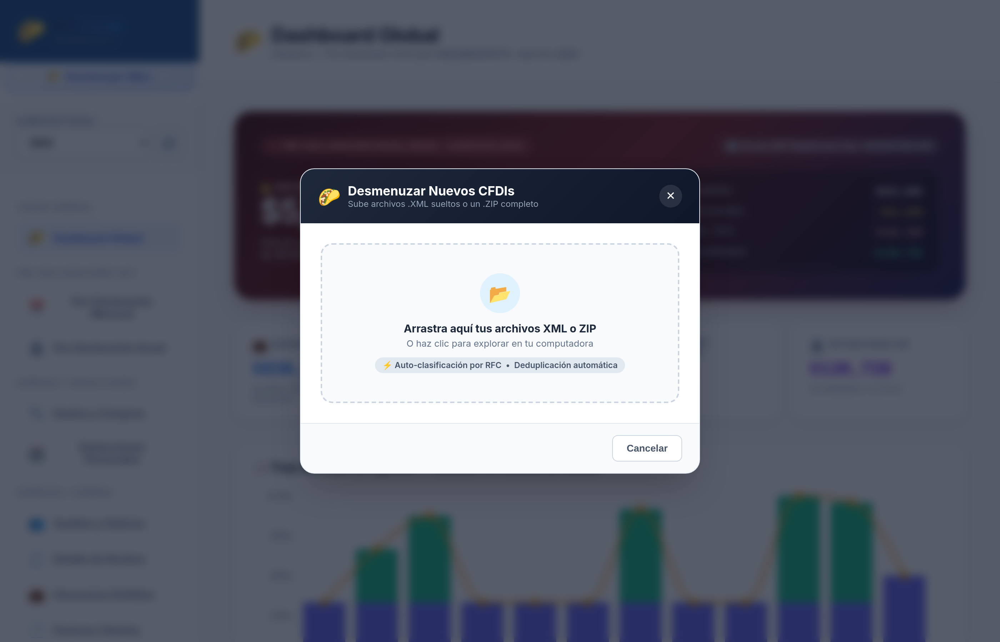

Al hacer clic en el botón de la barra lateral izquierda, se abre el modal de carga masiva (`UploadModal`):
- **Carga de Archivos Sueltos o ZIPs Completos:** Puedes arrastrar archivos `.xml` individuales o un archivo `.zip` con cientos de comprobantes organizados en subcarpetas.
- **Deduplicación Automática por UUID:** Identifica el folio fiscal único de cada comprobante. Nunca duplicará ingresos o gastos aunque el mismo archivo se suba repetidamente.
- **Auto-Clasificación por RFC:** Detecta automáticamente si el contribuyente es Emisor (facturas de honorarios/ingresos) o Receptor (recibos de nómina, compras, gastos deducibles) y asigna el comprobante al año fiscal correspondiente.

---

# Capítulo 3: Módulo 1 — Dashboard Global

El **Dashboard Global** es el centro de mando que ofrece una radiografía inmediata de la salud fiscal del contribuyente.

---

### 1. Gran Hero Card y Cuatro KPIs Ejecutivos

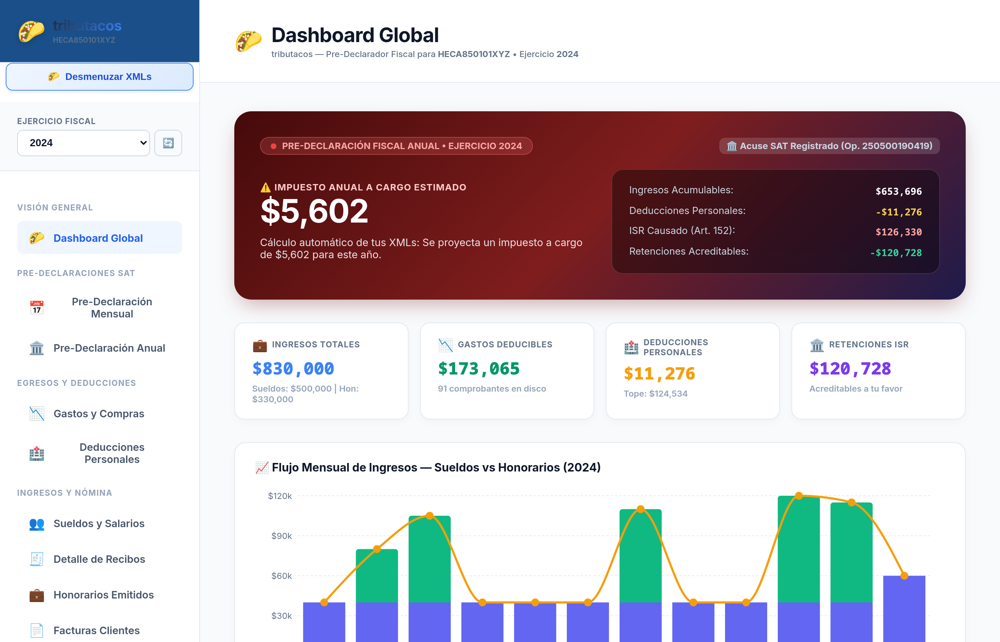

- **Hero Card con Semáforo Fiscal:** Indica con fondo dinámico el resultado anual estimado (Verde: Saldo a Favor / Rojo: Impuesto a Cargo).
- **4 Tarjetas de Métricas Clave (KPIs):** Ingresos Totales Brutos, Deducciones Totales, Retenciones de ISR acumuladas y Balance Anual.

---

### 2. Desglose y Distribución por Régimen

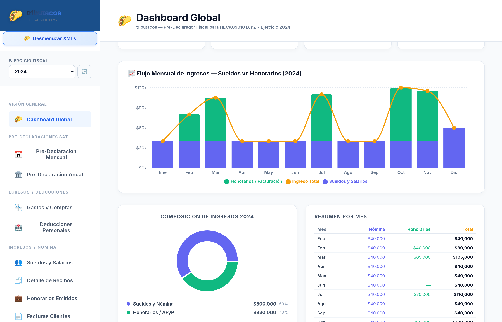

- **👔 Sueldos y Salarios:** Percepciones brutas, gravadas, exentas y retenciones de patrones.
- **💼 Honorarios / Actividad Empresarial:** Facturación cobrada bajo flujo de efectivo, gastos deducibles y utilidad neta.
- **📈 Intereses Financieros:** Rendimientos reales e ISR retenido por bancos.

---

### 3. Cascada Fiscal de Determinación (Waterfall)

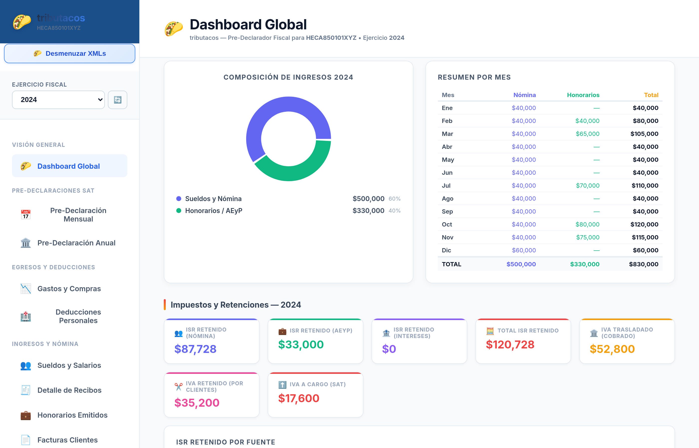

Detalla el cálculo progresivo desde el ingreso acumulable total hasta el saldo a favor final o impuesto a cargo.

---

# Capítulo 4: Módulo 2 — Pre-Declaración Mensual (Pagos Provisionales)

Diseñado para cumplir con las obligaciones del día 17 de cada mes para Personas Físicas con Actividad Empresarial y Servicios Profesionales.

---

### 1. Encabezado y KPIs Ejecutivos


- **Ingresos Facturados (Honorarios):** Ingresos acumulados de facturas cobradas.
- **Gastos Deducibles Bancarizados:** Compras y gastos pagados por medios electrónicos.
- **ISR Provisional a Pagar:** Suma de pagos provisionales acumulables para la anual.
- **IVA Definitivo a Pagar:** Impuesto al valor agregado liquidado al SAT tras acreditar compras.

---

### 2. Matriz de 12 Meses (Primer y Segundo Semestre)


Muestra mes por mes el ingreso facturado, gasto deducible, margen de utilidad o déficit operativo, retenciones del 10%, ISR a pagar, IVA cobrado, IVA acreditable e importe total a pagar.

---

### 3. Modal "Borrador Espejo SAT" (Listo para Copiar)

#### A. Sección R122: Determinación de ISR


#### B. Sección R21: Determinación de IVA


Permite copiar los números calculados directamente al portal del SAT en menos de 2 minutos sin temor a errores de cálculo.

---

# Capítulo 5: Módulo 2 — Pre-Declaración Anual (Art. 152 LISR)

Calcula la determinación del Impuesto Sobre la Renta anual aplicando la tarifa progresiva oficial de la LISR.

---

### 1. Gran Hero Card: Saldo Proyectado y Cascada Oficial


- **Cálculo en Tiempo Real:** Proyecta con meses de anticipación si el contribuyente obtendrá una devolución de impuestos.
- **Botón "📊 Exportar Papel de Trabajo (CSV)":** Genera un archivo descargable estructurado para Excel con todos los renglones de la determinación anual.

---

### 2. Desglose de Origen de Ingresos y Patrones de Nómina


Explica con precisión de dónde proviene cada peso gravable (Sueldos por patrón, Utilidad de Honorarios y Rendimientos Bancarios).

---

### 3. Optimizador de Deducciones Personales (Art. 151 LISR)


- Calcula el tope legal (menor entre 15% de ingresos brutos y 5 UMAs anuales).
- Muestra las deducciones aplicadas y el **remanente libre para deducir** antes del 31 de diciembre para maximizar el saldo a favor.

---

# Capítulo 6: Módulo 3 — Egresos, Gastos, Deducciones y Bancarización

---

### 1. Sub-pestañas, Selector en Píldoras y KPIs de Egresos


- **Alternador de Sub-pestañas:** Conmuta entre **📉 Compras y Gastos** y **💵 Devoluciones y Reembolsos (Notas de Crédito)**.
- **Selector de Periodo en Píldoras:** Botón *🗓️ Todo el Año* y 12 botones mensuales con badges de cantidad de facturas.
- **4 KPIs Ejecutivos:** Egresos Pagados, Gasto Neto Deducible, IVA Acreditable Acumulado y Mes Pico Anual.

---

### 2. Gráfica Interactiva de Evolución Mensual y Flujo


- Barras apiladas de Subtotal Deducible e IVA Acreditable.
- Línea de referencia verde del promedio mensual de gasto.

---

### 3. Panel de Deducibilidad y Ranking de Proveedores


- **Mix de Deducibilidad:** Gráfica donut que clasifica compras en *100% Deducibles* vs *No Deducibles / Observadas*.
- **Top 6 Proveedores:** Identifica las empresas con mayor concentración de pagos.

---

### 4. Explorador y Agrupación de Gastos (3 Modos Interactivos)

#### Modo 1: 📁 Por Rubro / Categoría (Maestro-Detalle de Partidas por Artículo)


#### Modo 2: 🏢 Por Proveedor (Agrupación Consolidada por RFC)


#### Modo 3: 📋 Lista Cronológica (Tabla Continua con Auditoría de Efectivo)


---

### 5. Notas de Crédito y Reembolsos (CFDI Tipo E)


- Detalla devoluciones de compras a tarjetas y bonificaciones de proveedores que disminuyen las compras netas del ejercicio fiscal.

---

### 6. Deducciones Personales (Art. 151 LISR)


- Termómetro de tope legal (15% de ingresos vs 5 UMAs anuales).
- Matriz de conceptos personales: salud (D01, D02), seguros (D07), hipotecas (D05), donativos (D04) y colegiaturas (D10).

---

# Capítulo 7: Módulo 4 — Ingresos, Nómina y Honorarios

---

### 1. Sueldos, Salarios e Ingresos Exentos (Art. 93 LISR)

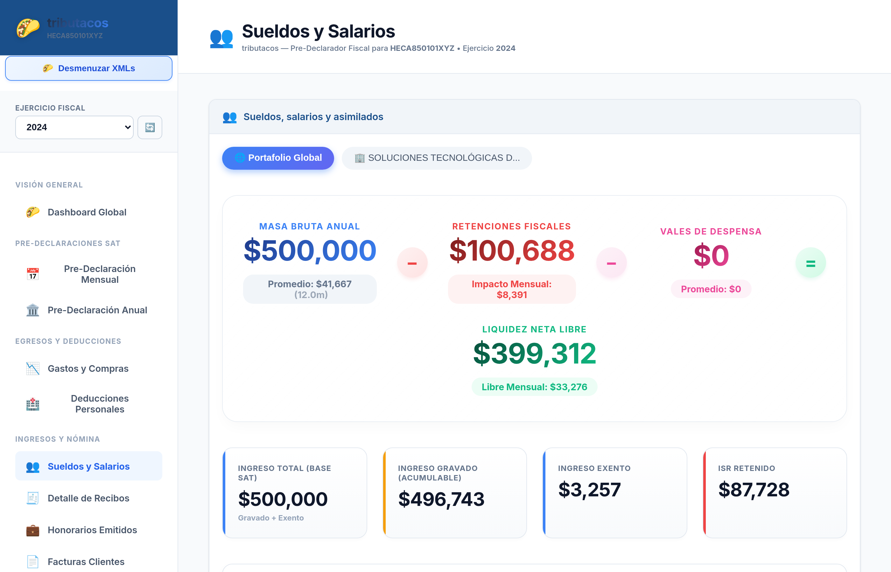

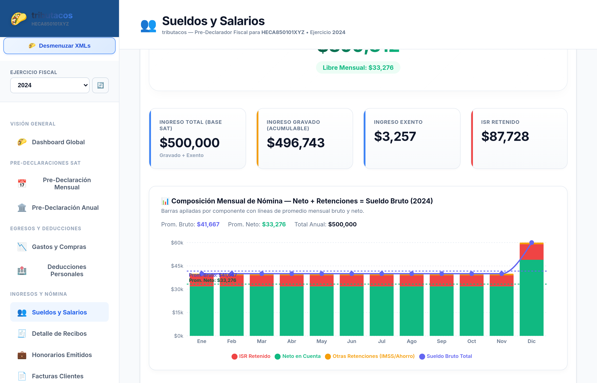

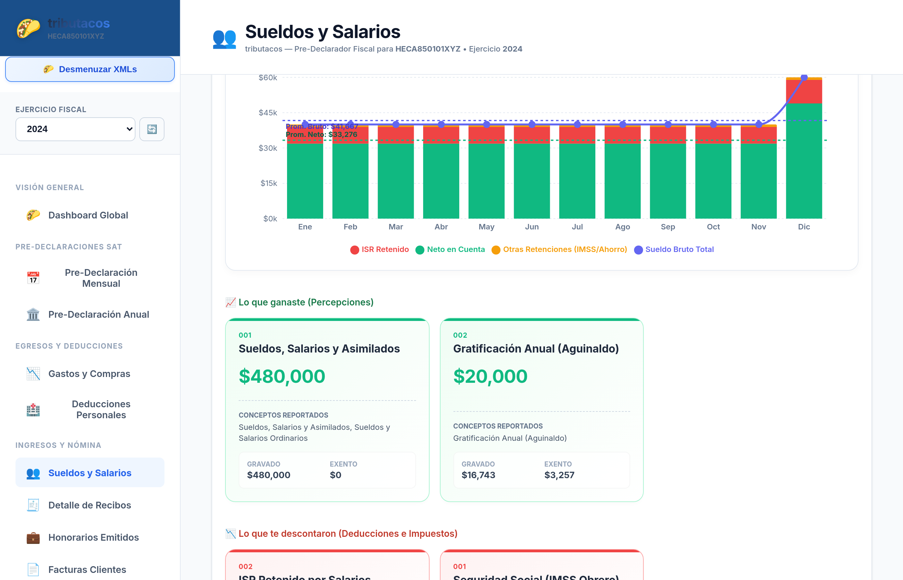

Aplica los topes en UMAs para Aguinaldo (30 UMAs), Prima Vacacional (15 UMAs) y PTU (15 UMAs).

---

### 2. Visor Detallado de Recibos de Nómina

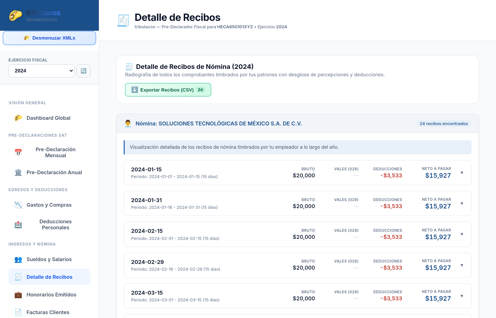

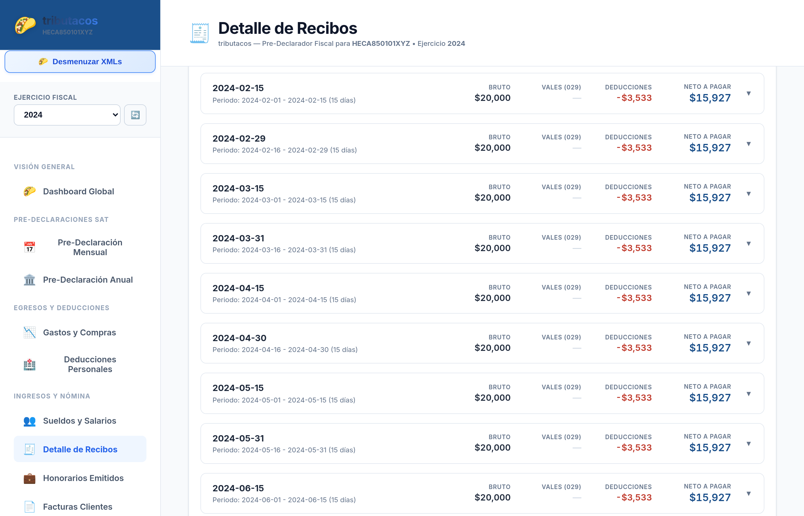

Detalla cada quincena con percepciones, retención de IMSS (001), retención de ISR (002) y descarga de XMLs.

---

### 3. Honorarios, Píldoras de Clientes y Catálogo SAT (`c_ClaveProdServ`)

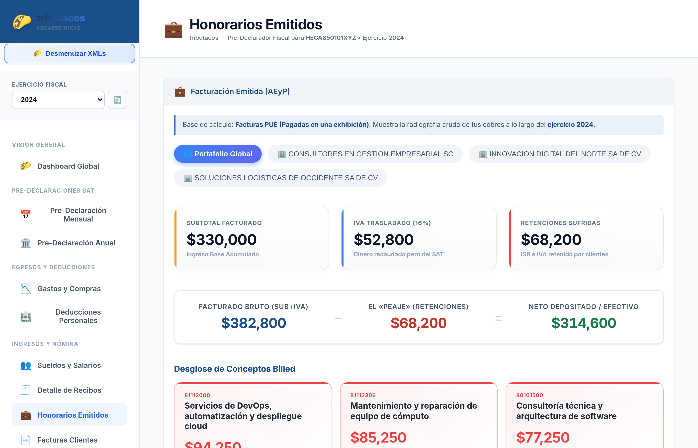

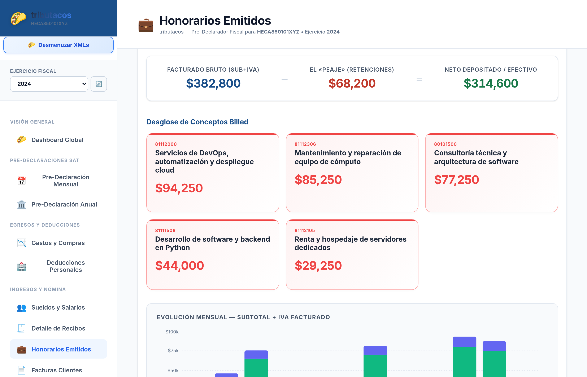

Agrupa clientes por RFC y traduce códigos numéricos del SAT a descripciones oficiales legibles en español.

---

### 4. Facturación Emitida y Descarga de XMLs

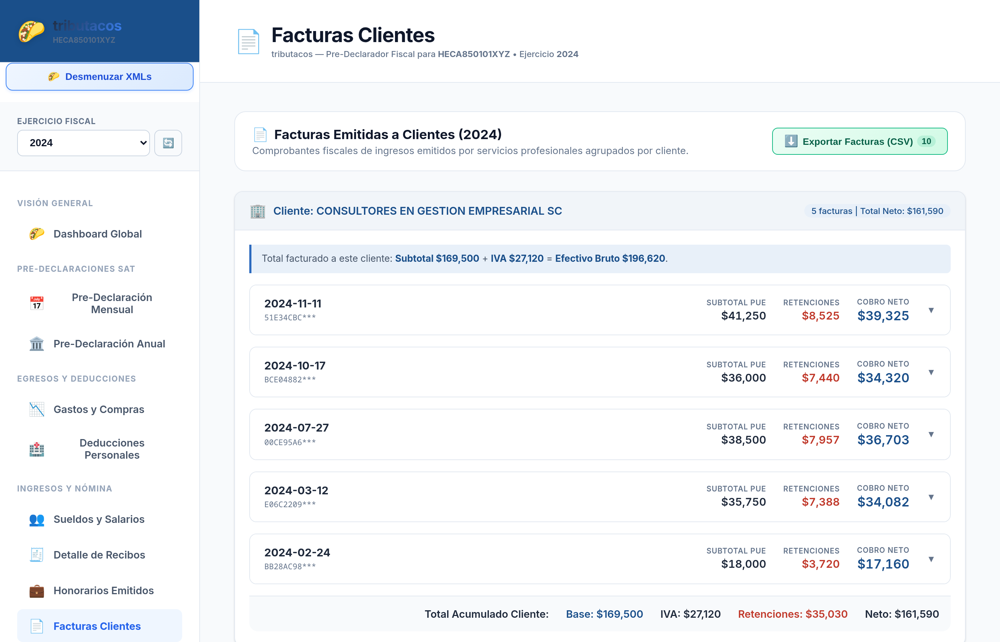

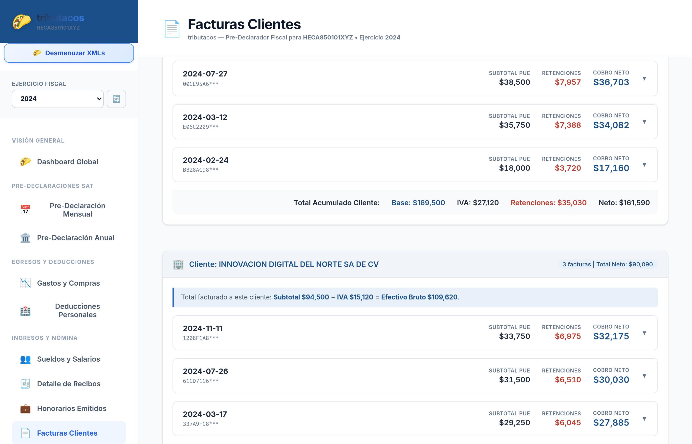

---

# Capítulo 8: Módulo 5 — Auditoría Oficial SAT y Conciliación

---

### 1. Declaración Anual Oficial y Cuenta CLABE


Muestra número de operación SAT de 14 dígitos, estatus (Normal/Complementaria), cuenta CLABE y banco para depósito de la devolución.

---

### 2. Resumen de Cumplimiento y Matriz de 12 Meses Declarados


Compara las declaraciones mensuales presentadas en ventanilla bancaria con lo calculado a partir de los XMLs.

---

# Capítulo 9: Guía Comercial, Presentación de Ventas y Argumentario

## 🎯 Propuesta de Valor Comercial
tributacos es la herramienta de inteligencia fiscal definitiva para:
1. **Profesionistas Independientes:** Elimina el estrés de los pagos provisionales y evita multas.
2. **Asalariados:** Recupera hasta decenas de miles de pesos en saldo a favor gracias a la optimización de deducciones.
3. **Despachos Contables:** Reduce en un 80% el tiempo de auditoría de clientes, genera borradores automáticos y entrega reportes de nivel directivo.

## 🚀 Guión de Demostración en 5 Minutos
1. **Carga en Vivo:** Arrastra 200 XMLs en el botón *"Desmenuzar XMLs"* y muestra la velocidad de ingesta.
2. **El Semáforo:** Muestra el saldo proyectado en el Dashboard.
3. **Borrador Mensual:** Abre el modal *"Borrador SAT"* listo para copiar en el portal oficial.
4. **Optimizador de Deducciones:** Enseña el margen disponible para deducir antes de fin de año.
5. **Exportación:** Descarga el Papel de Trabajo a CSV y ábrelo en Excel para cerrar la venta.
