# tribuTACOS — Manual de Usuario Completo

> **Plataforma de Inteligencia Fiscal, Conciliación de Comprobantes Digitales (CFDI 3.3/4.0) y Simulación Analítica de Pre-Declaración Mensual y Anual para Personas Físicas en México.**

---

## Tabla de Contenidos

1. [Capítulo 01: Introducción y Propuesta de Valor](#capítulo-01-introducción-y-propuesta-de-valor)
2. [Capítulo 02: Primeros Pasos e Ingesta de Comprobantes](#capítulo-02-primeros-pasos-e-ingesta-de-comprobantes)
3. [Capítulo 03: Módulo Dashboard Principal](#capítulo-03-módulo-dashboard-principal)
4. [Capítulo 04: Módulo de Pre-Declaración Mensual (ISR e IVA)](#capítulo-04-módulo-de-pre-declaración-mensual-isr-e-iva)
5. [Capítulo 05: Módulo de Declaración Anual](#capítulo-05-módulo-de-declaración-anual)
6. [Capítulo 06: Módulo de Egresos y Deducciones](#capítulo-06-módulo-de-egresos-y-deducciones)
7. [Capítulo 07: Módulo de Ingresos y Nómina](#capítulo-07-módulo-de-ingresos-y-nómina)
8. [Capítulo 08: Módulo de Auditoría SAT y Conciliación Oficial](#capítulo-08-módulo-de-auditoría-sat-y-conciliación-oficial)
9. [Capítulo 09: Roadmap y Evolución Modular](#capítulo-09-roadmap-y-evolución-modular)

---

# Capítulo 01: Introducción y Propuesta de Valor

Plataforma de inteligencia fiscal, conciliación de comprobantes digitales (CFDI 3.3 y 4.0 en XML) y pre-declaración automática para personas físicas en México.

---

## 1. Visión General del Producto

**tribuTACOS** es una herramienta analítica diseñada para contribuyentes bajo regímenes de **Sueldos y Salarios (Capítulo I)** y **Actividad Empresarial y Servicios Profesionales (Capítulo II - PFAE)**.

La plataforma resuelve la complejidad del cálculo tributario mediante el análisis algorítmico y determinista de los comprobantes fiscales digitales timbrados (CFDIs) y los documentos oficiales del SAT en PDF, permitiendo proyectar con exactitud:
* **Pagos Provisionales Mensuales de ISR (Art. 106 LISR)** bajo el principio estricto de flujo de efectivo.
* **Declaración Definitiva Mensual de IVA (Art. 5 y 6 LIVA)** con control y arrastre automático de saldos a favor.
* **Declaración Anual del Ejercicio (Art. 152 LISR)** con auditoría del límite legal de deducciones personales (Art. 151 LISR).
* **Auditoría Bidireccional** contra las declaraciones presentadas ante el SAT y los acuses de pago bancarios.

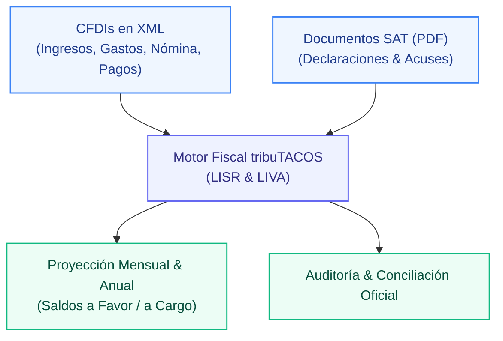

---

## 2. Diferenciadores Clave

| Característica | Visor Tradicional / SAT | tribuTACOS |
| :--- | :--- | :--- |
| **Procesamiento de Datos** | Servidores remotos y lentos | 100% Local y Privado (Baja latencia <15ms) |
| **Taxonomía de Gastos** | Sin categorización operativa | Clasificación automática en 8 rubros de 52,547 claves SAT |
| **Flujo de Efectivo** | Mezcla PUE y PPD sin conciliar | Validación estricta por fecha efectiva de cobro/pago |
| **Deducciones Personales** | Criterio opaco sin desglose de topes | Termómetro en tiempo real: 15% de ingresos vs 5 UMAs y PPR |
| **Arrastre de IVA** | Manual y propenso a errores | Arrastre automático mes a mes de remanentes a favor |
| **Auditoría de Pagos** | Consulta dispersa en portales bancarios | Conciliación 1 a 1 de acuses bancarios vs declaraciones |

---

## 3. Principio de Soberanía y Privacidad de Datos

tribuTACOS opera bajo una estricta política de **privacidad local**. La información contable, UUIDs fiscales, cadenas originales y montos financieros residen exclusivamente en la base de datos relacional local (`tributacos.db`), sin transmisión a servidores externos ni intermediarios terceros.

---

## 4. Aviso Legal / Disclaimer

tribuTACOS es una plataforma de análisis, proyección y simulación fiscal basada en la interpretación algorítmica de comprobantes digitales (CFDI) y la legislación mexicana (LISR y LIVA). Los cálculos y resultados presentados son de carácter estrictamente estimativo e informativo, no constituyen asesoría fiscal ni reemplazan las declaraciones oficiales presentadas ante el Servicio de Administración Tributaria (SAT).

---

# Capítulo 02: Primeros Pasos e Ingesta de Comprobantes

Guía paso a paso para la inicialización del entorno, selección de contribuyente, ejercicio fiscal e ingesta masiva de archivos XML y documentos SAT.

---

## 1. Puesta en Marcha Inicial

Para arrancar el sistema completo con servidores de backend y frontend sincronizados:

```bash
# Instalación y preparación con base de datos demo
make setup

# Ejecución paralela de servicios (Backend :8010 + Frontend :3000)
make dev
```

La plataforma estará disponible de inmediato en:
* **Interfaz de Usuario:** `http://localhost:3000`
* **API REST y Swagger:** `http://localhost:8010/docs`

---

## 2. Selector de Contribuyente y Ejercicio Fiscal

En el panel lateral izquierdo (*Sidebar*), el usuario dispone de los selectores maestros:

1. **Selector de Contribuyente:** Permite alternar entre diferentes personas físicas registradas en el sistema (por ejemplo, `SHLL250825XYZ - Sheila Shellaquiles Ortega`).
2. **Selector de Ejercicio Fiscal:** Permite navegar instantáneamente entre los ejercicios fiscales **2021 a 2026**, recalculando la base gravable y las tarifas oficiales en menos de 15 milisegundos.
3. **Botón de Sincronización:** Fuerza la reevaluación de los comprobantes y la invalidación de la caché.

---

## 3. Ingesta Masiva de Comprobantes XML

Al hacer clic en el botón principal **"Cargar Comprobantes XML"**, se despliega el modal interactivo de ingesta:

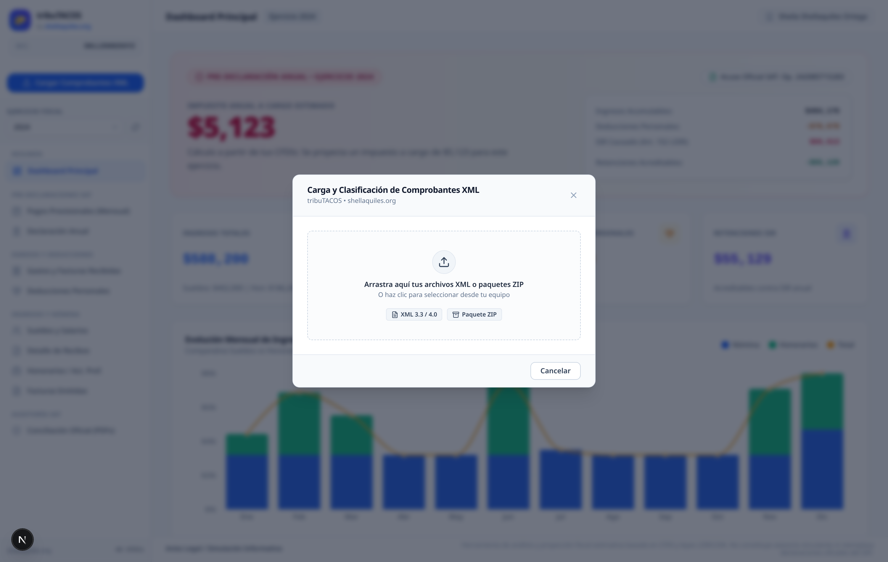

### 3.1 Métodos de Carga Soportados:
* **Arrastrar y Soltar (Drag & Drop):** Arrastre de múltiples archivos `.xml` o carpetas completas directamente sobre el área punteada.
* **Archivos Comprimidos (.ZIP):** Carga de paquetes `.zip` con cientos de facturas timbradas; el backend descomprime y clasifica cada archivo en memoria.
* **Explorador de Archivos:** Clic sobre el área de carga para seleccionar archivos locales desde el explorador del sistema operativo.

### 3.2 Pipeline Automático de Procesamiento:
1. **Validación de Esquema XML:** Comprobación del estándar Anexo 20 (CFDI 3.3 y CFDI 4.0) mediante el parser optimizado en C (`lxml`).
2. **Deduplicación por UUID Fiscal:** Si un comprobante ya fue registrado previamente en la base de datos, se omite de forma idempotente sin duplicar montos.
3. **Clasificación por RFC:** Si el RFC del contribuyente activo coincide con el emisor, se clasifica como *Ingreso / Emitido*; si coincide con el receptor, se clasifica como *Gasto / Deducción / Recibido*.
4. **Invalidación de Caché:** Se actualiza automáticamente el registro en `summary_cache` para reflejar las nuevas cifras en tiempo real.

---

# Capítulo 03: Módulo Dashboard Principal

Visión consolidada del ejercicio fiscal, KPIs financieros, distribución de ingresos por régimen y determinación preliminar anual.

---

## 1. Visión General del Tablero

El **Dashboard Principal** es la pantalla de bienvenida y centro de mando del contribuyente. Proporciona una radiografía financiera y fiscal inmediata del ejercicio seleccionado.

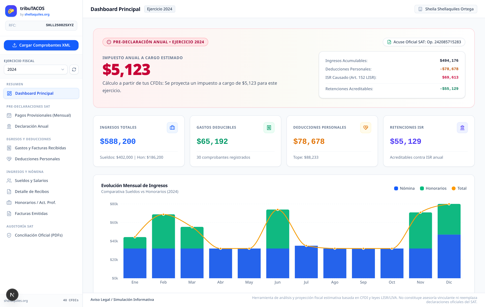

---

## 2. Componentes y Métricas del Tablero

### 2.1 Tarjeta Hero de Determinación Proyectada
* **Saldo Estimado:** Muestra en tipografía destacada el saldo a favor proyectado con devolución estimada del SAT (en color verde esmeralda) o el impuesto a cargo a liquidar.
* **Número de Acuse SAT:** Si existe una declaración anual oficial conciliada en PDF, muestra el número de operación oficial registrado ante la autoridad tributaria.
* **Desglose Sintético:** Presenta el resumen de:
  - Ingresos Acumulables Totales
  - Deducciones Personales Aplicadas
  - ISR Causado Anual (Art. 152 LISR)
  - Retenciones Acreditables (Nómina y Clientes PM)

### 2.2 Cuatro Indicadores Financieros Clave (KPIs)
1. **Ingresos Totales:** Suma consolidada de percepciones por nómina y facturación de honorarios/actividad empresarial.
2. **Gastos Deducibles:** Monto total de egresos operativos bancarizados con CFDI de tipo Gasto.
3. **Deducciones Personales:** Monto aceptado para el cálculo anual dentro de los topes legales de la LISR.
4. **Retenciones de ISR:** Total de impuestos retenidos por terceros (patrones y personas morales clientes) disponibles para acreditar.

### 2.3 Mix y Distribución de Ingresos
Gráfico de distribución que contrasta el peso relativo entre los ingresos por **Sueldos y Salarios (Capítulo I)** y los ingresos por **Servicios Profesionales / PFAE (Capítulo II)**.

---

# Capítulo 04: Módulo de Pre-Declaración Mensual (ISR e IVA)

Matriz analítica de los 12 meses del ejercicio, pagos provisionales acumulativos de ISR, acreditamiento de IVA y generación del borrador oficial SAT.

---

## 1. Fundamento Legal y Flujo de Efectivo

El módulo opera bajo el principio de **flujo de efectivo** exigido por la legislación tributaria para personas físicas con Actividad Empresarial y Profesional:
* **Ingresos Computables:** Facturas emitidas con método `PUE` (Pago en una Sola Exhibición) y complementos de pago `PPD` efectivamente cobrados en el mes (`fecha_pago`).
* **Gastos Deducibles:** Facturas recibidas `PUE` y complementos de pago efectivamente erogados mediante medios bancarizados.
* **Pagos Provisionales de ISR (Art. 106 LISR):** Cálculo acumulativo desde enero hasta el mes de causación.
* **Determinación de IVA (Art. 5 y 6 LIVA):** Impuesto definitivo mensual con acreditamiento de saldos a favor arrastrables.

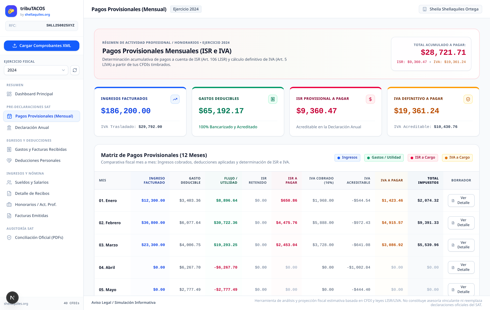

---

## 2. Matriz Comparativa de 12 Meses

La tabla principal desglosa para cada uno de los meses del año (Enero a Diciembre):
1. **Ingresos PFAE Efectivos:** Monto cobrado en el mes.
2. **Gastos Operativos Efectivos:** Monto pagado deducible.
3. **Utilidad / Pérdida del Periodo:** Semáforo visual en verde (utilidad) o rojo (pérdida).
4. **ISR Retenido (10% PM):** Retenciones aplicadas por personas morales en el periodo.
5. **ISR a Pagar Proyectado:** Determinación del pago provisional tras descontar retenciones y pagos anteriores.
6. **IVA a Pagar / Remanente:** IVA cobrado menos IVA acreditable, retención de IVA y remanentes anteriores.
7. **Acción Borrador:** Botón para abrir el desglose oficial del mes.

---

## 3. Modal de Borrador Oficial SAT (ISR e IVA)

Al hacer clic en el botón **"Borrador"** de cualquier mes, se abre la ventana emergente con el borrador interactivo:


### 3.1 Pestaña ISR (Régimen 122 - Art. 106):
* Ingresos acumulados del ejercicio al mes corriente.
* Deducciones acumuladas del ejercicio al mes corriente.
* Base gravable provisional acumulada.
* ISR causado acumulado según tarifa mensual del SAT.
* Menos: Pagos provisionales realizados en meses anteriores del mismo ejercicio.
* Menos: Retenciones de ISR efectuadas por personas morales acumuladas.
* **ISR a Pagar en el Periodo**.

### 3.2 Pestaña IVA (Régimen 21 - Art. 5/6 LIVA):
* Total de actos o actividades gravados al 16%.
* IVA trasladado cobrado en el mes.
* Menos: IVA acreditable pagado en gastos del mes.
* Menos: IVA retenido por personas morales en el mes (10.6667%).
* Menos: Remanente de saldo a favor de IVA arrastrado de periodos anteriores.
* **Impuesto a Cargo o Nuevo Saldo a Favor de IVA**.

---

# Capítulo 05: Módulo de Declaración Anual

Determinación del Impuesto Sobre la Renta anual conforme al Artículo 152 de la LISR, desglose en cascada de cinco pasos, cálculo de tasas y gestión de devoluciones.

---

## 1. Visión General de la Determinación Anual

El módulo de **Declaración Anual** integra todos los ingresos acumulables del contribuyente (Sueldos y Salarios + Honorarios/PFAE + Intereses) y computa el impuesto del ejercicio contra la tarifa progresiva del **Art. 152 LISR**.


---

## 2. La Cascada Fiscal de Cinco Pasos

La plataforma visualiza el cálculo en cinco etapas transparentes y auditables:

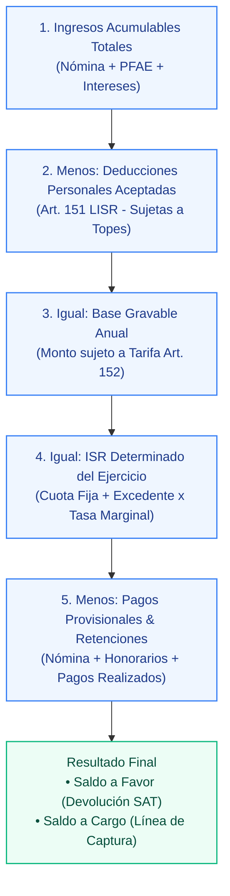

---

## 3. Métricas Financieras del Ejercicio

* **Tasa Efectiva de Impuesto:** Porcentaje real del ingreso que representa el impuesto determinado ($\text{ISR Determinado} / \text{Ingresos Totales}$).
* **Tasa Marginal:** Porcentaje aplicable al último tramo de la tarifa en el que se ubica la base gravable (hasta el 35%).
* **Evolución Multianual de Saldos:**
  - **2021-2022:** Saldos a cargo por salto de tarifa del Art. 152.
  - **2023:** Inicio de estrategia fiscal con Planes Personales de Retiro (PPR) y Seguro de Gastos Médicos Mayores (SGMM), reduciendo el saldo a cargo.
  - **2024-2026:** Consolidación con **Saldos a Favor recurrentes** (de $2,358 a $9,105 MXN) sujetos a devolución automática del SAT a cuenta CLABE.

---

# Capítulo 06: Módulo de Egresos y Deducciones

Auditoría de compras y gastos operativos, clasificación jerárquica en los 8 rubros maestros del SAT y optimizador de deducciones personales (Art. 151 LISR).

---

## 1. Gastos y Facturas Recibidas (Egresos Operativos)

Este módulo procesa todas las facturas recibidas de proveedores, verificando su estatus de bancarización y asociándolas a los 8 rubros operativos:

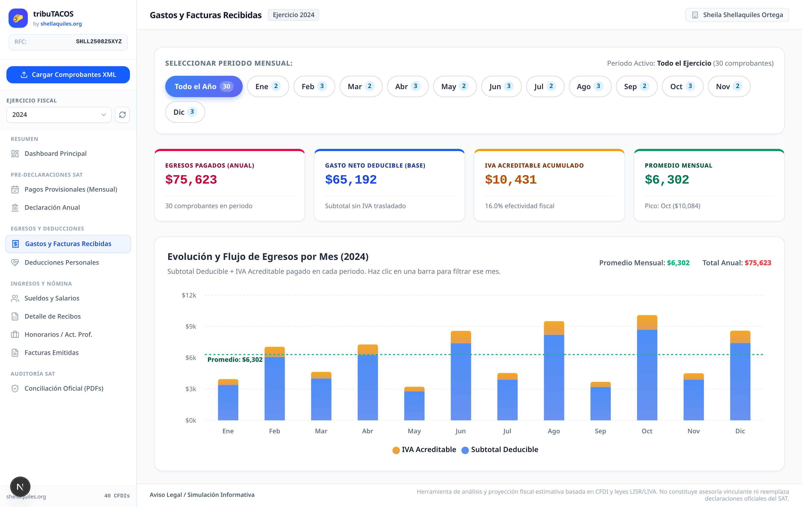

### 1.1 Funcionalidades Principales:
* **Filtro por Mes y por Rubro SAT:** Permite auditar erogaciones mes con mes o por tipo de servicio/producto.
* **Comprobación de Bancarización:** Alerta inmediata sobre facturas mayores a $2,000.00 MXN liquidadas en efectivo (`01`), las cuales son no deducibles conforme a la LISR.
* **Tratamiento de Notas de Crédito:** Descuentos y devoluciones emitidos por proveedores que restan el monto de gastos deducibles.
* **Explorador Maestro-Detalle:** Visualización de cada partida individual de la factura con su clave UNSPSC y tasa de IVA correspondiente.

---

## 2. Deducciones Personales (Art. 151 LISR)

El módulo de **Deducciones Personales** analiza las facturas con uso `D01` a `D10` y las constancias fiscales externas (aportaciones a PPR y seguros):

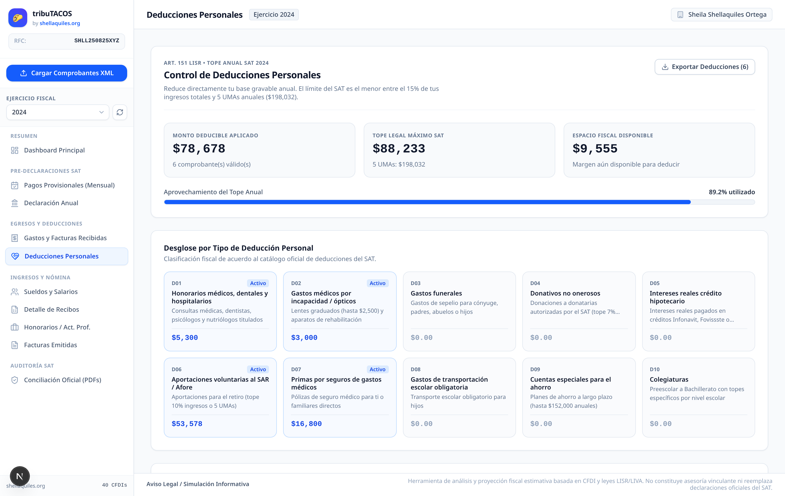

### 2.1 Termómetro del Límite Legal:
* **Tope General:** El menor entre el **15% del total de ingresos acumulables** o **5 UMAs anuales** ($198,031.80 MXN en 2024; $220,614.90 MXN en 2026).
* **Planes Personales de Retiro (PPR - Fracc. V):** Subtope independiente de hasta el **10% de los ingresos acumulables o 5 UMAs anuales**, permitiendo maximizar el saldo a favor.
* **Seguro de Gastos Médicos Mayores (SGMM - Fracc. VI):** Integrado en el límite general con validación de medios de pago electrónicos.

### 2.2 Auditoría de Requisitos Fiscales:
* **Medios de Pago Permitidos:** Tarjeta de débito/crédito (`04`/`28`), transferencia electrónica (`03`), cheque nominativo (`02`).
* **Medios Inválidos:** Todo gasto médico o dental pagado en efectivo (`01`) es marcado como **No Aceptado** de forma automática por el motor fiscal.

---

# Capítulo 07: Módulo de Ingresos y Nómina

Auditoría integral de Sueldos y Salarios (Capítulo I), desglose de recibos quincenales, facturación emitida por Honorarios/PFAE (Capítulo II) y concentración de clientes.

---

## 1. Sueldos y Salarios (Capítulo I LISR)

El módulo de **Sueldos y Salarios** procesa los complementos de nómina 1.2 timbrados por los empleadores durante el ejercicio:

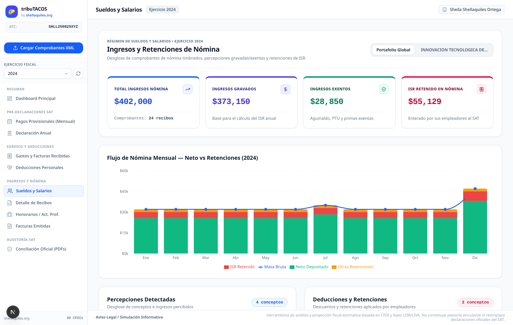

### 1.1 Indicadores Consolidados:
* **Masa Salarial Bruta:** Total de percepciones devengadas ($30,000.00 MXN mensuales / $15,000.00 quincenales de base).
* **Percepciones Gravadas:** Monto sujeto a retención de ISR conforme al Art. 96 LISR.
* **Percepciones Exentas (Art. 93 LISR):** Aguinaldo (hasta 30 UMAs exentas), prima vacacional (hasta 15 UMAs exentas) y previsión social.
* **Retenciones de ISR de Nómina:** Impuesto retenido por el patrón acumulable para acreditar en la declaración anual.

---

## 2. Detalle de Recibos de Nómina

Visualización quincena por quincena de los recibos de nómina:


* **Desglose de Percepciones:** Sueldos, bono de productividad, aguinaldo y primas.
* **Desglose de Deducciones:** Retención de ISR y cuotas de seguridad social IMSS (obrero).
* **Auditoría de Fechas:** Fecha de inicio, fecha de fin y días laborados.

---

## 3. Honorarios y Facturación Emitida (Capítulo II LISR)

El módulo de **Honorarios / Act. Prof.** analiza los ingresos generados por prestación de servicios profesionales y proyectos de desarrollo/DevOps:

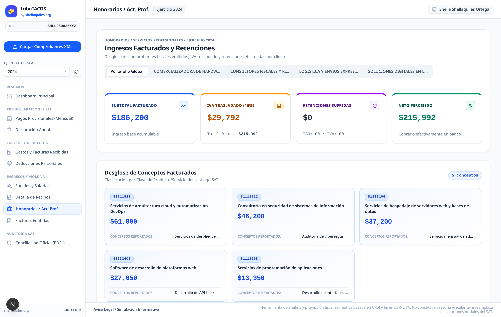

### 3.1 Métricas de Facturación:
* **Total Facturado:** Subtotal de facturas de ingresos emitidas en el ejercicio.
* **Retenciones de ISR Sufridas:** 10% retenido por clientes personas morales.
* **Retenciones de IVA Sufridas:** 10.6667% (dos terceras partes del IVA) retenido por personas morales.
* **Mix de Servicios por Clave SAT:** Servicios de consultoría TI (`80101500`), desarrollo de APIs FastAPI (`81111508`), DevOps (`81111811`) y ciberseguridad (`81111801`).

---

## 4. Explorador de Facturas Emitidas

Visualizador estructurado de cada comprobante emitido a clientes:

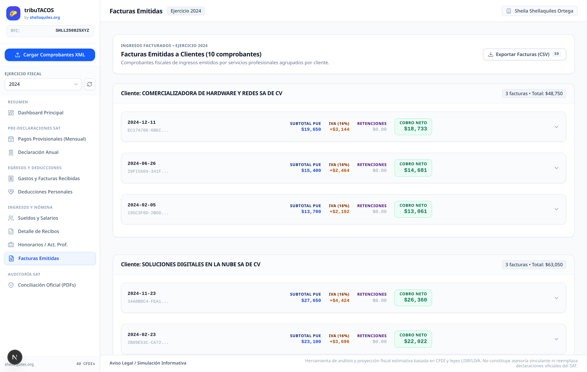

* Búsqueda instantánea por folio, RFC de cliente, método de pago (`PUE` / `PPD`) y estatus fiscal.
* Exportación a CSV individual o consolidada.

---

# Capítulo 08: Módulo de Auditoría SAT y Conciliación Oficial

Conciliación 1 a 1 de declaraciones anuales, pagos provisionales de 12 meses y acuses bancarios de pago extraídos de los PDFs oficiales del SAT.

---

## 1. Visión General de la Auditoría Bidireccional

Este módulo permite contrastar la realidad contable obtenida de los comprobantes digitales timbrados (**XMLs**) contra las cifras registradas formalmente ante la autoridad tributaria (**PDFs oficiales del SAT**).

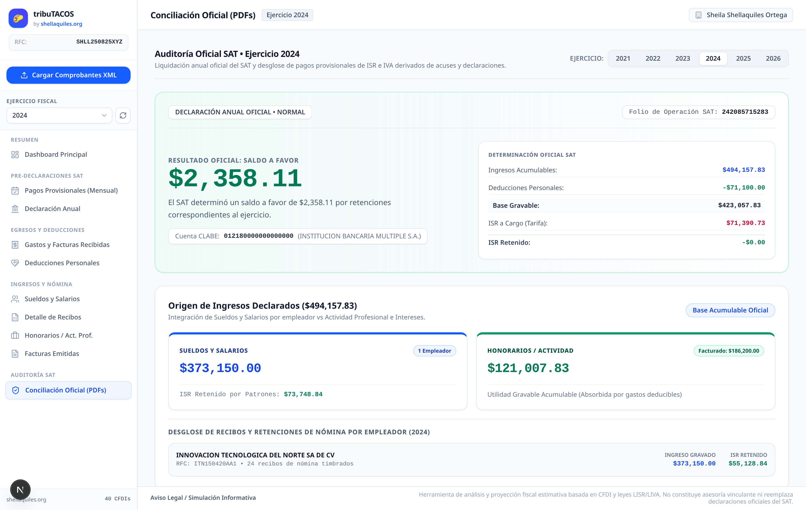

---

## 2. Componentes de Auditoría

### 2.1 Declaración Anual Oficial:
* **Número de Operación:** Código oficial de recepción del SAT (ej. `261572124966`).
* **Fecha y Hora de Presentación:** Marca de tiempo oficial del timbrado de la declaración.
* **Tipo de Declaración:** Normal o Complementaria.
* **Cuenta CLABE Registrada:** Identificación de la cuenta bancaria para la devolución del saldo a favor (`012180000000000000` - BBVA México).

### 2.2 Matriz de Cumplimiento de Pagos Provisionales (12 Meses):
* **Tabla Comparativa Mensual:** Desglose mes a mes de los ingresos acumulados declarados ante el SAT, retenciones de ISR y montos de IVA reportados.
* **Verificación de Acuses Bancarios:** Validación de comprobantes bancarios emitidos por la institución financiera con su respectiva línea de captura y sello digital.

### 2.3 Utilidad Contable y Preventiva:
* Detección de discrepancias fiscales o diferencias entre lo timbrado por los clientes/proveedores y lo presentado en el portal del SAT.
* Prevención de cartas invitación, requerimientos o diferencias en declaraciones complementarias.

---

# Capítulo 09: Roadmap y Evolución Modular

Estructura modular del sistema, arquitectura por capas, roadmap de versiones y plan de expansión funcional.

---

## 1. Arquitectura Modular del Sistema

tribuTACOS está diseñado bajo un modelo desacoplado y extensible:

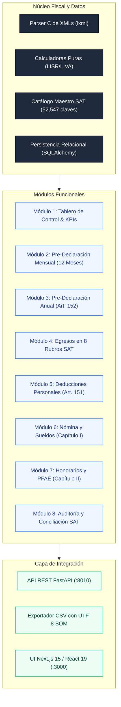

---

## 2. Roadmap Evolutivo de Versiones

### Versión 1.0 (Completada): Núcleo de Simulación y Análisis
* [x] Parser universal de comprobantes fiscales CFDI 3.3 y 4.0.
* [x] Calculadoras deterministas para Sueldos (Art. 96), Honorarios (Art. 106) y Declaración Anual (Art. 152).
* [x] Ingesta masiva por drag-and-drop y descompresión de archivos ZIP.
* [x] Taxonomía en 8 rubros con más de 52,000 claves del catálogo SAT.
* [x] Módulo de Conciliación y Auditoría de PDFs oficiales del SAT.

### Versión 2.0 (Completada): Interfaz Next.js 15 y Multi-Ejercicio
* [x] Migración integral a Next.js 15 (App Router) con React 19 y Tailwind CSS.
* [x] Soporte multianual instantáneo (2021 a 2026) con recálculo en menos de 15 ms.
* [x] Modales de borrador oficial del SAT para pagos provisionales de ISR e IVA.
* [x] Optimizador de deducciones personales con límites independientes para PPR (Fracc. V).
* [x] Generador de reportes CSV listos para Microsoft Excel con codificación UTF-8 BOM.

### Versión 2.5 (Próxima): Automatización y Alertas Tempranas
* [ ] Conector directo vía API de descarga masiva del SAT (Web Scraping / WS SAT con CIEC o e.firma).
* [ ] Sistema de alertas automáticas para deducciones en riesgo de tope legal o facturas no bancarizadas.
* [ ] Generador de proyecciones fiscales a futuro para planeación patrimonial.
* [ ] Soporte para Régimen Simplificado de Confianza (RESICO - Art. 113-E).

### Versión 3.0 (Planificada): Suite Corporativa y Multi-Tenant
* [ ] Modo multi-usuario con roles diferenciados (Contador, Asistente, Cliente).
* [ ] Panel de control para despachos contables con visión multi-empresa.
* [ ] Integración bancaria mediante Open Banking para conciliación automática de estados de cuenta.
* [ ] Exportación de declaraciones en formato XML oficial para carga en el portal del SAT.

---
