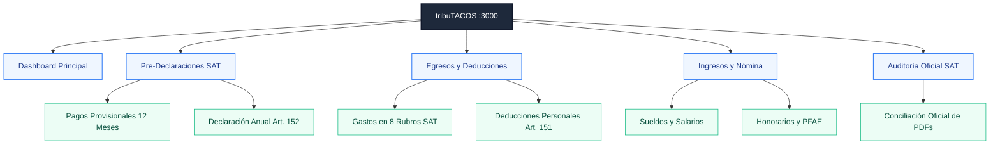

# tribuTACOS — Manual de Usuario y Guías de Operación

> **Plataforma de Inteligencia Fiscal, Conciliación de Comprobantes Digitales (CFDI 3.3/4.0) y Simulación Analítica de Pre-Declaración Mensual y Anual para Personas Físicas en México.**

---

## Estructura de Capítulos del Manual

| Capítulo | Archivo | Descripción Principal |
| :--- | :--- | :--- |
| **01** | [01_introduccion_y_propuesta_de_valor.md](01_introduccion_y_propuesta_de_valor.md) | Visión de producto, propuesta de valor, privacidad local y comparativa vs SAT. |
| **02** | [02_primeros_pasos_e_ingesta.md](02_primeros_pasos_e_ingesta.md) | Arranque, selector multi-contribuyente, ingesta masiva (XML/ZIP) y deduplicación. |
| **03** | [03_modulo_dashboard_global.md](03_modulo_dashboard_global.md) | Tablero Principal: KPIs consolidados, saldo proyectado y mix de ingresos. |
| **04** | [04_modulo_predeclaracion_mensual.md](04_modulo_predeclaracion_mensual.md) | Pagos provisionales de ISR (Art. 106) e IVA (Art. 5/6), matriz de 12 meses y borrador SAT. |
| **05** | [05_modulo_predeclaracion_anual.md](05_modulo_predeclaracion_anual.md) | Determinación anual conforme al Art. 152 LISR, cascada en 5 pasos y devolución SAT. |
| **06** | [06_modulo_egresos_y_deducciones.md](06_modulo_egresos_y_deducciones.md) | Gastos en 8 rubros maestros SAT y optimizador de deducciones personales (Art. 151). |
| **07** | [07_modulo_ingresos_y_nomina.md](07_modulo_ingresos_y_nomina.md) | Sueldos y salarios (Capítulo I), recibos quincenales y honorarios/PFAE (Capítulo II). |
| **08** | [08_modulo_auditoria_sat_conciliacion.md](08_modulo_auditoria_sat_conciliacion.md) | Conciliación de declaraciones oficiales en PDF, pagos provisionales y acuses bancarios. |
| **09** | [09_roadmap_y_evolucion_modulos.md](09_roadmap_y_evolucion_modulos.md) | Arquitectura modular de 3 capas, catálogo de módulos y principios de diseño fiscal. |
| **Manual Maestro** | [MANUAL_DE_USUARIO_COMPLETO.md](MANUAL_DE_USUARIO_COMPLETO.md) | Documento integral consolidado con todas las guías e imágenes del sistema. |

---

## Flujo de Navegación del Sistema

---

## Aviso Legal / Disclaimer

tribuTACOS es una plataforma de análisis, proyección y simulación fiscal basada en la interpretación algorítmica de comprobantes digitales (CFDI) y la legislación mexicana (LISR y LIVA). Los cálculos, proyecciones y determinaciones presentados son de carácter estrictamente estimativo e informativo, no constituyen asesoría fiscal, contable o legal vinculante, y no sustituyen las determinaciones, declaraciones formales ni obligaciones presentadas ante el Servicio de Administración Tributaria (SAT).
