# 🌮 tribuTACOS — Manual de Usuario y Guía Comercial

> **Plataforma de Inteligencia Fiscal, Auditoría de CFDIs y Pre-Declaración Anual y Mensual para Personas Físicas en México.**

# 🌮 tribuTACOS — Manual de Usuario y Guía Comercial

Bienvenido al **Manual de Usuario Integral y Guía Comercial** de **tribuTACOS**, la plataforma definitiva de inteligencia fiscal, conciliación de CFDI y pre-declaración para personas físicas en México.

```mermaid
graph TD
    A[🌮 tribuTACOS] --> B[Ingesta de CFDIs & Multi-RFC]
    A --> C[Módulo 1: Visión General]
    A --> D[Módulo 2: Pre-Declaraciones SAT]
    A --> E[Módulo 3: Egresos y Deducciones]
    A --> F[Módulo 4: Ingresos y Nómina]
    A --> G[Módulo 5: Auditoría Oficial SAT]
    A --> H[Herramientas de Exportación & Auditoría]

    C --> C1[Dashboard Global]
    D --> D1[Pre-Declaración Mensual ISR/IVA]
    D --> D2[Pre-Declaración Anual LISR Art. 152]
    E --> E1[Gastos y Compras - Bancarización]
    E --> E2[Deducciones Personales Art. 151]
    F --> F1[Sueldos y Salarios - Art. 93]
    F --> F2[Detalle de Recibos de Nómina]
    F --> F3[Honorarios y AEyP - Flujo Efectivo]
    F --> F4[Facturación Clientes y Claves SAT]
    G --> G1[Conciliación Oficial de PDFs]
    G --> G2[Matriz de Pagos Provisionales]
    G --> G3[Liquidación Anual y CLABE Devolución]
```

---

## 🗂️ Estructura de Capítulos del Manual

| Capítulo | Archivo | Descripción Principal |
| :--- | :--- | :--- |
| **01** | [01_introduccion_y_propuesta_de_valor.md](01_introduccion_y_propuesta_de_valor.md) | Visión de producto, propuesta comercial, diferenciadores clave, privacidad local y comparativa vs SAT. |
| **02** | [02_primeros_pasos_e_ingesta.md](02_primeros_pasos_e_ingesta.md) | Arranque, selector multi-contribuyente, ingesta masiva (XML/ZIP), deduplicación y auto-clasificación. |
| **03** | [03_modulo_dashboard_global.md](03_modulo_dashboard_global.md) | Pantalla por pantalla del Dashboard General: KPIs ejecutivos, semáforo fiscal, gráfica de cascada y distribución. |
| **04** | [04_modulo_predeclaracion_mensual.md](04_modulo_predeclaracion_mensual.md) | Simulador de pagos provisionales de ISR (R122) e IVA (R21), matriz de 12 meses y generador de borrador SAT. |
| **05** | [05_modulo_predeclaracion_anual.md](05_modulo_predeclaracion_anual.md) | Simulador anual con tarifa Art. 152 LISR, proyección de Saldo a Favor, optimizador de deducciones y exportación CSV. |
| **06** | [06_modulo_egresos_y_deducciones.md](06_modulo_egresos_y_deducciones.md) | Auditoría de compras, reglas de bancarización (Art. 27 LISR), IVA acreditable y catálogo de deducciones D01-D10. |
| **07** | [07_modulo_ingresos_y_nomina.md](07_modulo_ingresos_y_nomina.md) | Desglose de nómina con ingresos exentos (Art. 93), honorarios bajo flujo de efectivo y catálogo de más de 52,000 claves SAT. |
| **08** | [08_modulo_auditoria_sat_conciliacion.md](08_modulo_auditoria_sat_conciliacion.md) | Auditoría cruzada con acuses PDF oficiales del SAT, números de operación, cuentas CLABE y detección de discrepancias. |
| **09** | [09_guia_comercial_y_presentacion.md](09_guia_comercial_y_presentacion.md) | Argumentario de ventas ("Pitch Deck" comercial), casos de uso reales, cálculo de ROI y manejo de objeciones. |
| **Consolidado** | [MANUAL_DE_USUARIO_COMPLETO.md](MANUAL_DE_USUARIO_COMPLETO.md) | Documento unificado integral para impresión, exportación a PDF o consulta de punta a punta. |

---

## 🎯 ¿A quién está dirigido este software?

1. **Personas Físicas con Actividad Empresarial y Servicios Profesionales (Honorarios):** Para conocer exactamente cuánto pagarán de impuestos mes con mes y optimizar sus gastos antes del cierre.
2. **Asalariados (Sueldos y Salarios):** Para auditar a sus patrones, verificar que sus retenciones estén timbradas correctamente y maximizar su devolución anual.
3. **Contribuyentes con Múltiples Regímenes:** Personas que combinan Sueldos + Honorarios + Rendimientos Bancarios y necesitan ver la consolidación matemática real en un solo lugar.
4. **Despachos Contables y Contadores Independientes:** Para acelerar la revisión de clientes, generar borradores oficiales de declaración en segundos y entregar reportes ejecutivos de alto impacto a sus clientes.
