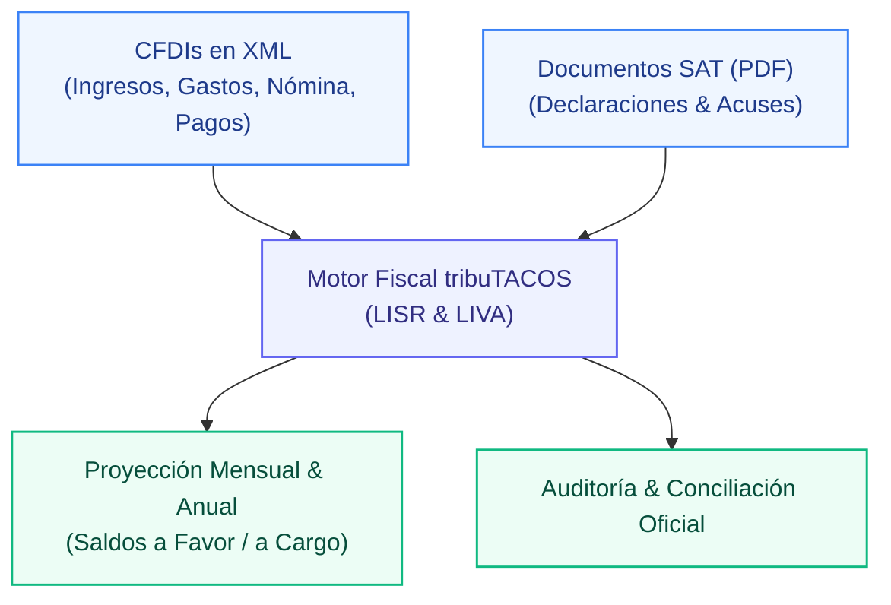

# tribuTACOS — Manual de Usuario

# Capítulo 01: Introducción y Propuesta de Valor

> **Versión de Referencia:** Este documento y sus guías visuales corresponden a **tribuTACOS v1.1.0-rc.3 RC** (Frontend Next.js 15 / Backend FastAPI).

Plataforma de inteligencia fiscal, conciliación de comprobantes digitales (CFDI 3.3 y 4.0 en XML) y pre-declaración automática para personas físicas en México.

---

## 1. Visión General del Producto

**tribuTACOS** es una herramienta analítica diseñada para contribuyentes bajo los regímenes fiscales de:
* **Sueldos y Salarios e Ingresos Asimilados (Capítulo I)**
* **Actividad Empresarial y Servicios Profesionales (Capítulo II - PFAE)**

La plataforma resuelve la complejidad del cálculo tributario mediante el análisis algorítmico y determinista de los comprobantes fiscales digitales timbrados (CFDIs) y los documentos oficiales del SAT en PDF, permitiendo proyectar con exactitud:
* **Pagos Provisionales Mensuales de ISR (Art. 106 LISR)** bajo el principio estricto de flujo de efectivo.
* **Declaración Definitiva Mensual de IVA (Art. 5 y 6 LIVA)** con control y arrastre automático de saldos a favor.
* **Declaración Anual del Ejercicio (Art. 152 LISR)** con auditoría del límite legal de deducciones personales (Art. 151 LISR).
* **Auditoría Bidireccional** contra las declaraciones presentadas ante el SAT y los acuses de pago bancarios.

---

## 2. Capacidades Operativas del Sistema

* **Procesamiento Local de Alta Velocidad:** Análisis e ingesta determinista en memoria local con tiempos de respuesta reactivos inferiores a 15 ms por ejercicio.
* **Taxonomía Automatizada de Egresos:** Clasificación de comprobantes en 8 rubros contables operativos a partir del catálogo de más de 52,000 claves del SAT.
* **Flujo de Efectivo Estricto:** Conciliación precisa de ingresos y egresos conforme a la fecha efectiva de cobro o pago (`PUE` y `PPD + REP`).
* **Auditoría de Deducciones Personales:** Verificación en tiempo real de los topes legales del Art. 151 LISR (15% de ingresos acumulables vs 5 UMAs anuales y subtope de PPR).
* **Control y Arrastre de IVA:** Determinación de pagos definitivos de IVA con acreditamiento y arrastre cronológico automático de saldos a favor.
* **Conciliación Bidireccional:** Cruce 1 a 1 entre comprobantes timbrados (XML) y documentos oficiales presentados ante el SAT (PDF).

> [!NOTE]
> **Soberanía y Privacidad Local:** tribuTACOS opera bajo una estricta política de privacidad local. La información contable, UUIDs fiscales, cadenas originales y montos financieros residen exclusivamente en la base de datos relacional local (`backend/tributacos.db`), sin transmisión a servidores externos ni intermediarios terceros.
>
> **Documentación Oficial PDF:** Toda la documentación técnica y manuales de usuario descargables en formato PDF son generados y maquetados mediante **[Pandocquiles](https://github.com/shellaquiles/pandocquiles) by shellaquiles.org**.

---

## 3. Aviso Legal / Disclaimer

> [!IMPORTANT]
> **Aviso Legal:** tribuTACOS es una plataforma de análisis, proyección y simulación fiscal basada en la interpretación algorítmica de comprobantes digitales (CFDI) y la legislación mexicana (LISR y LIVA). Los cálculos y resultados presentados son de carácter estrictamente estimativo e informativo, no constituyen asesoría fiscal ni reemplazan las declaraciones oficiales presentadas ante el Servicio de Administración Tributaria (SAT).
