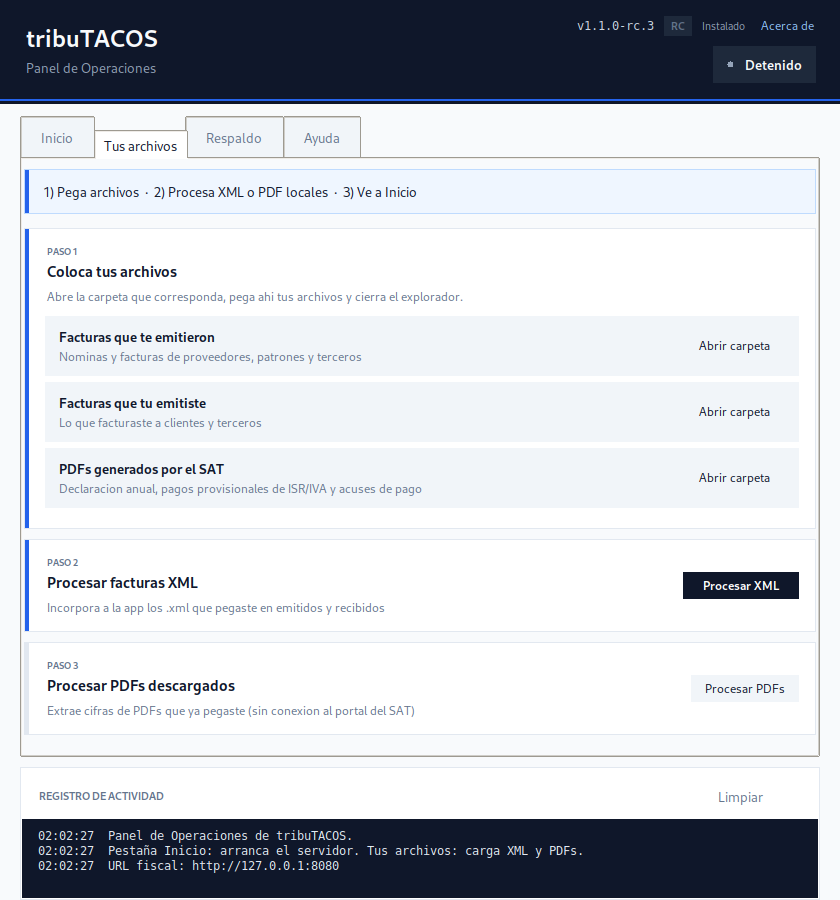
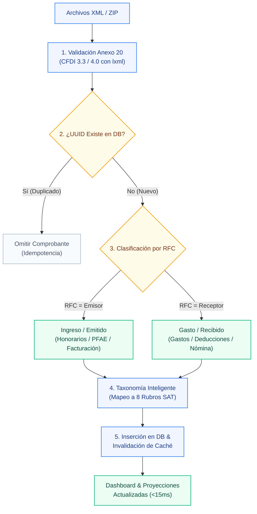

# tribuTACOS — Manual de Usuario

# Capítulo 02: Primeros Pasos e Ingesta de Comprobantes

[](#)
[](#)
[](#)

Guía paso a paso para la inicialización del entorno, selección de contribuyente, ejercicio fiscal e ingesta masiva de archivos XML y documentos SAT.

---

## 1. Puesta en Marcha Inicial

Si eres usuario final (instalador Windows, Docker o Panel de Operaciones), sigue la [Guía de instalación](../docs/INSTALACION_USUARIO.md). Esta sección es para desarrollo local.

Para arrancar el sistema completo con servidores de backend y frontend sincronizados:

```bash
# Instalación y preparación con base de datos demo
make setup

# Ejecución paralela de servicios (Backend :8010 + Frontend :3000)
make dev
```

La plataforma estará disponible de inmediato en:
* **Interfaz de Usuario:** `http://localhost:3000`
* **API REST y Swagger:** `http://localhost:8010/docs`

### Panel de Operaciones (alternativa sin terminal)

Si usas el instalador Windows, Docker o Python con el panel gráfico, abre **`Centro-de-Control-Tributacos.pyw`** o ejecuta `make gui`. Detalle en la [Guía de instalación](../docs/INSTALACION_USUARIO.md).


Desde el panel puedes <kbd>Iniciar tribuTACOS</kbd>, abrir la declaración en el navegador y, en **Tus archivos**, procesar XML y PDFs locales sin usar la terminal.

---

## 2. Selector de Contribuyente y Ejercicio Fiscal

En el panel lateral izquierdo (*Sidebar*), el usuario dispone de los selectores maestros:

* **Selector de Contribuyente:** Permite alternar entre diferentes personas físicas registradas en el sistema (identificadas por su RFC y Razón Social).
* **Selector de Ejercicio Fiscal:** Permite navegar instantáneamente entre los diferentes años fiscales analizados, recalculando la base gravable y las tarifas oficiales en tiempo real.
* **Botón de Sincronización (<kbd>🔄</kbd>):** Fuerza la reevaluación de los comprobantes y la invalidación de la caché.

---

## 3. Descarga de Comprobantes XML desde el Portal del SAT

Antes de realizar la carga en tribuTACOS, el usuario debe descargar sus comprobantes fiscales digitales timbrados directamente desde el portal oficial del SAT:

1. **Acceso al Servicio de Facturación:** Ingrese a [sat.gob.mx](https://www.sat.gob.mx) ➔ *Factura Electrónica* ➔ *Cancela y recupera tus facturas* (autenticación con Contraseña CIEC o e.firma portable).
2. **Facturas Emitidas (Ingresos):** Seleccione *Consultar Facturas Emitidas* y filtre por el rango de fechas del ejercicio fiscal (CFDI de Ingresos, Recibos de Honorarios y Complementos de Recepción de Pagos).
3. **Facturas Recibidas (Gastos, Nómina y Deducciones):** Seleccione *Consultar Facturas Recibidas* y descargue los comprobantes de gastos operativos, recibos de nómina timbrados por sus empleadores y facturas de deducciones personales (médicos, colegiaturas, seguros, aportaciones a retiro).

> [!TIP]
> **Recomendación para Descargas Masivas:** Para ejercicios con cientos de comprobantes, utilice la opción **Solicitud de Descarga Masiva** en el portal del SAT para obtener paquetes comprimidos `.zip` en lugar de descargar archivos individuales.

---

## 4. Ingesta Masiva de Comprobantes en tribuTACOS

Al hacer clic en el botón principal <kbd>📂 Cargar Comprobantes XML</kbd>, se despliega el modal interactivo de ingesta:


### 4.1 Métodos de Carga Soportados:
* **Arrastrar y Soltar (Drag & Drop):** Arrastre de múltiples archivos `.xml` o carpetas completas directamente sobre el área punteada del modal.
* **Archivos Comprimidos (.ZIP):** Carga directa de paquetes `.zip` descargados del SAT; el motor desempaca y clasifica cada archivo en memoria.
* **Explorador de Archivos:** Clic sobre el área de carga para seleccionar archivos locales desde el explorador del sistema operativo.
* **Panel de Operaciones:** En la pestaña **Tus archivos**, pegue `.xml` en las carpetas indicadas y pulse <kbd>Procesar facturas XML</kbd> (procesamiento local, sin conexión al SAT).
* **Línea de Comandos (CLI):** Ejecución de `make db-import-xml` para ingestar lotes de archivos ubicados en el almacenamiento local.

### 4.2 Ingesta por carpetas (Panel de Operaciones)



Flujo recomendado cuando no usa el modal web:

1. Abra <kbd>Facturas que te emitieron</kbd>, <kbd>Facturas que tu emitiste</kbd> o la carpeta que corresponda y pegue sus `.xml`.
2. Pulse <kbd>Procesar facturas XML</kbd>.
3. Abra la interfaz web (<kbd>Abrir declaracion en el navegador</kbd>) y pulse <kbd>🔄</kbd> para refrescar los totales.

> [!NOTE]
> tribuTACOS **no descarga** comprobantes del portal del SAT. Solo procesa archivos que usted ya guardó en su computadora.

### 4.3 Pipeline Automático de Procesamiento:



1. **Validación de Esquema XML:** Comprobación del estándar Anexo 20 (CFDI 3.3 y CFDI 4.0) mediante el parser optimizado en C (`lxml`).
2. **Deduplicación por UUID Fiscal:** Si un comprobante ya fue registrado previamente en la base de datos, se omite de forma idempotente sin duplicar montos.
3. **Clasificación por RFC:** Si el RFC del contribuyente activo coincide con el emisor, se clasifica como *Ingreso / Emitido*; si coincide con el receptor, se clasifica como *Gasto / Deducción / Recibido*.
4. **Taxonomía Inteligente de Conceptos:** Mapeo automático de las claves de producto/servicio del SAT a los 8 rubros contables operativos.
5. **Invalidación de Caché:** Se actualiza automáticamente el registro en `summary_cache` para reflejar las nuevas cifras en tiempo real.

> [!NOTE]
> La ingesta es estrictamente **idempotente**: cargar el mismo comprobante en múltiples ocasiones no generará duplicidades ni distorsionará los saldos calculados.
