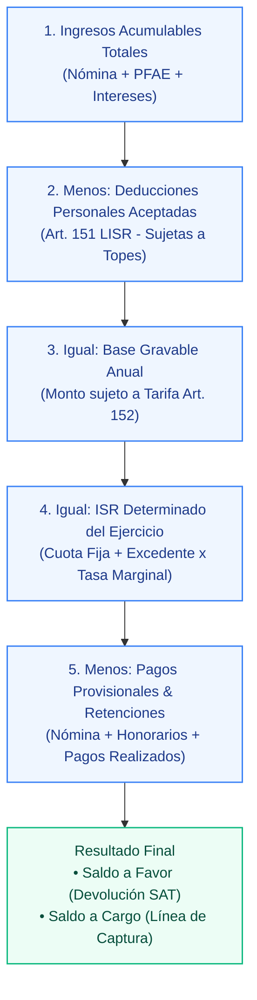

# tribuTACOS — Manual de Usuario

# Capítulo 05: Módulo de Declaración Anual

Determinación del Impuesto Sobre la Renta anual conforme al Artículo 152 de la LISR, desglose en cascada de cinco pasos, cálculo de tasas y gestión de devoluciones.

---

## 1. Visión General de la Determinación Anual

El módulo de **Declaración Anual** integra todos los ingresos acumulables del contribuyente (Sueldos y Salarios + Honorarios/PFAE + Intereses) y computa el impuesto del ejercicio contra la tarifa progresiva del **Art. 152 LISR**:

---

## 2. La Cascada Fiscal de Cinco Pasos

La plataforma visualiza el cálculo anual en cinco etapas transparentes y auditables:

### Tabla de Desglose de la Cascada Fiscal:

| Paso | Concepto | Operación Aritmética | Fundamento LISR |
| :---: | :--- | :--- | :--- |
| **1** | **Ingresos Acumulables** | Sueldos + Honorarios Netos + Otros ingresos | Art. 94 y Art. 100 |
| **2** | **Deducciones Personales** | Suma de deducciones aceptadas dentro de topes | Art. 151 |
| **3** | **Base Gravable Anual** | Paso 1 − Paso 2 | Art. 152 |
| **4** | **ISR Determinado** | Cuota Fija + [(Base Gravable − Límite Inferior) × Tasa %] | Art. 152 (Tarifa anual) |
| **5** | **Anticipos y Retenciones** | Retenciones Nómina + Retenciones PM + Pagos Prov. | Art. 96 y Art. 106 |
| **=** | **Saldo Final del Ejercicio** | Paso 4 − Paso 5 | **Saldo a Favor o a Cargo** |

---

## 3. Métricas Financieras del Ejercicio

* **Tasa Efectiva de Impuesto:** Porcentaje real del ingreso que representa el impuesto determinado (calculado como `(ISR Determinado / Ingresos Totales) × 100`). Permite evaluar la carga fiscal neta del contribuyente.
* **Tasa Marginal:** Porcentaje aplicable al último tramo de la tarifa en el que se ubica la base gravable (de acuerdo con el límite superior del Art. 152 LISR, de hasta el 35%).
* **Determinación de Saldos Anuales:**
  - **Saldo a Favor (Devolución SAT):** Se origina cuando el total de retenciones e impuestos pagados provisionalmente durante el ejercicio excede el ISR anual causado, indicando el importe disponible para solicitar devolución automática con CLABE interbancaria o compensación contra ejercicios futuros.
  - **Saldo a Cargo (Línea de Captura):** Se origina cuando el impuesto anual determinado es superior a los anticipos y retenciones acumuladas en el año, señalando el importe a enterar a la autoridad fiscal.

### 3.1 Termómetro de Deducciones y Conciliación Directa:
En la parte inferior del módulo se aprecian:
* **Termómetro del Tope Legal (Art. 151 LISR):** Tarjetas con el desglose de deducciones aplicadas, remanente disponible y porcentaje de aprovechamiento del tope con barra de progreso.
* **Conciliación Simulación vs Declaración Oficial SAT:** Comparativa 1 a 1 de Ingresos Acumulables, ISR Causado Anual y Saldo Final contra el acuse timbrado ante el SAT.

> [!TIP]
> **Estrategia Fiscal:** Aprovechar al máximo las deducciones del Artículo 151 (gastos médicos, colegiaturas, SGMM y aportaciones complementarias de retiro PPR) permite reducir la base gravable anual y maximizar el saldo a favor devuelto por el SAT.

