# tribuTACOS — Manual de Usuario Completo

[](#)

> **Plataforma de Inteligencia Fiscal, Conciliación de Comprobantes Digitales (CFDI 3.3/4.0) y Simulación Analítica de Pre-Declaración Mensual y Anual para Personas Físicas en México.**

> **Versión de Referencia:** Este documento y sus guías visuales corresponden a **tribuTACOS v1.0.1 STABLE**.

> *Documento y manuales generados con **[Pandocquiles](https://github.com/shellaquiles/pandocquiles) by shellaquiles.org**.*

---

## Tabla de Contenidos

1. [Capítulo 01: Introducción y Propuesta de Valor](#capítulo-01-introducci-n-y-propuesta-de-valor)
2. [Capítulo 02: Primeros Pasos e Ingesta de Comprobantes](#capítulo-02-primeros-pasos-e-ingesta-de-comprobantes)
3. [Capítulo 03: Módulo Dashboard Principal](#capítulo-03-m-dulo-dashboard-principal)
4. [Capítulo 04: Módulo de Pre-Declaración Mensual (ISR e IVA)](#capítulo-04-m-dulo-de-pre-declaraci-n-mensual-isr-e-iva-)
5. [Capítulo 05: Módulo de Declaración Anual](#capítulo-05-m-dulo-de-declaraci-n-anual)
6. [Capítulo 06: Módulo de Egresos y Deducciones](#capítulo-06-m-dulo-de-egresos-y-deducciones)
7. [Capítulo 07: Módulo de Ingresos y Nómina](#capítulo-07-m-dulo-de-ingresos-y-n-mina)
8. [Capítulo 08: Módulo de Auditoría SAT y Conciliación Oficial](#capítulo-08-m-dulo-de-auditor-a-sat-y-conciliaci-n-oficial)
9. [Capítulo 09: Arquitectura y Componentes Modulares](#capítulo-09-arquitectura-y-componentes-modulares)

---

# Capítulo 01: Introducción y Propuesta de Valor

[](#)
[](#)
[](#)
[](#)

> **Versión de Referencia:** Este documento y sus guías visuales corresponden a **tribuTACOS v1.0.1 STABLE** (Frontend Next.js 15 / Backend FastAPI).

Plataforma de inteligencia fiscal, conciliación de comprobantes digitales (CFDI 3.3 y 4.0 en XML) y pre-declaración automática para personas físicas en México.


---

## 1. Visión General del Producto

**tribuTACOS** es una herramienta analítica diseñada para contribuyentes bajo los regímenes fiscales de:
* **Sueldos y Salarios e Ingresos Asimilados (Capítulo I)**
* **Actividad Empresarial y Servicios Profesionales (Capítulo II - PFAE)**

La plataforma resuelve la complejidad del cálculo tributario mediante el análisis algorítmico y determinista de los comprobantes fiscales digitales timbrados (CFDIs) y los documentos oficiales del SAT en PDF, permitiendo proyectar con exactitud:
* **Pagos Provisionales Mensuales de ISR (Art. 106 LISR)** bajo el principio estricto de flujo de efectivo.
* **Declaración Definitiva Mensual de IVA (Art. 5 y 6 LIVA)** con control y arrastre automático de saldos a favor.
* **Declaración Anual del Ejercicio (Art. 152 LISR)** con auditoría del límite legal de deducciones personales (Art. 151 LISR).
* **Auditoría Bidireccional** contra las declaraciones presentadas ante el SAT y los acuses de pago bancarios.

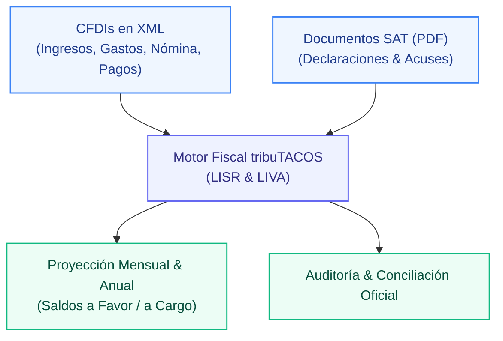

---

## 2. Capacidades Operativas del Sistema

* **Procesamiento Local de Alta Velocidad:** Análisis e ingesta determinista en memoria local con tiempos de respuesta reactivos inferiores a 15 ms por ejercicio.
* **Taxonomía Automatizada de Egresos:** Clasificación de comprobantes en 8 rubros contables operativos a partir del catálogo de más de 52,000 claves del SAT.
* **Flujo de Efectivo Estricto:** Conciliación precisa de ingresos y egresos conforme a la fecha efectiva de cobro o pago (`PUE` y `PPD + REP`).
* **Auditoría de Deducciones Personales:** Verificación en tiempo real de los topes legales del Art. 151 LISR (15% de ingresos acumulables vs 5 UMAs anuales y subtope de PPR).
* **Control y Arrastre de IVA:** Determinación de pagos definitivos de IVA con acreditamiento y arrastre cronológico automático de saldos a favor.
* **Conciliación Bidireccional:** Cruce 1 a 1 entre comprobantes timbrados (XML) y documentos oficiales presentados ante el SAT (PDF).

> [!NOTE]
> **Soberanía y Privacidad Local:** tribuTACOS opera bajo una estricta política de privacidad local. La información contable, UUIDs fiscales, cadenas originales y montos financieros residen exclusivamente en la base de datos relacional local (`backend/tributacos.db`), sin transmisión a servidores externos ni intermediarios terceros.
>
> **Documentación Oficial PDF:** Toda la documentación técnica y manuales de usuario descargables en formato PDF son generados y maquetados mediante **[Pandocquiles](https://github.com/shellaquiles/pandocquiles) by shellaquiles.org**.


---

## 3. Aviso Legal / Disclaimer

> [!IMPORTANT]
> **Aviso Legal:** tribuTACOS es una plataforma de análisis, proyección y simulación fiscal basada en la interpretación algorítmica de comprobantes digitales (CFDI) y la legislación mexicana (LISR y LIVA). Los cálculos y resultados presentados son de carácter estrictamente estimativo e informativo, no constituyen asesoría fiscal ni reemplazan las declaraciones oficiales presentadas ante el Servicio de Administración Tributaria (SAT).


---

# Capítulo 02: Primeros Pasos e Ingesta de Comprobantes

[](#)
[](#)
[](#)

Guía paso a paso para la inicialización del entorno, selección de contribuyente, ejercicio fiscal e ingesta masiva de archivos XML y documentos SAT.

---

## 1. Puesta en Marcha Inicial

Para arrancar el sistema completo con servidores de backend y frontend sincronizados:

```bash
# Instalación y preparación con base de datos demo
make setup

# Ejecución paralela de servicios (Backend :8010 + Frontend :3000)
make dev
```

La plataforma estará disponible de inmediato en:
* **Interfaz de Usuario:** `http://localhost:3000`
* **API REST y Swagger:** `http://localhost:8010/docs`

---

## 2. Selector de Contribuyente y Ejercicio Fiscal

En el panel lateral izquierdo (*Sidebar*), el usuario dispone de los selectores maestros:

* **Selector de Contribuyente:** Permite alternar entre diferentes personas físicas registradas en el sistema (identificadas por su RFC y Razón Social).
* **Selector de Ejercicio Fiscal:** Permite navegar instantáneamente entre los diferentes años fiscales analizados, recalculando la base gravable y las tarifas oficiales en tiempo real.
* **Botón de Sincronización (<kbd>🔄</kbd>):** Fuerza la reevaluación de los comprobantes y la invalidación de la caché.

---

## 3. Descarga de Comprobantes XML desde el Portal del SAT

Antes de realizar la carga en tribuTACOS, el usuario debe descargar sus comprobantes fiscales digitales timbrados directamente desde el portal oficial del SAT:

1. **Acceso al Servicio de Facturación:** Ingrese a [sat.gob.mx](https://www.sat.gob.mx) ➔ *Factura Electrónica* ➔ *Cancela y recupera tus facturas* (autenticación con Contraseña CIEC o e.firma portable).
2. **Facturas Emitidas (Ingresos):** Seleccione *Consultar Facturas Emitidas* y filtre por el rango de fechas del ejercicio fiscal (CFDI de Ingresos, Recibos de Honorarios y Complementos de Recepción de Pagos).
3. **Facturas Recibidas (Gastos, Nómina y Deducciones):** Seleccione *Consultar Facturas Recibidas* y descargue los comprobantes de gastos operativos, recibos de nómina timbrados por sus empleadores y facturas de deducciones personales (médicos, colegiaturas, seguros, aportaciones a retiro).

> [!TIP]
> **Recomendación para Descargas Masivas:** Para ejercicios con cientos de comprobantes, utilice la opción **Solicitud de Descarga Masiva** en el portal del SAT para obtener paquetes comprimidos `.zip` en lugar de descargar archivos individuales.

---

## 4. Ingesta Masiva de Comprobantes en tribuTACOS

Al hacer clic en el botón principal <kbd>📂 Cargar Comprobantes XML</kbd>, se despliega el modal interactivo de ingesta:


### 4.1 Métodos de Carga Soportados:
* **Arrastrar y Soltar (Drag & Drop):** Arrastre de múltiples archivos `.xml` o carpetas completas directamente sobre el área punteada del modal.
* **Archivos Comprimidos (.ZIP):** Carga directa de paquetes `.zip` descargados del SAT; el motor desempaca y clasifica cada archivo en memoria.
* **Explorador de Archivos:** Clic sobre el área de carga para seleccionar archivos locales desde el explorador del sistema operativo.
* **Línea de Comandos (CLI):** Ejecución de `make db-import-xml` para ingestar lotes de archivos ubicados en el almacenamiento local.

### 4.2 Pipeline Automático de Procesamiento:

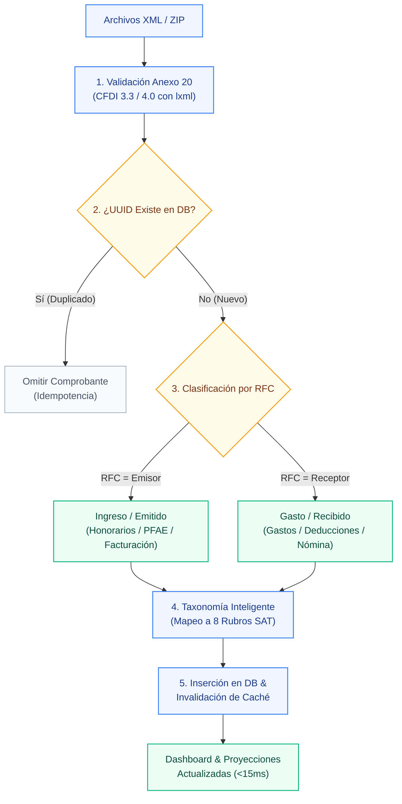

1. **Validación de Esquema XML:** Comprobación del estándar Anexo 20 (CFDI 3.3 y CFDI 4.0) mediante el parser optimizado en C (`lxml`).
2. **Deduplicación por UUID Fiscal:** Si un comprobante ya fue registrado previamente en la base de datos, se omite de forma idempotente sin duplicar montos.
3. **Clasificación por RFC:** Si el RFC del contribuyente activo coincide con el emisor, se clasifica como *Ingreso / Emitido*; si coincide con el receptor, se clasifica como *Gasto / Deducción / Recibido*.
4. **Taxonomía Inteligente de Conceptos:** Mapeo automático de las claves de producto/servicio del SAT a los 8 rubros contables operativos.
5. **Invalidación de Caché:** Se actualiza automáticamente el registro en `summary_cache` para reflejar las nuevas cifras en tiempo real.

> [!NOTE]
> La ingesta es estrictamente **idempotente**: cargar el mismo comprobante en múltiples ocasiones no generará duplicidades ni distorsionará los saldos calculados.


---

# Capítulo 03: Módulo Dashboard Principal

[](#)
[](#)
[](#)

Visión consolidada del ejercicio fiscal, KPIs financieros, distribución de ingresos por régimen y determinación preliminar anual.

---

## 1. Visión General del Tablero

El **Dashboard Principal** es la pantalla de bienvenida y centro de mando del contribuyente. Proporciona una radiografía financiera y fiscal inmediata del ejercicio seleccionado:


---

## 2. Componentes y Métricas del Tablero

### 2.1 Tarjeta Hero de Determinación Proyectada
* **Saldo Estimado:** Muestra en tipografía destacada el saldo a favor proyectado con devolución estimada del SAT (en color verde esmeralda) o el impuesto a cargo a liquidar (en color ámbar/rojo).
* **Número de Acuse SAT:** Si existe una declaración anual oficial conciliada en PDF, muestra el número de operación oficial registrado ante la autoridad tributaria.
* **Desglose Sintético:** Presenta el resumen de:
  - Ingresos Acumulables Totales
  - Deducciones Personales Aplicadas
  - ISR Causado Anual (Art. 152 LISR)
  - Retenciones Acreditables (Nómina y Clientes Personas Morales)

### 2.2 Cuatro Indicadores Financieros Clave (KPIs)

| Indicador KPI | Descripción Contable | Impacto en la Determinación |
| :--- | :--- | :--- |
| **Ingresos Totales** | Suma consolidada de percepciones por nómina y facturación de honorarios/actividad empresarial. | Base acumulable bruta del ejercicio fiscal. |
| **Gastos Deducibles** | Monto total de egresos operativos bancarizados con CFDI de tipo Gasto. | Disminuye la base gravable mensual de PFAE (Art. 106). |
| **Deducciones Personales** | Monto aceptado para el cálculo anual dentro de los topes de la LISR. | Reduce la base gravable anual del Art. 152 LISR. |
| **Retenciones de ISR** | Impuestos retenidos por terceros (patrones y personas morales clientes). | Se acreditan íntegramente contra el impuesto anual causado. |

> [!NOTE]
> **Recálculo Instantáneo:** Al alternar el selector de año fiscal o tras realizar una nueva carga de comprobantes, todas las cifras del Dashboard se recalculan en memoria en menos de 15 milisegundos.

---

## 3. Mix y Distribución de Ingresos

Gráfico de distribución interactivo y desglose tabular que contrasta visualmente el peso relativo de las fuentes de ingreso del contribuyente:
* **Sueldos y Salarios (Capítulo I):** Percepciones ordinarias, asimilados, aguinaldo y primas vacacionales.
* **Servicios Profesionales / PFAE (Capítulo II):** Facturas timbradas por honorarios y actividades empresariales independientes.

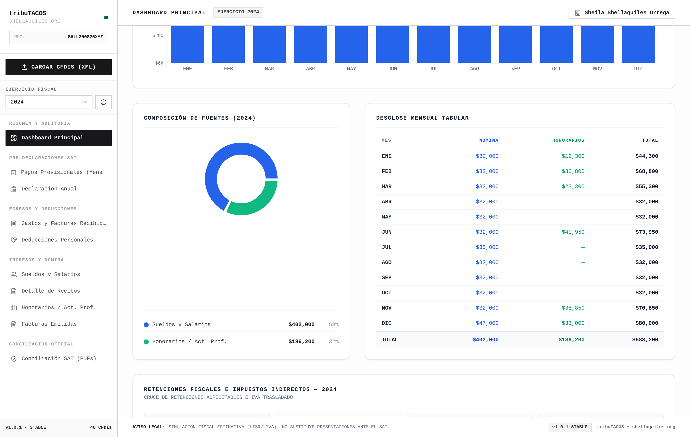

### 3.1 Componentes de la Sección Inferior:
* **Evolución Mensual (Gráfico de Barras y Línea):** Curva comparativa de sueldos de nómina (azul) frente a honorarios facturados (verde) con el trazo de ingresos totales acumulados mes a mes (línea ámbar).
* **Composición de Fuentes (Gráfico de Dona):** Porcentaje y monto consolidado aportado por cada régimen en el ejercicio.
* **Desglose Mensual Tabular:** Matriz numérica exacta con cifras tabulares alineadas que permite auditar el flujo mensual de cada concepto.
* **Retenciones Fiscales e Impuestos Indirectos:** Cruce de retenciones de ISR por origen (patrones en nómina, clientes personas morales e intereses bancarios) junto con el balance de IVA trasladado e IVA retenido.


---

# Capítulo 04: Módulo de Pre-Declaración Mensual (ISR e IVA)

[](#)
[](#)
[](#)

Matriz analítica de los 12 meses del ejercicio, pagos provisionales acumulativos de ISR, acreditamiento de IVA y generación del borrador oficial SAT.

---

## 1. Fundamento Legal y Flujo de Efectivo

El módulo opera bajo el principio estricto de **flujo de efectivo** exigido por la legislación tributaria mexicana:

* **Ingresos Computables:** Facturas emitidas con método `PUE` (Pago en una Sola Exhibición) y complementos de recepción de pagos `PPD + REP` efectivamente cobrados en el mes (`fecha_pago`).
* **Gastos Deducibles:** Facturas recibidas `PUE` y complementos de pago efectivamente erogados mediante medios bancarizados autorizados.
* **Pagos Provisionales de ISR (Art. 106 LISR):** Determinación acumulativa progresiva desde enero hasta el mes de causación.
* **Declaración Definitiva de IVA (Art. 5 y 6 LIVA):** Impuesto mensual definitivo con control y arrastre automático de saldos a favor.


---

## 2. Matriz Comparativa de 12 Meses

La tabla principal desglosa cronológicamente el comportamiento fiscal del ejercicio:

| Columna | Concepto Fiscal | Descripción |
| :--- | :--- | :--- |
| **Mes** | Periodo fiscal | Del mes `01 (Enero)` al `12 (Diciembre)`. |
| **Ingresos PFAE** | Flujo cobrado | Facturación efectivamente percibida en el mes. |
| **Gastos Deducibles** | Egresos operativos | Comprobantes de gasto pagados con requisitos fiscales. |
| **Utilidad / Pérdida** | Margen operativo | Semáforo visual en verde (utilidad) o rojo (pérdida). |
| **ISR Retenido (10%)** | Retenciones PM | Retenciones efectuadas por clientes Personas Morales. |
| **ISR a Pagar** | Pago provisional | Monto resultante tras acreditar pagos previos y retenciones. |
| **IVA a Pagar / Favor** | Impuesto definitivo | IVA trasladado menos IVA acreditable, retenciones y arrastres. |
| **Acción** | Botón interactivo | Acceso al borrador oficial mediante <kbd>📄 Borrador</kbd>. |
 
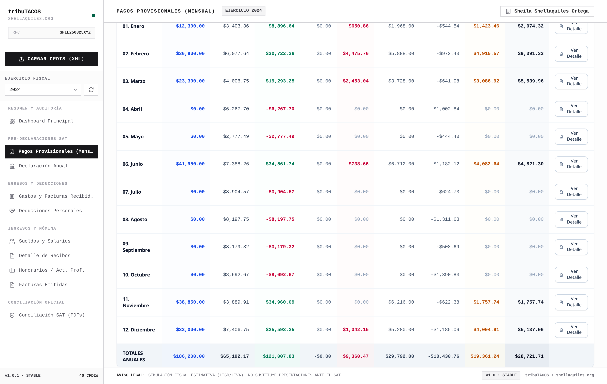

### 2.1 Cierre y Totales Anuales Acumulados:
Al desplazarse por la matriz se aprecian los meses del segundo semestre y el renglón de **Totales Anuales**, el cual consolida:
* **Ingresos y Gastos Acumulados:** Total de facturación percibida y deducciones autorizadas operativas efectivamente erogadas.
* **Flujo Neto del Ejercicio:** Determinación de la utilidad o déficit financiero anual bajo flujo de efectivo.
* **Total Pagos Provisionales de ISR:** Sumatoria exacta de pagos a cuenta del impuesto sobre la renta enterados mes a mes, listos para acreditarse en la anual.
* **IVA Definitivo Anual:** Total de IVA cobrado frente a IVA acreditable e impuestos netos a cargo liquidados.

> [!IMPORTANT]
> **Arrastre Automático de IVA:** Cuando un mes genera saldo a favor de IVA, tribuTACOS lo arrastra de forma automática como remanente acreditable para los meses siguientes, optimizando el flujo de caja del contribuyente sin requerir cálculos manuales.


---

## 3. Modal de Borrador Oficial SAT (ISR e IVA)

Al hacer clic en el botón <kbd>📄 Borrador</kbd> de cualquier mes, se despliega la ventana emergente con el desglose exacto que solicita el formulario del portal del SAT:

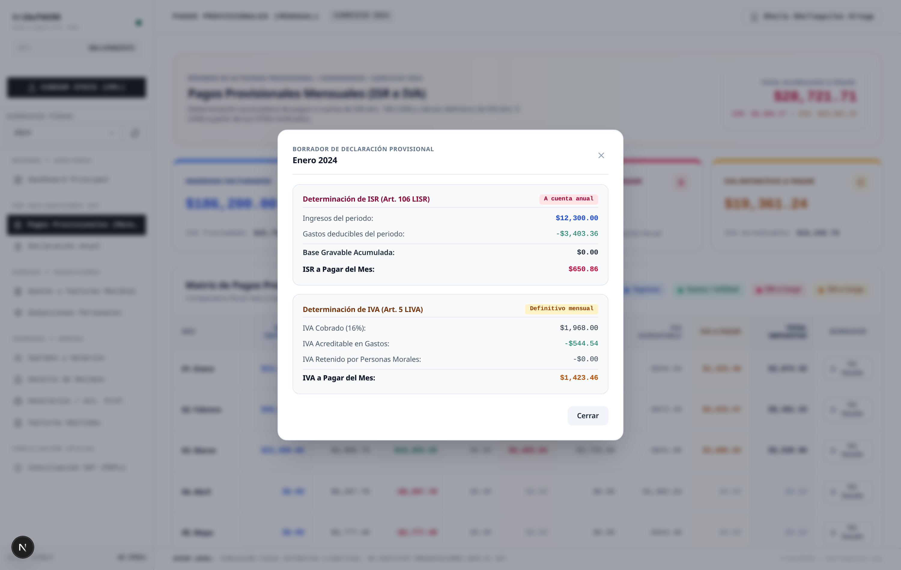

### 3.1 Pestaña ISR (Régimen 122 - Art. 106 LISR):
* Ingresos acumulados del ejercicio al mes corriente.
* Deducciones acumuladas del ejercicio al mes corriente.
* Base gravable provisional acumulada.
* ISR causado acumulado según tarifa mensual oficial del SAT.
* **Menos:** Pagos provisionales realizados en meses anteriores del mismo ejercicio.
* **Menos:** Retenciones de ISR acumuladas efectuadas por personas morales.
* **ISR a Pagar en el Periodo**.

### 3.2 Pestaña IVA (Régimen 21 - Art. 5 y 6 LIVA):
* Total de actos o actividades gravados a la tasa general del `16%`.
* IVA trasladado efectivamente cobrado en el mes.
* **Menos:** IVA acreditable pagado en gastos operativos del mes.
* **Menos:** IVA retenido por personas morales en el mes (`10.6667%`).
* **Menos:** Remanente de saldo a favor de IVA arrastrado de periodos anteriores.
* **Impuesto a Cargo o Nuevo Saldo a Favor de IVA**.

> [!TIP]
> **Llenado Directo en el SAT:** Los campos del borrador replican el orden y nomenclatura del servicio de *Declaraciones y Pagos* del SAT, permitiendo copiar y pegar las cifras con absoluta tranquilidad durante la presentación mensual.


---

# Capítulo 05: Módulo de Declaración Anual

[](#)
[](#)
[](#)

Determinación del Impuesto Sobre la Renta anual conforme al Artículo 152 de la LISR, desglose en cascada de cinco pasos, cálculo de tasas y gestión de devoluciones.

---

## 1. Visión General de la Determinación Anual

El módulo de **Declaración Anual** integra todos los ingresos acumulables del contribuyente (Sueldos y Salarios + Honorarios/PFAE + Intereses) y computa el impuesto del ejercicio contra la tarifa progresiva del **Art. 152 LISR**:


---

## 2. La Cascada Fiscal de Cinco Pasos

La plataforma visualiza el cálculo anual en cinco etapas transparentes y auditables:

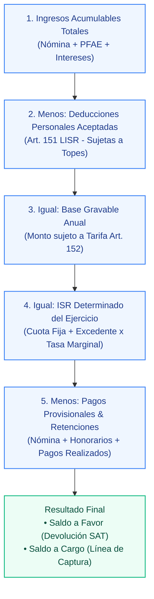

### Tabla de Desglose de la Cascada Fiscal:

| Paso | Concepto | Operación Aritmética | Fundamento LISR |
| :---: | :--- | :--- | :--- |
| **1** | **Ingresos Acumulables** | Sueldos + Honorarios Netos + Otros ingresos | Art. 94 y Art. 100 |
| **2** | **Deducciones Personales** | Suma de deducciones aceptadas dentro de topes | Art. 151 |
| **3** | **Base Gravable Anual** | Paso 1 − Paso 2 | Art. 152 |
| **4** | **ISR Determinado** | Cuota Fija + [(Base Gravable − Límite Inferior) × Tasa %] | Art. 152 (Tarifa anual) |
| **5** | **Anticipos y Retenciones** | Retenciones Nómina + Retenciones PM + Pagos Prov. | Art. 96 y Art. 106 |
| **=** | **Saldo Final del Ejercicio** | Paso 4 − Paso 5 | **Saldo a Favor o a Cargo** |

---

## 3. Métricas Financieras del Ejercicio

* **Tasa Efectiva de Impuesto:** Porcentaje real del ingreso que representa el impuesto determinado (calculado como `(ISR Determinado / Ingresos Totales) × 100`). Permite evaluar la carga fiscal neta del contribuyente.
* **Tasa Marginal:** Porcentaje aplicable al último tramo de la tarifa en el que se ubica la base gravable (de acuerdo con el límite superior del Art. 152 LISR, de hasta el 35%).
* **Determinación de Saldos Anuales:**
  - **Saldo a Favor (Devolución SAT):** Se origina cuando el total de retenciones e impuestos pagados provisionalmente durante el ejercicio excede el ISR anual causado, indicando el importe disponible para solicitar devolución automática con CLABE interbancaria o compensación contra ejercicios futuros.
  - **Saldo a Cargo (Línea de Captura):** Se origina cuando el impuesto anual determinado es superior a los anticipos y retenciones acumuladas en el año, señalando el importe a enterar a la autoridad fiscal.

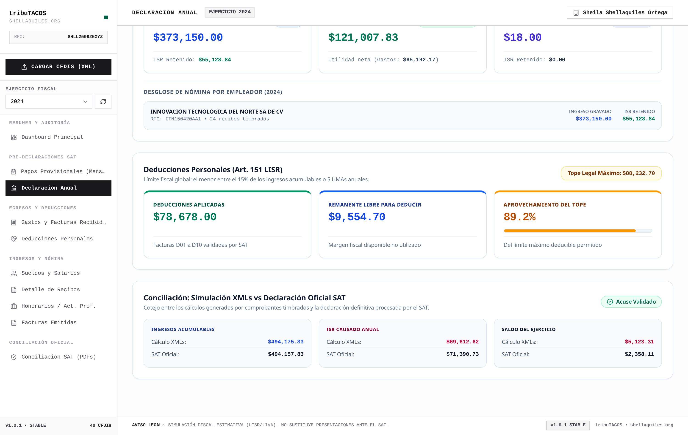

### 3.1 Termómetro de Deducciones y Conciliación Directa:
En la parte inferior del módulo se aprecian:
* **Termómetro del Tope Legal (Art. 151 LISR):** Tarjetas con el desglose de deducciones aplicadas, remanente disponible y porcentaje de aprovechamiento del tope con barra de progreso.
* **Conciliación Simulación vs Declaración Oficial SAT:** Comparativa 1 a 1 de Ingresos Acumulables, ISR Causado Anual y Saldo Final contra el acuse timbrado ante el SAT.

> [!TIP]
> **Estrategia Fiscal:** Aprovechar al máximo las deducciones del Artículo 151 (gastos médicos, colegiaturas, SGMM y aportaciones complementarias de retiro PPR) permite reducir la base gravable anual y maximizar el saldo a favor devuelto por el SAT.


---

# Capítulo 06: Módulo de Egresos y Deducciones

[](#)
[](#)
[](#)

Auditoría de compras y gastos operativos, clasificación jerárquica en los 8 rubros maestros del SAT y optimizador de deducciones personales (Art. 151 LISR).

---

## 1. Gastos y Facturas Recibidas (Egresos Operativos)

Este módulo procesa todas las facturas recibidas de proveedores, verificando su estatus de bancarización y asociándolas a los 8 rubros operativos:


### 1.1 Funcionalidades Principales:
* **Filtro por Mes y por Rubro SAT:** Permite auditar erogaciones mes con mes o por tipo de servicio/producto.
* **Comprobación de Bancarización:** Alerta inmediata sobre facturas mayores a `$2,000.00 MXN` liquidadas en efectivo (`01`), las cuales son no deducibles conforme al Art. 27 Fracc. III de la LISR.
* **Tratamiento de Notas de Crédito:** Descuentos y devoluciones emitidos por proveedores que restan el monto de gastos deducibles.
* **Explorador Maestro-Detalle:** Visualización de cada partida individual de la factura con su clave UNSPSC y tasa de IVA correspondiente.

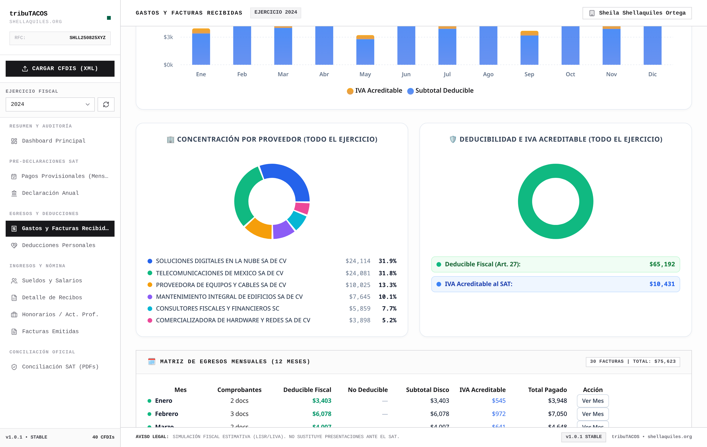

### 1.2 Analítica de Proveedores y Matriz de Egresos:
* **Gráfica de Barras Mensual:** Distribución del subtotal deducible frente al IVA acreditable erogado mes con mes.
* **Concentración por Proveedor (Gráfico de Dona):** Ranking de los principales emisores con montos y porcentajes de participación en el presupuesto de compras.
* **Deducibilidad e IVA Acreditable:** Semáforo del cumplimiento estricto del Art. 27 LISR y monto total de IVA listo para acreditar.
* **Matriz de Egresos Mensuales (12 Meses):** Desglose cronológico de comprobantes válidos, deducibles, no deducibles y totales liquidados con botón de auditoría <kbd>Ver Mes</kbd>.

### 1.3 Explorador Multimodal y Botones Interactivos:
El explorador de egresos cuenta con 3 modos de visualización y herramientas avanzadas de auditoría:
1. **Selector de Vistas:**
   - <kbd>📁 Por Rubro / Categoría</kbd>: Agrupa los comprobantes por partidas y artículos en los 8 rubros SAT (servicios, tecnología, mantenimiento, etc.).
   - <kbd>🏢 Por Proveedor</kbd>: Agrupa el gasto por emisor comercial / RFC, mostrando el volumen y total acumulado por empresa.
   - <kbd>📋 Lista Cronológica</kbd>: Tabla plana de todas las facturas del periodo ordenadas por fecha con badges de estatus de deducibilidad.
2. **Pestañas Superiores de Filtro (<kbd>Pills</kbd>):** Permite aislar rápidamente las facturas de un mes específico (`Ene`...`Dic`) o ver el consolidado `Todo el Año`.
3. **Buscador Instantáneo:** Filtro reactivo en tiempo real por nombre de artículo, clave de producto SAT (`c_ClaveProdServ`), razón social del proveedor o UUID.
4. **Exportación de Datos (<kbd>📥 Exportar (CSV)</kbd>):** Descarga inmediata de un archivo CSV codificado con UTF-8 BOM listo para abrir en Microsoft Excel o importar a software contable.
5. **Inspectores de Comprobante por Fila:**
   - **Clic en UUID:** Abre el visor detallado del CFDI con los datos del emisor, receptor, conceptos, impuestos y sellos fiscales.
   - **Botón <kbd>JSON</kbd>:** Abre el modal interactivo con el árbol estructurado de propiedades del comprobante para depuración técnica.
   - **Botón <kbd>XML</kbd>:** Permite descargar directamente el archivo XML original timbrado.


> [!WARNING]
> **Regla Estricta de Bancarización (Art. 27 Fracc. III LISR):** Los pagos de gastos operativos que excedan los `$2,000.00 MXN` deben realizarse obligatoriamente mediante cheque nominativo, transferencia electrónica (SPEI), tarjeta de crédito, débito o servicios. Cualquier pago en efectivo por encima de dicho umbral es descalificado automáticamente.


---

## 2. Deducciones Personales (Art. 151 LISR)

El módulo de **Deducciones Personales** analiza las facturas con uso `D01` a `D10` y las constancias fiscales externas (aportaciones a PPR y primas de seguros):


### 2.1 Termómetro del Límite Legal:

| Concepto de Deducción | Límite / Tope Máximo Legal | Criterio de Aceptación |
| :--- | :--- | :--- |
| **Tope General (Fracc. I a IV)** | Menor entre el **15% del ingreso total** o **5 UMAs anuales**. | Gastos médicos, dentales, hospitalarios, lentes y gastos funerarios. |
| **PPR (Fracc. V - Retiro)** | **10% de ingresos acumulables** o **5 UMAs anuales** (subtope independiente). | Aportaciones complementarias a Planes Personales de Retiro. |
| **SGMM (Fracc. VI - Seguros)** | Dentro del tope general del 15% / 5 UMAs. | Primas por seguros de gastos médicos mayores. |

### 2.2 Auditoría de Medios de Pago en Salud:

* **Medios Válidos:** Tarjeta de débito/crédito (`04`/`28`), transferencia electrónica SPEI (`03`), cheque nominativo (`02`).
* **Medios Inválidos:** Todo honorario médico, dental o psicológico pagado en efectivo (`01`) es marcado como **No Deducible** por disposición expresa del Art. 151 Fracc. I.

### 2.3 Claves de Uso de CFDI de Deducciones Personales:
* `D01`: Honorarios médicos, dentales y gastos hospitalarios.
* `D02`: Gastos médicos por incapacidad o discapacidad.
* `D03`: Gastos funerales.
* `D04`: Donativos.
* `D05`: Intereses reales devengados y efectivamente pagados por créditos hipotecarios.
* `D06`: Aportaciones voluntarias al SAR.
* `D07`: Primas por seguros de gastos médicos.
* `D08`: Gastos de transportación escolar obligatoria.
* `D09`: Depósitos en cuentas personales especiales para el ahorro.
* `D10`: Pagos por servicios educativos (colegiaturas con tope por nivel escolar).


---

# Capítulo 07: Módulo de Ingresos y Nómina

[](#)
[](#)
[](#)

Auditoría integral de Sueldos y Salarios (Capítulo I), desglose de recibos quincenales, facturación emitida por Honorarios/PFAE (Capítulo II) y concentración de clientes.

---

## 1. Sueldos y Salarios (Capítulo I LISR)

El módulo de **Sueldos y Salarios** procesa los complementos de nómina 1.2 timbrados por los empleadores durante el ejercicio fiscal:


### 1.1 Indicadores Consolidados:

| Indicador Salarial | Fundamento Legal | Descripción |
| :--- | :--- | :--- |
| **Masa Salarial Bruta** | Art. 94 LISR | Total acumulado de percepciones devengadas por el trabajador. |
| **Percepciones Gravadas** | Art. 96 LISR | Monto sujeto a la tarifa mensual de retención de ISR. |
| **Percepciones Exentas** | Art. 93 LISR | Aguinaldo (hasta 30 UMAs), prima vacacional (hasta 15 UMAs) y previsión social. |
| **Retenciones de ISR Nómina** | Art. 96 LISR | Impuesto retenido por el patrón acumulable para acreditar en la declaración anual. |

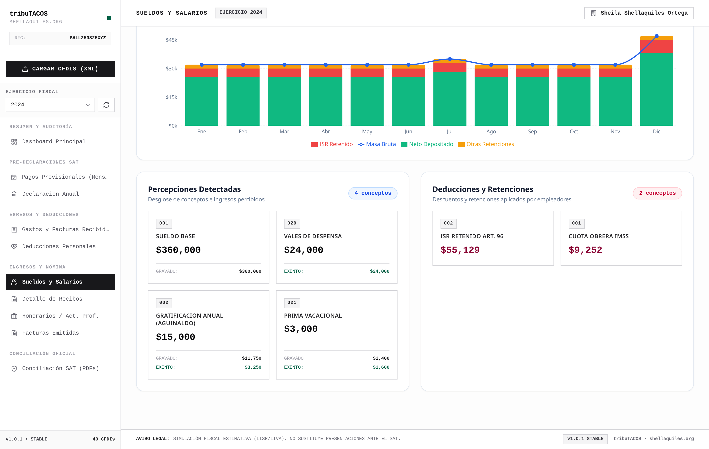

### 1.2 Flujo Mensual y Catálogo de Conceptos:
* **Evolución Mensual (Gráfico Compuesto):** Curva de masa salarial bruta frente a los montos de neto depositado, retenciones de ISR y cuotas IMSS de enero a diciembre.
* **Percepciones Detectadas:** Tarjetas desglosadas por clave oficial del complemento de nómina (`001 Sueldo Base`, `029 Vales de Despensa`, `002 Gratificación Anual / Aguinaldo`, `021 Prima Vacacional`) con el desglose exacto de montos gravados y exentos.
* **Deducciones y Retenciones:** Auditoría de `002 ISR Retenido Art. 96` y `001 Cuota Obrera IMSS`.


---

## 2. Detalle de Recibos de Nómina
 
 Visualización interactiva quincena por quincena de los recibos de nómina timbrados:
 
 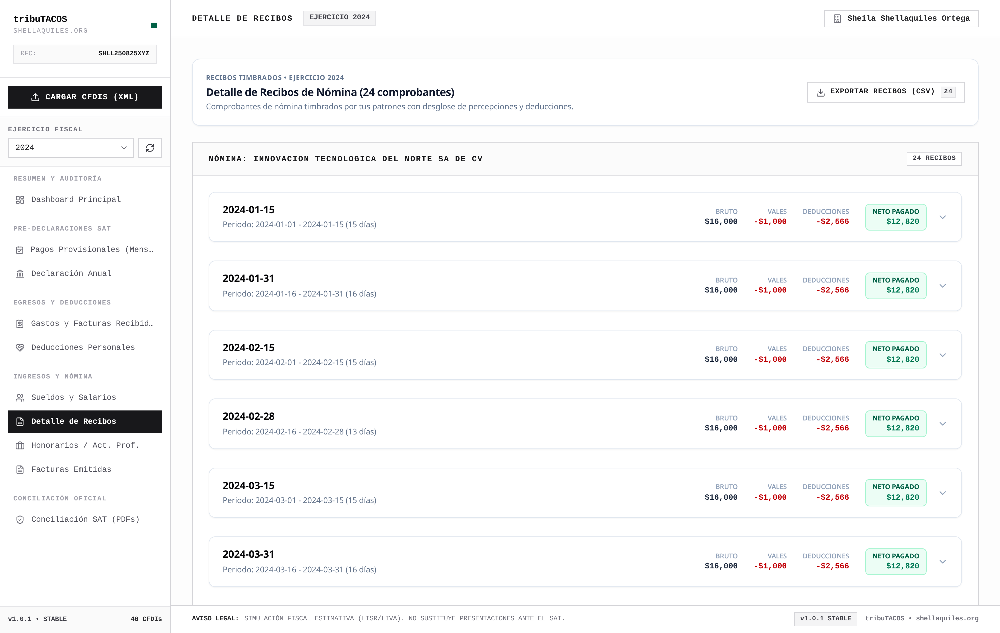
 
-* **Desglose de Percepciones:** Sueldo base, bono de productividad, aguinaldo y prima vacacional.
-* **Desglose de Deducciones:** Retención de ISR del periodo y cuotas obreras de seguridad social IMSS.
-* **Auditoría de Vigencia:** Fecha de inicio, fecha de fin y días laborados efectivamente liquidados.
+### 2.1 Acciones Interactivas en Recibos de Nómina:
+* **Acordeón Expandible (<kbd>▼</kbd>):** Al hacer clic sobre cualquier recibo quincenal se despliega el desglose pormenorizado de percepciones (gravadas y exentas) y deducciones (ISR y cuotas obreras IMSS).
+* **Visor CFDI (Clic en UUID):** Abre el modal con la estructura completa del comprobante.
+* **Botón <kbd>JSON</kbd>:** Abre el visor de metadatos estructurados JSON para auditoría técnica.
+* **Botón <kbd>XML</kbd>:** Descarga inmediata del archivo XML del complemento de nómina 1.2.
 
 ---
 
 ## 3. Honorarios y Facturación Emitida (Capítulo II LISR)
 
 El módulo de **Honorarios / Act. Prof.** analiza los ingresos generados por prestación de servicios profesionales y proyectos independientes:
 
 
 
-### 3.1 Métricas de Facturación:
+### 3.1 Métricas y Filtros por Cliente:
+* **Selector de Portafolio (<kbd>Portafolio Global</kbd> / Botones por Cliente):** Permite filtrar los ingresos, IVA trasladado y retenciones exclusivamente para un cliente específico o ver la totalidad de la cartera.
 * **Total Facturado:** Subtotal de facturas de ingresos emitidas en el ejercicio antes de impuestos.
 * **Retenciones de ISR Sufridas:** `10%` retenido por clientes personas morales conforme al Art. 106 LISR.
 * **Retenciones de IVA Sufridas:** `10.6667%` (dos terceras partes del IVA) retenido por personas morales conforme al Art. 1-A LIVA.
-* **Mix de Servicios por Clave SAT:** Clasificación de facturación según el catálogo `c_ClaveProdServ`.
+* **Tarjetas de Conceptos Facturados:** Resumen por clave de producto/servicio del catálogo del SAT con badges distintivos y montos acumulados.
 
 ---
 
 ## 4. Explorador de Facturas Emitidas
 
 Visualizador estructurado de cada comprobante emitido a clientes:
 
 
 
-* **Búsqueda Instantánea:** Filtrado por folio, RFC de cliente, método de pago (`PUE` / `PPD`) y estatus fiscal.
-* **Exportación de Datos:** Descarga de reportes estructurados en formato CSV para conciliación contable externa.
+* **Botón <kbd>Exportar Facturas (CSV)</kbd>:** Genera el reporte consolidado de facturación de ingresos con formato tabular y codificación internacional.
+* **Inspección de Factura:** Visualización de folios fiscales, RFC de receptores, desglose de impuestos trasladados (IVA 16%) y retenciones con botones de acceso directo a visores <kbd>JSON</kbd> y descarga de <kbd>XML</kbd>.


---

# Capítulo 08: Módulo de Auditoría SAT y Conciliación Oficial

[](#)
[](#)
[](#)

Conciliación 1 a 1 de declaraciones anuales, pagos provisionales de 12 meses y acuses bancarios de pago extraídos de los PDFs oficiales del SAT.

---

## 1. Visión General de la Auditoría Bidireccional

Este módulo permite contrastar la realidad contable obtenida de los comprobantes digitales timbrados (**XMLs**) contra las cifras registradas formalmente ante la autoridad tributaria (**PDFs oficiales del SAT**):


---

## 2. Documentos Oficiales a Descargar e Ingestar

Para habilitar la conciliación automática, el contribuyente o contador debe descargar del portal del SAT y de su banca electrónica los siguientes comprobantes en formato **PDF**:

| Documento | Origen / Dónde Descargar | Datos Extraídos por el Parser |
| :--- | :--- | :--- |
| **Declaración Anual (PDF)** | *Portal del SAT ➔ Declaraciones ➔ Consulta de Declaraciones* | Folio de 14 dígitos, tipo de declaración, fecha de timbrado, base gravable e ISR a favor/cargo con CLABE. |
| **Pagos Provisionales (PDF)** | *Portal del SAT ➔ Pagos Provisionales / Declaraciones y Pagos* | Ingresos, deducciones, retenciones de ISR/IVA, pagos provisionales e IVA de los 12 meses. |
| **Acuses Bancarios (PDF)** | *Banca Electrónica ➔ Pagos de Impuestos Federales SAT* | Folio de control bancario, línea de captura, fecha efectiva de pago e importe transferido. |

### Procesamiento y Carga en tribuTACOS:
* **Desde la Interfaz Web:** Arrastre los archivos PDF al modal de carga o al panel de Conciliación SAT.
* **Desde la Terminal:** Ejecute `make db-import-pdf` para procesar por lotes todos los PDFs colocados en el directorio local.
* **Motor de Extracción:** El parser interno de tribuTACOS extrae mediante expresiones regulares y análisis de tablas los folios de 14 dígitos, sellos digitales y matrices financieras sin requerir captura manual.

---

## 3. Componentes de la Pantalla de Auditoría

### 3.1 Resumen de la Declaración Anual Oficial:
* **Número de Operación:** Folio oficial de recepción emitido por el SAT al sellar y timbrar la declaración.
* **Fecha y Hora de Presentación:** Marca de tiempo oficial de acuse de recibo.
* **Tipo de Declaración:** Indicador de declaración Normal o Complementaria.
* **Cuenta CLABE Registrada:** Cuenta bancaria estandarizada a 18 dígitos designada ante la autoridad para el depósito del saldo a favor.

### 3.2 Matriz de Cumplimiento de Pagos Provisionales (12 Meses):
* **Tabla Comparativa Mensual:** Desglose mes a mes de los ingresos acumulados declarados ante el SAT, retenciones de ISR y montos de IVA reportados vs lo calculado por tribuTACOS.
* **Verificación de Acuses Bancarios:** Validación de comprobantes bancarios emitidos por la institución financiera con su respectiva línea de captura y sello digital.

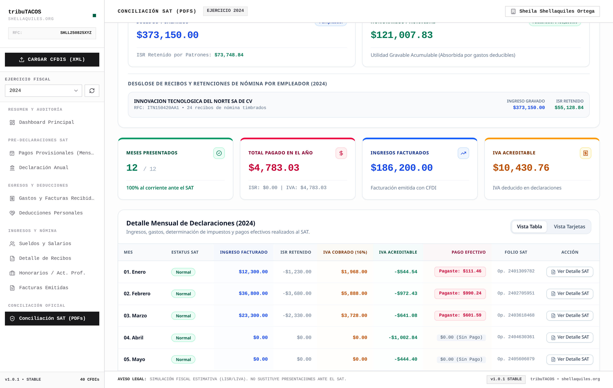

### 3.3 Detalle Mensual de Declaraciones y Folios SAT:
* **Estatus SAT de Presentación:** Etiqueta oficial indicando declaración `Normal` o `Complementaria`.
* **Cifras de Flujo Declaradas:** Ingresos facturados reportados, ISR retenido, IVA cobrado e IVA acreditable.
* **Pago Efectivo Realizado:** Monto transferido con línea de captura bancaria asociada.
* **Folio SAT Oficial:** Número de operación de 10 a 14 dígitos verificado y botón de auditoría <kbd>Ver Detalle SAT</kbd>.

> [!IMPORTANT]
> **Utilidad Preventiva:** Este módulo detecta discrepancias fiscales entre lo timbrado en CFDI por clientes/proveedores y lo presentado en el portal del SAT, evitando cartas invitación, multas o diferencias en revisiones electrónicas de la autoridad.


---

# Capítulo 09: Arquitectura y Componentes Modulares

[](#)
[](#)
[](#)

Estructura modular del sistema, arquitectura por capas, catálogo de componentes y flujo de datos fiscal.

---

## 1. Arquitectura Modular del Sistema

tribuTACOS está diseñado bajo un modelo desacoplado, determinista y de alto rendimiento organizado en tres capas independientes:

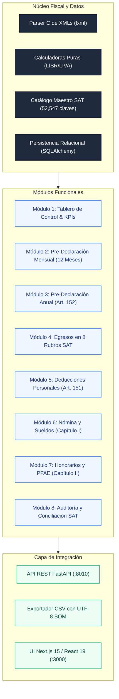

---

## 2. Catálogo de Módulos Funcionales del Sistema

| Módulo | Responsabilidad Fiscal y Contable | Tecnologías y Motores |
| :--- | :--- | :--- |
| **1. Tablero Global** | KPIs financieros consolidados, mix de ingresos y saldo estimado. | FastAPI `/api/summary` + React 19 |
| **2. Pre-Declaración Mensual** | Matriz de 12 meses, pagos provisionales ISR (Art. 106) y arrastre de IVA (Art. 5/6). | Motor fiscal de flujo de efectivo |
| **3. Pre-Declaración Anual** | Cascada de 5 pasos conforme al Art. 152 LISR y tasas efectivas. | Tarifa progresiva oficial multianual |
| **4. Egresos Operativos** | Clasificación en 8 rubros de 52,547 claves SAT y auditoría de bancarización. | Catálogo `c_ClaveProdServ` SAT |
| **5. Deducciones Personales** | Termómetro del Art. 151 LISR (15% vs 5 UMAs) y subtope PPR (10%). | Validador de topes y constancias |
| **6. Sueldos y Salarios** | Percepciones gravadas/exentas (Art. 93) y recibos de nómina 1.2. | Complemento Nómina CFDI 1.2 |
| **7. Honorarios y PFAE** | Facturación emitida, retenciones del 10% ISR y 10.6667% IVA. | CFDI 3.3/4.0 de Ingresos y REP |
| **8. Auditoría SAT** | Conciliación 1 a 1 de declaraciones anuales, pagos y acuses bancarios. | Parser de PDFs oficiales del SAT |

---

## 3. Principios de Diseño del Sistema

* **Determinismo Puro:** Mismas entradas (CFDIs y PDFs) producen invariablemente los mismos resultados fiscales al centavo, sin redondeos arbitrarios.
* **Flujo de Efectivo Estricto:** La causación de ISR e IVA se computa por fecha efectiva de pago (`fecha_pago`), respetando la legislación aplicable a personas físicas.
* **Privacidad Local:** El procesamiento y la persistencia residen exclusivamente en la máquina del usuario (`backend/tributacos.db`), garantizando la soberanía de la información financiera.
* **Interoperabilidad:** Exportación instantánea en formatos abiertos estándar (CSV con UTF-8 BOM y PDF).


---
